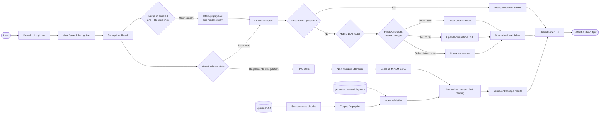
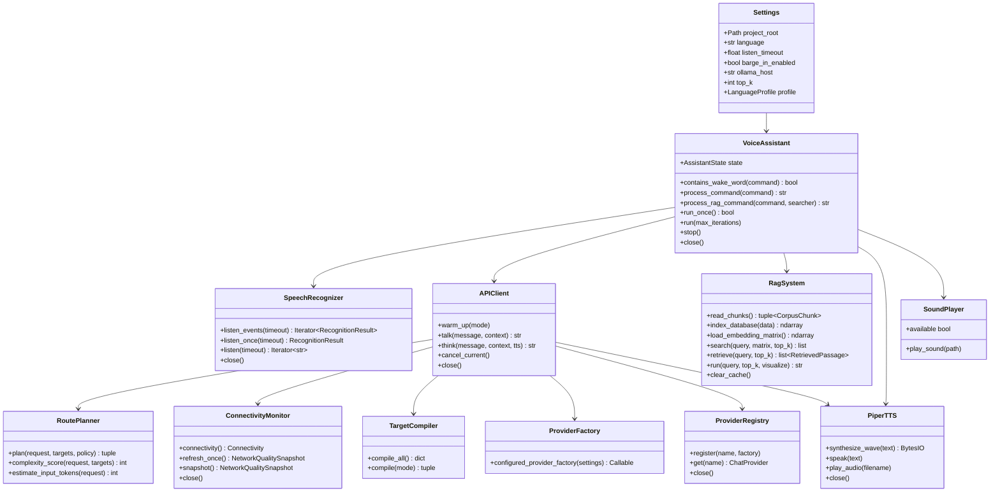
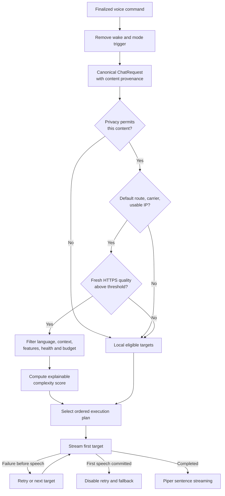
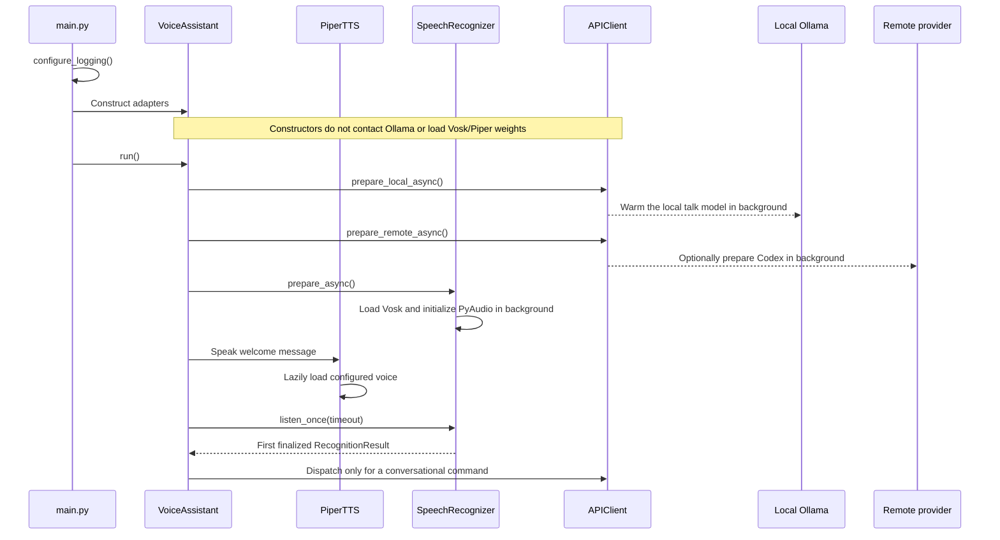
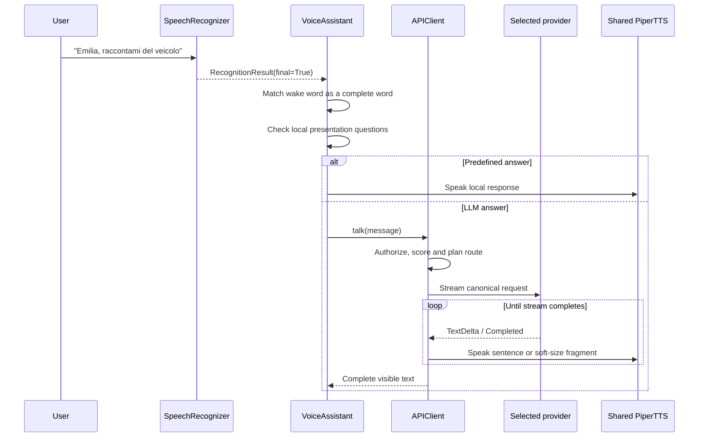
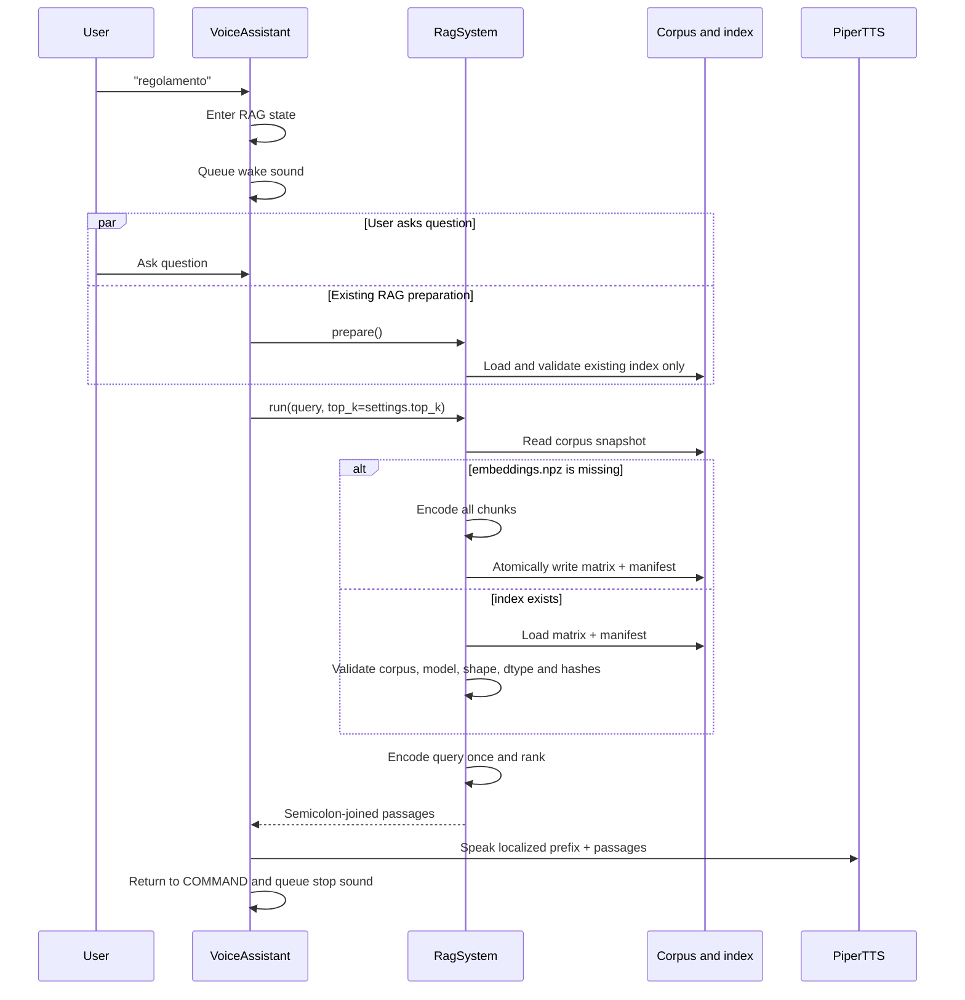

<p align="center">
  
</p>

# Helios AI

## Offline-first voice assistant and adaptive LLM framework for NVIDIA Jetson

Helios AI turns an edge computer into a hands-free, voice-driven assistant. A
user can speak to it, ask a language model a question, or search a bundled
knowledge base without needing a keyboard, display, or permanently available
Internet connection.

The project was created for **Emilia 5.9**, Onda Solare's solar vehicle, and is
primarily aimed at developers building voice interfaces for NVIDIA Jetson
devices, robots, demonstrators, and other installations where interaction must
remain simple and resilient. It combines offline speech recognition, local
neural text-to-speech, local semantic search, and an Ollama-hosted language
model in one Python application. When explicitly authorized, it can also
offload a request to an OpenAI-compatible API or to Codex through a ChatGPT
subscription, while preserving the local model as a fast fallback.

What makes Helios unusual is that remote inference is not merely an on/off
switch. Before a transcript can leave the device, the runtime checks privacy,
network reachability and quality, provider health, model capabilities, and
optional cost limits. It then selects an appropriately sized remote model from
an explainable complexity score. Generated text is spoken sentence by sentence
as it streams, reducing perceived latency.

Helios AI is a developer-oriented framework, not a packaged consumer
application. The repository contains the complete voice pipeline and the
knowledge files used by the Emilia deployment, but it does not implement
vehicle control, telemetry, navigation, battery management, or GPIO
integration.

> **Current implementation:** Vosk transcribes the microphone, an explicit
> state machine routes finalized utterances, an offline-first hybrid LLM layer
> selects Ollama, an explicitly authorized remote SSE endpoint, or the Codex
> app-server, a local
> SentenceTransformer retrieves regulations through an integrity-checked
> index, and a shared Piper instance speaks the result.

## Contents

- [What Helios AI does](#what-helios-ai-does)
- [Architecture](#architecture)
  - [Design and responsibilities](#design-and-responsibilities)
  - [Component interaction](#component-interaction)
- [Hybrid inference and data flow](#hybrid-inference-and-data-flow)
  - [Routing and model selection](#routing-and-model-selection)
  - [Connectivity gate](#connectivity-gate)
  - [Privacy, cost, and failure safety](#privacy-cost-and-failure-safety)
- [Runtime workflows](#runtime-workflows)
  - [Startup](#startup)
  - [Conversational command](#conversational-command)
  - [RAG query](#rag-query)
  - [Shutdown](#shutdown)
- [Repository structure](#repository-structure)
- [Technology stack and dependencies](#technology-stack-and-dependencies)
- [Main components](#main-components)
- [Prerequisites](#prerequisites)
- [Installation](#installation)
- [Ollama model setup](#ollama-model-setup)
- [Configuration](#configuration)
- [Remote inference setup](#remote-inference-setup)
- [Active settings](#active-settings)
- [KPI observability and dashboard](#kpi-observability-and-dashboard)
- [Running and using the assistant](#running-and-using-the-assistant)
- [Knowledge base and embeddings](#knowledge-base-and-embeddings)
- [Asset validation and provenance](#asset-validation-and-provenance)
- [Logging and diagnostics](#logging-and-diagnostics)
- [Testing and development](#testing-and-development)
- [Performance considerations](#performance-considerations)
- [Known limitations](#known-limitations)
- [Troubleshooting](#troubleshooting)
- [FAQ](#faq)
- [Project background](#project-background)
- [License](#license)

## What Helios AI does

The default profile runs in Italian and listens through the default microphone.
Each recognition call has a maximum duration of 6.5 seconds, but it returns
earlier as soon as Vosk produces a finalized phrase.

Helios supports two primary user flows:

1. **Conversational command**
   - Include `emilia`, `amelia`, or `hello` as a complete word in the spoken
     phrase.
   - Helios removes the first wake-word occurrence before inference.
   - The configured route chooses local Ollama or an authorized remote target.
   - The streamed answer is synthesized locally with Piper at sentence or soft
     length boundaries.

2. **Knowledge-base query**
   - Say `regolamento` to enter RAG mode (`regulation` in English mode).
   - Ask a question in the following finalized utterance.
   - Helios embeds the query, validates and searches the local vector index,
     selects the configured number of passages, and speaks them.

Implemented capabilities include:

- offline Italian and English speech recognition with bundled Vosk models;
- structured partial/final recognition events and first-final routing;
- consecutive-word deduplication for Vosk results;
- whole-word wake and RAG trigger detection;
- local streaming chat through the official Ollama Python client;
- optional, fail-closed OpenAI-compatible Chat Completions SSE routing;
- optional Codex app-server routing using a ChatGPT sign-in instead of an API
  key;
- deterministic routing policies and an explainable adaptive remote model
  cascade;
- a Linux route/carrier/IP gate plus background HTTPS quality measurements;
- privacy, health, cost, observability, timeout, and audio no-replay controls;
- custom Italian and English Ollama definitions for concise responses;
- offline Italian and English Piper voices bundled as ONNX models;
- one Piper instance shared by direct and Ollama-generated responses;
- in-memory WAV synthesis that plays PCM frames without a temporary file;
- source-aware semantic retrieval with SentenceTransformers and NumPy;
- an atomic vector-index format bound to the corpus and embedding model;
- wake and completion sounds through ALSA `aplay`;
- explicit service cleanup and graceful `Ctrl+C` shutdown;
- model-free automated tests and cross-platform CI;
- asset checksum, companion-file, and provenance validation.

## Architecture



### Design and responsibilities

The application uses a small composition-root architecture:

- `main.py` configures logging and owns the top-level application lifecycle.
- `VoiceAssistant` coordinates state without implementing hardware details.
- `SpeechRecognizer` isolates PyAudio and Vosk.
- `BargeInDetector` identifies sustained PCM energy or non-empty Vosk events,
  with an injected pure echo-suppression policy.
- `APIClient` preserves the public `talk()`/`think()` API while provider
  adapters, connectivity, routing, streaming safety, privacy, health, budget,
  and metrics remain internal.
- `RagSystem` owns corpus chunking, index generation, integrity validation, and
  ranking.
- `PiperTTS` isolates voice loading, synthesis, WAV parsing, and playback.
- `SoundPlayer` delegates short cues to `aplay` with a bounded timeout.
- `Settings` and `LanguageProfile` centralize validated configuration.

Production services have defaults, but `VoiceAssistant` accepts injected
recognizer, TTS, sound, API, RAG, executor, random-choice, and sleep
implementations. This keeps the hardware path convenient while allowing the
same orchestration to be tested without opening a microphone, loading neural
models, or contacting Ollama.

Dependency direction is intentionally one-way:

```text
main.py
  `-- VoiceAssistant
      |-- SpeechRecognizer
      |-- APIClient
      |   `-- shared PiperTTS
      |-- RagSystem (created only when RAG is first used)
      `-- SoundPlayer
```

### Component interaction



## Hybrid inference and data flow

The repository defaults to the Codex/ChatGPT-subscription profile with
`remote_first` routing and local Ollama fallback. Remote transmission still
passes through the same sequence of fail-closed checks:



Helios owns an in-memory logical conversation session above the providers. It
commits each finalized user turn once and commits assistant text only after a
successful completion. Ollama receives the bounded canonical user/assistant
history on every turn, including after provider fallback. When
`HELIOS_LLM_ALLOW_REMOTE_CONTEXT=true`, Codex resumes a healthy ephemeral thread
and recovers an interrupted, stale, idle, or capped physical thread by starting
a replacement and rehydrating it from the same canonical history. The session
is intentionally not persisted across process restarts.

Natural barge-in and Codex multi-turn context are enabled by default in the
application and bundled Codex profile; no environment overrides are required.
Set `HELIOS_BARGE_IN_ENABLED=false` or
`HELIOS_LLM_ALLOW_REMOTE_CONTEXT=false` to opt out. Remote context means prior
in-session turns may be transmitted remotely. Startup logs explicitly report
whether Codex context is enabled and warn when each remote request will use a
fresh physical thread. A `local_only` turn,
local-document-derived answer, or unredacted `remote_redacted` turn remains
ineligible for later remote history until an explicit session reset.

### Routing and model selection

`RoutePlanner` supports five policies:

| Policy | Eligible-target order |
|---|---|
| `local_only` | Local targets only |
| `remote_only` | Remote targets only |
| `local_first` | Local targets, then remote targets |
| `remote_first` | Remote targets, then local targets |
| `auto` | Complexity score chooses local-first or remote-first |

Candidate order is declared separately for `talk` and `think`. Eligibility
checks target/provider enablement, allowlists and denylists, language,
capabilities, conservative context size, health, privacy authorization,
connectivity, and—when enabled—catalog and budget state.

The complexity score adds:

- 2 points when input plus reserved output exceeds 80% of the largest eligible
  local context;
- 1 point for `think`;
- 1 point above 160 conservatively estimated input tokens;
- 1 point for an Italian or English reasoning cue;
- 1 point for at least three connectors or question separators;
- 1 point for more than 64 estimated context tokens;
- 2 points when an API caller supplies `request_options={"complex": true}`.

For `auto`, the mode's `complexity_threshold` controls local-versus-remote
order. Independently, remote targets with `min_complexity_score` form a model
cascade: the planner keeps only the healthy tier with the highest floor not
exceeding the score. The committed Codex profile maps scores as follows:

| Score | Talk/think remote model | Typical intent |
|---:|---|---|
| 0–2 | `gpt-5.6-luna` | Short, direct requests |
| 3–4 | `gpt-5.6-terra` | Explanations and moderate reasoning |
| 5+ | `gpt-5.6-sol` | Longer, multi-step work |

Only one remote tier is attempted before the local fallback. Helios does not
try all three remote models serially during an outage. Model availability is
account-dependent and must be checked on the deployment device.

See [Adaptive remote model routing and latency](docs/ADAPTIVE_REMOTE_ROUTING.md)
for scoring, calibration, speech chunking, and benchmark guidance.

### Connectivity gate

When network monitoring is enabled, a request never waits for a new Internet
probe. A synchronous Linux-only passive check reads kernel route/address state
and requires:

1. an IPv4 or IPv6 default route;
2. an allowed interface, and Wi-Fi when configured;
3. `operstate` equal to `up` or `unknown`;
4. no explicit `carrier=0`;
5. a usable non-loopback, non-link-local address.

Failure removes remote targets immediately. A background monitor then validates
the real HTTPS path with bounded DNS, TCP, TLS, time-to-first-byte, and
application payload measurements. It smooths TTFB, variation, success ratio,
payload rate, and available Wi-Fi signal into a zero-to-one quality score with
hysteresis. Netlink route events wake the monitor when Linux link state changes.
A failed probe, stale result, captive/intercepted TLS path, changed interface,
or sub-threshold score fails closed.

Run the sanitized diagnostic with the active routing profile:

```bash
export HELIOS_LLM_CONFIG="$PWD/examples/llm-routing.codex-subscription.toml"
export HELIOS_LLM_REMOTE_ENABLED=true
python scripts/network_diagnostics.py
```

Exit status is zero only when the remote path is admitted. The JSON deliberately
omits addresses, URLs, prompts, responses, tokens, and credentials. Detailed
tuning is in
[Fast connectivity and network-quality routing](docs/NETWORK_CONNECTIVITY_ROUTING.md).

### Privacy, cost, and failure safety

Remote content is labeled by origin. Raw transcripts, conversation/tool
context, and local documents have independent permission gates; unknown-origin
content never leaves the device. `remote_redacted` additionally requires every
non-static message to be explicitly marked as already redacted. Helios does not
implement a general-purpose redactor.

When budget enforcement is enabled, a strict expiring JSON catalog defines the
exact provider/model identity, context limits, output limits, and decimal token
prices. An append-only ledger reserves the conservative maximum before
dispatch, then settles returned usage. Missing usage settles the full
reservation. A missing/stale catalog, corrupt/unwritable ledger, price mismatch,
clock rollback, or exceeded per-request/daily/monthly limit blocks remote
execution.

Every provider adapter performs one transport attempt; retry and fallback are
owned centrally. Text received before speech is discarded if an attempt fails.
After Helios commits the first fragment to Piper, retry and fallback are
disabled because replaying another answer could duplicate speech already heard.
Reasoning deltas are neither spoken nor returned as visible text. Refusal,
cancellation, and TTS errors are terminal.

## Runtime workflows

### Startup



The constructor establishes the dependency graph without performing network
requests or opening audio devices. The first welcome message loads Piper, and
the runtime begins loading Vosk and initializing PyAudio in a background thread
at the same time. The input stream is opened only when listening begins. The
Ollama SDK client remains lazy until an explicit warm-up or an inference turn.
At runtime, Helios starts one local, empty-prompt warm-up in a background
thread before the greeting, so the first real command does not compete with a
cold model load. The adapter admits only one Ollama request at a time until its
worker has actually exited. If the current network gate admits a configured
Codex route, app-server startup and ChatGPT account validation also begin in a
background thread while the welcome message is spoken. Preparation sends no
user transcript and starts no conversation turn.

The embedding model and corpus are not loaded during normal startup. When the
user enters RAG mode, Helios prepares the model and any existing validated
index in the background while the user asks the question. A missing index is
not built during listening; that expensive operation remains part of the query
path or the explicit index-building command.

### Conversational command



Only finalized recognition results are executed. Partial phrases and measured
PCM energy are available through `listen_events()` and, while default-on barge-in is
active, can stop the current response early. One continuous microphone/Vosk
session then flushes the finalized interruption utterance, which is executed as
an immediate follow-up without another wake word. A finalized utterance during
model generation or TTS synthesis also supersedes that response instead of
being discarded. After a response completes normally, finalized follow-ups are
accepted without another wake word until the configured conversation idle
timeout. Partial text is never sent to a model as a normal idle command.

Provider failures are retried or routed to the next target only while doing so
is safe. Once speech has started, a failed stream is not replayed because doing
so could duplicate audio already heard by the user. TTS failures are preserved
as TTS errors rather than being relabeled as network failures.

### Interruptible conversation (opt-in)

Set `HELIOS_BARGE_IN_ENABLED=true` to keep one Vosk capture session open while a
response is generated and Piper is speaking. Detection is armed only for actual
playback and its short echo tail. The same opt-in flow pre-synthesizes short
language-specific backchannels before the first command and plays one after a
configurable 700 ms silent gap. A fast real fragment cancels the cue before it
starts; a cue already playing is stopped through its own cancellation event and
joined before real speech. The default remains `false` until thresholds and
timing are calibrated on the target microphone, speaker, enclosure, and playback
level.

```mermaid
sequenceDiagram
    participant User
    participant VA as VoiceAssistant
    participant STT as Vosk
    participant API as APIClient
    participant TTS as PiperTTS

    VA->>API: Run response on two-worker conversation executor
    API->>TTS: Speak streamed fragment
    par Playback
        TTS-->>User: Response audio
    and Barge-in monitoring
        User->>STT: Begin follow-up while audio plays
        STT-->>VA: Partial/final RecognitionResult
    end
    VA->>TTS: interrupt()
    VA->>API: cancel_current()
    Note over API: Cancellation is terminal; no retry/fallback
    STT-->>VA: Finalized follow-up
    VA->>API: Process follow-up without another wake word
```

Playback uses 100 ms output chunks, allowing another thread to stop between
writes and leaving the stream reusable for the next response. Backchannels are
cached WAVs rather than on-demand synthesis. The detector uses measured PCM RMS
and a conservative software echo gate; see
[`docs/BARGE_IN_DESIGN.md`](docs/BARGE_IN_DESIGN.md) for calibration guidance,
the scripted first-audio benchmark, rejected AEC alternatives, and the
cancellation/budget contract.

### RAG query



The active RAG path is extractive. It returns matching source passages directly
and does not send them to Ollama for generative synthesis. The structured
`retrieve()` API retains source filenames and scores; the compatibility
`run()` method returns plain semicolon-joined text.

### Shutdown

`Ctrl+C`, `VoiceAssistant.stop()`, context-manager exit, or the end of a bounded
test run reaches the same idempotent cleanup path:

1. stop the assistant loop;
2. wait for the single notification-sound worker;
3. close the microphone recognizer;
4. terminate owned PyAudio resources;
5. close the API/TTS adapters without closing shared instances twice;
6. mark the assistant closed so it cannot be restarted accidentally.

Each `aplay` operation has a default ten-second timeout, preventing a wedged cue
process from blocking shutdown indefinitely.

## Repository structure

```text
.
|-- main.py                         Application entry point and logging setup
|-- assistant.py                    Dependency composition and state machine
|-- config.py                       Settings, language profiles, compatibility aliases
|-- pyproject.toml                  Pytest/Ruff configuration; source-checkout contract
|-- requirements.txt                Portable desktop dependency entry point
|-- requirements-runtime.txt        Platform-neutral direct dependencies
|-- requirements-jetson.txt         Jetson-specific installation contract
|-- requirements-remote.txt         Optional remote SSE and Codex dependencies
|-- requirements-dev.txt            Model-free test and quality dependencies
|-- assets-manifest.json            Machine-readable asset inventory and hashes
|-- THIRD_PARTY_NOTICES.md          Provenance and redistribution gaps
|-- api/
|   |-- api_client.py               Public talk/think facade and composition
|   |-- provider_factory.py         Lazy configured-adapter construction
|   |-- target_compiler.py          Settings-to-execution-target compilation
|   |-- routing.py                  Eligibility, policies, complexity scoring
|   |-- streaming.py                Retry, fallback, speech and settlement
|   |-- connectivity.py             Linux passive gate and HTTPS quality monitor
|   |-- privacy.py                  Provenance-aware remote authorization
|   |-- health.py                   Provider/model circuits and cooldowns
|   |-- catalog.py                  Strict expiring model/price catalog
|   |-- budget.py                   Durable reservation and settlement ledger
|   |-- metrics.py                  Content-free metric schema and recorder
|   |-- providers/
|   |   |-- contracts.py            Provider-neutral requests and stream events
|   |   |-- ollama.py               Local or explicitly trusted Ollama adapter
|   |   |-- openai_chat_sse.py      Strict Chat Completions SSE adapter
|   |   `-- codex_app_server.py     ChatGPT-subscription Codex adapter
|   |-- Modelfile-IT                Italian Emilia Ollama definition
|   `-- Modelfile-EN                English Emilia Ollama definition
|-- audio/
|   |-- tts.py                      Piper synthesis and PCM playback
|   |-- sound_player.py             Bounded ALSA cue playback
|   |-- playback.py                 Compatibility exports for historical imports
|   `-- models/                     Bundled Italian and English Piper voices
|-- document/
|   `-- rag_system.py               Chunking, indexing, validation, and retrieval
|-- models/
|   `-- all-MiniLM-L6-v2/           Bundled SentenceTransformer model
|-- recognizer/
|   |-- speech_recognizer.py        Vosk/PyAudio recognition boundary
|   `-- models/                     Bundled Italian and English Vosk models
|-- observability/
|   |-- activity.py                 Local/remote inference activity correlation
|   |-- service.py                  Optional KPI lifecycle and composition
|   |-- storage.py                  Versioned SQLite storage and retention
|   |-- aggregate.py                Bounded summaries, percentiles, and series
|   |-- resources.py                Cross-platform and Jetson resource sampling
|   |-- dashboard.py                Local-first read-only HTTP API
|   `-- static/                     Dependency-free dashboard assets
|-- scripts/
|   |-- build_index.py              Explicit RAG index builder
|   |-- doctor.py                   Environment and asset validator
|   |-- run_jetson.py               Virtualenv/OpenMP-aware Jetson launcher
|   |-- network_diagnostics.py      Sanitized route and HTTPS quality report
|   |-- codex_subscription.py       Device login, status, and model listing
|   |-- kpi.py                      KPI status, clear, export, and dashboard CLI
|   |-- benchmark_kpi.py            Synthetic KPI performance benchmark
|   `-- smoke_tts.py                Manual Piper/audio smoke command
|-- docs/
|   |-- HYBRID_LLM_OPERATIONS.md    Security, deployment, live-test checklist
|   |-- CODEX_SUBSCRIPTION.md       ChatGPT sign-in and Codex operation
|   |-- ADAPTIVE_REMOTE_ROUTING.md  Complexity tiers and latency tuning
|   |-- KPI_OBSERVABILITY.md        KPI definitions, dashboard, privacy, operations
|   `-- NETWORK_CONNECTIVITY_ROUTING.md
|                                    Network decision and calibration details
|-- examples/
|   |-- llm-routing.offline.toml    Explicit local-only policy
|   |-- llm-routing.codex-subscription.toml
|   |                                Remote-first ChatGPT/Codex policy
|   |-- llm-routing.free-tier-first.toml
|   |-- llm-routing.paid-first.toml
|   |-- llm-routing.local-first-escalation.toml
|   `-- model-catalog.example.json  Deliberately stale fail-closed template
|-- tests/
|   `-- test_*.py                   Model-free unit/integration-style coverage
|-- uploads/
|   |-- qa_pairs.txt                Question-and-answer knowledge
|   |-- regolamento.txt             Competition regulations
|   `-- team_notice.txt             Control-stop notice
|-- sounds/
|   |-- wake_up.wav                 RAG-entry cue
|   `-- stop.wav                    RAG-completion cue
|-- pictures/
|   |-- heliosAI.png                Project logo
|   `-- emilia5.9.bmp               Emilia 5.9 photograph
|-- prompts/
|   `-- update_readme.txt           Technical-writing prompt for this README
|-- .env.example                    Non-secret deployment variable template
|-- .github/workflows/quality.yml   Cross-platform quality workflow
|-- .gitattributes                  Line-ending and future LFS policy
|-- .gitignore                      Generated/runtime artifact exclusions
`-- LICENSE                         MIT license
```

Generated files such as `embeddings.npz`, logs, caches, virtual environments,
and synthesized audio are intentionally ignored.

Helios currently runs from a source checkout. The bundled models, corpus, and
audio assets are not packaged into a Python wheel, so `pyproject.toml`
deliberately configures repository tools without advertising an installable
console command.

## Technology stack and dependencies

| Technology | Role in the active runtime |
|---|---|
| Python 3.10+ | Application, orchestration, adapters, scripts, and tests |
| Vosk | Offline Italian/English speech recognition |
| PyAudio / PortAudio | 16 kHz mono microphone capture |
| Ollama Python SDK | Streaming communication with a local chat model |
| HTTPX | Optional timed HTTPS and OpenAI-compatible SSE transport |
| `openai-codex` | Optional native Codex app-server and ChatGPT authentication |
| Gemma 3 GGUF | Base model referenced by the included Ollama Modelfiles |
| Piper | Offline neural text-to-speech |
| ONNX Runtime | Piper inference backend |
| `sounddevice` | Playback of synthesized PCM audio |
| ALSA `aplay` | Wake and completion cue playback |
| SentenceTransformers | Local corpus and query encoding |
| PyTorch | SentenceTransformer inference backend |
| NumPy | Matrix storage, validation, normalization, and ranking |
| SQLite / Python HTTP server | Optional KPI persistence and local dashboard, using only the standard library |
| Pytest | Model-free unit tests |
| Ruff | Linting and formatting checks |
| GitHub Actions | Linux/Windows automated quality checks |

No inbound listener starts by default. The optional KPI dashboard exposes only a
versioned, read-only operational API; it is disabled by default and binds to
`127.0.0.1` unless explicitly reconfigured. `APIClient` remains an in-process
facade, and provider integrations remain outgoing clients behind typed
contracts. The dashboard adds no third-party runtime or frontend dependency.

### Dependency files

| File | Intended use |
|---|---|
| `requirements-runtime.txt` | Dependencies that resolve consistently across desktop and Jetson |
| `requirements.txt` | Desktop install, adding generic Torch, ONNX Runtime, and Piper |
| `requirements-jetson.txt` | Shared dependencies after platform backends are provisioned |
| `requirements-remote.txt` | Optional HTTP/SSE and native Codex app-server clients |
| `requirements-dev.txt` | Model-free test and lint dependencies, including the fake-transport HTTP surface |

Jetson inference packages are deliberately not pinned to guessed public wheel
URLs. Torch and ONNX Runtime must match the exact JetPack/L4T image.

## Main components

### `main.py`

`main.py` is intentionally small:

1. configure file or stream logging from `Settings`;
2. construct `VoiceAssistant` as a context manager;
3. call `run()`;
4. return through deterministic cleanup.

The default log is `app.log` under the project root. It is opened in append mode
and library logging is not globally disabled.

### `VoiceAssistant`

`VoiceAssistant` implements two states:

- `COMMAND` accepts wake-word commands and the RAG trigger;
- `RAG` treats the next finalized utterance as a retrieval query and then always
  returns to `COMMAND`.

Its most important methods are:

- `run_once()` — consume and route at most one finalized utterance;
- `process_command()` — remove the wake word, select talk/think, and dispatch
  the model request;
- `process_rag_command()` — execute retrieval and speak the localized result;
- `run()` — speak the greeting and maintain the recoverable main loop;
- `close()` — release owned resources exactly once.

Wake words are matched as complete words, avoiding accidental activation by
larger words such as `emiliana`. The activation occurrence is removed before
inference. Italian commands prefixed with `pensa` or `ragiona` use `think`;
English commands use `think` or `reason`.

### `SpeechRecognizer`

The active recognizer:

- lazily loads the selected Vosk model;
- lazily creates the PyAudio interface;
- opens a configured input, or the platform default, as 16 kHz, 16-bit mono PCM;
- reads 1,600 frames per iteration (100 ms at 16 kHz);
- emits `RecognitionResult(text, is_final)` values;
- returns from `listen_once()` on the first final phrase;
- can retain the historical text-only `listen()` generator interface;
- stops and closes every stream in a `finally` block;
- terminates an owned PyAudio instance during `close()`;
- resolves `HELIOS_AUDIO_INPUT_DEVICE` by index or by one unambiguous
  capture-capable device name, and fails instead of silently falling back when
  the requested microphone is absent.

### `APIClient`

The compatibility boundary:

- defaults to the same lazy Ollama client and model payloads;
- keeps `talk()`, `think()`, `warm_up()`, shared Piper, and idempotent cleanup;
- normalizes provider streams before sentence-level speech;
- registers provider adapters lazily and builds per-language execution targets;
- constructs canonical, provenance-labeled messages and applies the shared
  Emilia system instruction only when a hybrid routing file is active;
- supports Ollama, OpenAI-compatible Chat Completions SSE, and Codex app-server
  providers;
- retries or switches targets only before speech is committed; a request that
  may already have been transmitted is never retried on the same provider;
- warms the local talk model once in the background at assistant startup,
  without sending a user transcript;
- supports strict remote privacy authorization, health cooldowns, an expiring
  price catalog, durable budgets, and content-free metrics;
- never performs remote warm-up;
- raises sanitized `APIClientError` values after routing is exhausted.

The configured host defaults to `http://localhost:11434`.

The supporting modules separate policy from transport:

| Module | Responsibility |
|---|---|
| `providers/contracts.py` | Typed messages, requests, deltas, completion metadata, usage, errors, cancellation, and capabilities |
| `provider_factory.py` | Converts validated provider settings into lazy adapter factories without importing optional transports at startup |
| `target_compiler.py` | Compiles talk/think candidate chains, limits, prices, language models, priorities, and emergency-local behavior into execution targets |
| `routing.py` | Lazy registry, eligibility, policy ordering, input estimation, and adaptive tier selection |
| `streaming.py` | Attempt loop, text buffering, speech commit, retry/fallback, health, metrics, and budget settlement |
| `connectivity.py` | Passive Linux path inspection, active TLS/HTTPS probe, smoothing, and hysteresis |
| `privacy.py` | Origin-specific authorization and dispatch-time revalidation |
| `health.py` | Exponential provider/model circuits, quota/auth state, and latency EWMA |
| `catalog.py` / `budget.py` | Strict model identity/pricing and durable spending limits |
| `metrics.py` | Validated content-free operational events |

### `RagSystem`

`RagSystem` uses the bundled `all-MiniLM-L6-v2` model:

1. read top-level `uploads/*.txt` files in deterministic filename order;
2. split each source independently at sentence boundaries;
3. retain source filename and ordinal for every chunk;
4. encode chunks in configurable batches;
5. explicitly L2-normalize every vector;
6. write an atomic compressed NPZ containing the matrix and manifest;
7. validate the complete index before searching;
8. encode each query once;
9. rank by normalized dot product with deterministic tie ordering;
10. cache the corpus and matrix for subsequent queries.

The current corpus produces 1,115 deterministic chunks. At this size a stable
full ranking is simpler and sufficiently fast; an approximate-nearest-neighbor
service is not justified without a substantially larger measured corpus.

### Audio

`PiperTTS` synthesizes into an in-memory WAV buffer, reopens the buffer with the
standard `wave` module, and passes only PCM frames plus their format metadata to
`sounddevice`. It does not write a shared `output.wav` file and does not treat
the WAV header as audio samples.

The old public name `Pyttsx3TTS` remains as an alias to `PiperTTS` for
compatibility. It does not import or use `pyttsx3`.

The public `PiperTTS.speak(text)` method also retains its historical `None`
return value. KPI instrumentation uses the internal `speak_with_timing(text)`
path to collect content-free synthesis and playback timing without changing the
legacy caller contract.

`SoundPlayer` resolves `aplay` only when a cue is requested. Cue playback runs
on one reusable assistant worker and has a configurable timeout.

`SoundDeviceBackend` uses a conservative `high` output latency by default to
avoid underruns on ALSA/PulseAudio bridges. Set `HELIOS_AUDIO_OUTPUT_DEVICE` to
an index or a sounddevice name to pin the speaker, and set
`HELIOS_AUDIO_OUTPUT_LATENCY=low` only after measuring reliable playback.

## Prerequisites

### Hardware

- NVIDIA Jetson or another machine capable of running the selected backends;
- microphone available to PyAudio, optionally selected through
  `HELIOS_AUDIO_INPUT_DEVICE`;
- speaker or audio device available to `sounddevice`, optionally selected
  through `HELIOS_AUDIO_OUTPUT_DEVICE`;
- ALSA output and `aplay` for notification cues on Linux;
- enough storage and memory for Vosk, Piper, SentenceTransformer, and Ollama
  models.

The exact production Jetson model, JetPack release, microphone, and audio-device
configuration are deployment-specific. **This could not be determined from the
current codebase.**

### Software

- Python 3.10 or newer;
- a virtual environment;
- PortAudio development/runtime support for PyAudio;
- a running Ollama service;
- the configured Ollama model tags;
- platform-compatible PyTorch and ONNX Runtime builds.

## Installation

Clone the repository and enter it:

```bash
git clone https://github.com/UbiquitousDynamics/helios-ai-jetson-framework.git
cd helios-ai-jetson-framework
```

### Desktop development

Create a virtual environment:

```bash
python -m venv .venv
source .venv/bin/activate
python -m pip install --upgrade pip
```

PowerShell activation:

```powershell
python -m venv .venv
.\.venv\Scripts\Activate.ps1
python -m pip install --upgrade pip
```

Install the portable desktop dependencies:

```bash
python -m pip install -r requirements.txt
```

On Linux, PyAudio may require PortAudio headers supplied by the distribution.
Install `requirements-remote.txt` in addition when this deployment will use an
HTTP/SSE provider or Codex:

```bash
python -m pip install -r requirements-remote.txt
```

### NVIDIA Jetson

Provision PyTorch and ONNX Runtime for the exact JetPack/L4T image first. Do not
allow generic pip wheels to replace working NVIDIA/vendor backends.

Verify the platform installations:

```bash
python -c "import torch, onnxruntime; print(torch.__version__, onnxruntime.__version__)"
```

The known Helios target uses `piper-phonemize-fix`. Preserve that backend and
install Piper without transitive dependency resolution:

```bash
python -m pip install piper-phonemize-fix==1.2.1
python -m pip install --no-deps piper-tts==1.2.0
python -m pip install -r requirements-jetson.txt
python -c "import piper, torch, onnxruntime; print('Jetson backends import successfully')"
```

`requirements-jetson.txt` contains runtime dependencies only. To run the
model-free test and quality suite on the Jetson, install the separate developer
dependencies:

```bash
python -m pip install -r requirements-dev.txt
python -m pytest -q
```

Use the repository launcher for validation and normal operation:

```bash
python3 scripts/run_jetson.py --doctor --runtime-only
python3 scripts/run_jetson.py
```

For systemd, `ExecStart` must invoke `scripts/run_jetson.py`, not `main.py`
directly; otherwise the Jetson OpenMP preload is bypassed. See
[`examples/helios.service.example`](examples/helios.service.example) and adapt
its user, project path, and audio-device selectors before installation.

The launcher deliberately starts `venv/bin/python3` or `.venv/bin/python3`
instead of relying on whichever `python3` is currently on `PATH`. On AArch64 it
prefers the OpenMP runtime bundled with scikit-learn, preserves any existing
`LD_PRELOAD` entries, and falls back to the system `libgomp` only when a private
copy is unavailable. This setup occurs before the runtime interpreter starts,
which is required to avoid Jetson static-TLS loader failures. Set
`HELIOS_PYTHON` to an explicit virtualenv interpreter when neither conventional
directory name is used. The launcher intentionally preserves the
`venv/bin/python3` symlink path: resolving it to the base interpreter would
bypass the virtual environment.

Revalidate these versions whenever JetPack changes. The repository does not
embed a third-party wheel URL because those URLs and ABI combinations are tied
to the target image.

## Ollama model setup

The default Italian profile expects `emilia-gemma3:1b`:

```bash
ollama create emilia-gemma3:1b -f api/Modelfile-IT
```

The English profile expects `emilia-en-gemma3:1b`:

```bash
ollama create emilia-en-gemma3:1b -f api/Modelfile-EN
```

The secondary `think()` API defaults to `qwen3:0.6b`:

```bash
ollama pull qwen3:0.6b
```

Both Emilia Modelfiles derive from
`hf.co/unsloth/gemma-3-1b-it-GGUF:Q4_K_M`, request very short answers, and use a
512-token context window. Creating the models may require network access the
first time Ollama retrieves the base model.

Check the installed tags:

```bash
ollama list
```

## Configuration

Configuration is defined in [`config.py`](config.py). New code should use the
immutable `config.SETTINGS` object and its `LanguageProfile`. Historical
module-level constants remain as compatibility aliases.

### Environment variables

Copy [`.env.example`](.env.example) into a deployment-owned environment or
secret manager as a starting point. The application reads process environment
variables; it does not load `.env` files itself.

Core overrides:

```bash
export HELIOS_LANGUAGE=it
export HELIOS_OLLAMA_HOST=http://localhost:11434
export HELIOS_BARGE_IN_ENABLED=false
export HELIOS_BACKCHANNEL_DELAY_SECONDS=0.7
export HELIOS_LOG_LEVEL=INFO
export HELIOS_LOG_FILE=app.log
export HELIOS_AUDIO_INPUT_DEVICE="USB PnP Audio Device"
export HELIOS_AUDIO_OUTPUT_DEVICE="Tegra Analog"
export HELIOS_AUDIO_OUTPUT_LATENCY=high
```

PowerShell:

```powershell
$env:HELIOS_LANGUAGE = "it"
$env:HELIOS_OLLAMA_HOST = "http://localhost:11434"
$env:HELIOS_BARGE_IN_ENABLED = "false"
$env:HELIOS_BACKCHANNEL_DELAY_SECONDS = "0.7"
$env:HELIOS_LOG_LEVEL = "INFO"
$env:HELIOS_LOG_FILE = "app.log"
$env:HELIOS_AUDIO_INPUT_DEVICE = "USB PnP Audio Device"
$env:HELIOS_AUDIO_OUTPUT_DEVICE = "Tegra Analog"
$env:HELIOS_AUDIO_OUTPUT_LATENCY = "high"
```

Supported language values are `it` and `en`. Unsupported values raise
`ConfigurationError` rather than selecting an incomplete profile.

Legacy values such as `http://localhost:11434/api/generate` are accepted for the
Ollama host and normalized to the SDK base host.

`HELIOS_LOG_LEVEL` accepts `DEBUG`, `INFO`, `WARNING`, `ERROR`, or `CRITICAL`.
`HELIOS_LOG_FILE` is resolved from the repository root. Set it to `-` or an
empty value to send logs to stderr instead of a file:

```bash
HELIOS_LOG_LEVEL=DEBUG HELIOS_LOG_FILE=- python3 scripts/run_jetson.py
```

Hybrid routing uses a versioned TOML file. These overrides force offline mode:

```bash
export HELIOS_LLM_CONFIG=examples/llm-routing.offline.toml
export HELIOS_LLM_REMOTE_ENABLED=false
```

With no `HELIOS_LLM_CONFIG`, a clean checkout is local-only. The repository
also includes offline, free-tier-first, paid-first, local-first escalation, and
Codex-subscription examples; selecting one is an explicit deployment choice.
The committed catalog is intentionally stale and must be replaced with reviewed
current provider data.
See
[`docs/HYBRID_LLM_OPERATIONS.md`](docs/HYBRID_LLM_OPERATIONS.md) for the full
configuration, credential, privacy, budget, live-test, benchmark, rollout, and
human-review checklist.

For OpenClaw-style ChatGPT subscription routing through the native Codex
app-server, see
[`docs/CODEX_SUBSCRIPTION.md`](docs/CODEX_SUBSCRIPTION.md). It requires no API
key and keeps Ollama as the configured fallback.

All implemented LLM environment overrides are:

| Variable | Purpose |
|---|---|
| `HELIOS_LLM_CONFIG` | Path to a version-1 routing TOML |
| `HELIOS_LLM_REMOTE_ENABLED` | Independent remote-transmission gate |
| `HELIOS_LLM_EMERGENCY_LOCAL_ONLY` | Force local-only operation after restart |
| `HELIOS_LLM_POLICY` | Override `local_only`, `remote_only`, `local_first`, `remote_first`, or `auto` |
| `HELIOS_LLM_ALLOW_REMOTE_TRANSCRIPTS` | Permit raw transcript origin remotely |
| `HELIOS_LLM_ALLOW_REMOTE_CONTEXT` | Permit canonical conversation history remotely and enable Codex thread resume/recovery |
| `HELIOS_LLM_CONTEXT_IDLE_TIMEOUT_SECONDS` | Expire the logical voice session and rotate idle Codex context; default `900` |
| `HELIOS_LLM_CONTEXT_MAX_TURNS` | Bound transmitted history and rotate a Codex thread before the next turn; default `20` |
| `HELIOS_LLM_ALLOW_REMOTE_RAG` | Permit local-document content remotely |
| `HELIOS_LLM_CATALOG` | Override the strict model catalog path |
| `HELIOS_LLM_DAILY_BUDGET_USD` | Override the daily USD limit |
| `HELIOS_LLM_MONTHLY_BUDGET_USD` | Override the monthly USD limit |
| `HELIOS_LLM_ZERO_COST_ONLY` | Reject nonzero cost reservations when true |
| `HELIOS_LLM_METRICS_ENABLED` | Enable content-free metrics |
| `HELIOS_LLM_LOG_CONTENT` | Reserved; content logging remains disabled |

Audio environment overrides are independent of routing:

| Variable | Purpose |
|---|---|
| `HELIOS_AUDIO_INPUT_DEVICE` | PyAudio input index or one unambiguous capture-device name; blank uses the platform default |
| `HELIOS_AUDIO_OUTPUT_DEVICE` | sounddevice output index or name; blank uses the platform default |
| `HELIOS_AUDIO_OUTPUT_LATENCY` | `high` (default, robust) or `low` (only after device-specific validation) |

The broader KPI recorder and dashboard use a separate `HELIOS_KPI_*`
configuration. Collection and automatic dashboard startup both default to
`false`; the default database is `logs/helios-kpi.sqlite3`, and the dashboard
defaults to `127.0.0.1:8765`. The principal switches are:

| Variable | Purpose |
|---|---|
| `HELIOS_KPI_ENABLED` | Enable sanitized SQLite KPI collection |
| `HELIOS_KPI_STORAGE_PATH` | Override the project-rooted SQLite path |
| `HELIOS_KPI_DASHBOARD_ENABLED` | Start the read-only dashboard with the assistant |
| `HELIOS_KPI_DASHBOARD_HOST` / `HELIOS_KPI_DASHBOARD_PORT` | Configure the local listener |
| `HELIOS_KPI_DASHBOARD_ALLOW_LAN` | Explicitly permit a non-loopback bind |
| `HELIOS_KPI_DASHBOARD_AUTH_TOKEN_ENV` | Name the environment variable holding the required LAN Basic/Bearer token |
| `HELIOS_KPI_EXPORT_ENABLED` | Enable bounded sanitized JSON/CSV export |

Queue, batch, flush, retention, rollup, size, resource interval, query, and
export limits are also configurable. The complete list, validation rules, and
secure defaults are in
[`docs/KPI_OBSERVABILITY.md`](docs/KPI_OBSERVABILITY.md#configuration). An
invalid KPI override disables the optional subsystem without changing assistant
or routing behavior.

`HELIOS_PYTHON` is consumed by `scripts/run_jetson.py` and must point to a
virtual-environment interpreter. API credentials use the environment-variable
name declared by the selected provider, such as `OPENAI_API_KEY` or
`GROQ_API_KEY`; secret values never belong in TOML or Git.

Environment overrides can disable remote operation, but cannot construct a
remote route without a validated TOML. Invalid files and invalid overrides
restore local-only behavior.

## Remote inference setup

Remote inference is optional. Choose exactly the mechanism appropriate for the
deployment.

### Codex through a ChatGPT subscription

This path follows the OpenClaw-style mechanism: the official Codex app-server
runs locally over stdio and uses a ChatGPT device login. It does **not** use
`OPENAI_API_KEY`.

```bash
python -m pip install -r requirements-remote.txt
python scripts/codex_subscription.py login
python scripts/codex_subscription.py status
python scripts/codex_subscription.py models
```

Open the displayed verification URL on any computer, enter the one-time code,
and complete sign-in. `status` must identify a `chatgpt` account. Then:

```bash
export HELIOS_LLM_CONFIG="$PWD/examples/llm-routing.codex-subscription.toml"
export HELIOS_LLM_REMOTE_ENABLED=true
python scripts/network_diagnostics.py
python3 scripts/run_jetson.py
```

The Codex child receives cleared API-key variables, an isolated temporary
`CODEX_HOME` containing only a private copy of `auth.json`, a temporary empty
workspace, read-only sandboxing, and deny-all approvals. Tools, shell, web,
plugins, connectors, and user Codex configuration are not exposed to the voice
request. The prompt still leaves the device and is subject to the signed-in
account's terms and limits.

Verify that every configured Luna/Terra/Sol identifier appears in the output of
`models`; otherwise remove or replace the unavailable target and its candidate
reference. Do not guess model identifiers.

### OpenAI-compatible API with an API key

Copy and review `examples/llm-routing.paid-first.toml`. Replace placeholder
model and catalog entries with current, independently verified provider data.
Inject the actual key outside source control:

```bash
export OPENAI_API_KEY='sk-example-not-a-real-key'
export HELIOS_LLM_CONFIG=/etc/helios/llm-routing.toml
export HELIOS_LLM_REMOTE_ENABLED=true
python3 scripts/run_jetson.py
```

The shell assignment must not contain whitespace around `=`. The adapter
accepts only HTTPS endpoints without embedded credentials, query strings, or
fragments and performs no hidden internal retry.

The example catalog is deliberately expired and uses blocking placeholder
prices. It is documentation, not a ready production catalog. Complete the
account, pricing, privacy, budget, and failure-injection checklist in
[Hybrid LLM deployment and operations](docs/HYBRID_LLM_OPERATIONS.md) before
enabling a paid or free-tier API route.

### Immediate rollback

```bash
export HELIOS_LLM_EMERGENCY_LOCAL_ONLY=true
```

Restart Helios after changing the switch. Remove or set it to `false` only
after the remote issue has been reviewed.

## Active settings

| `Settings` field | Default | Runtime effect |
|---|---|---|
| `project_root` | Repository root | Anchors models, corpus, index, sounds, and logs |
| `language` | `"it"` | Selects Vosk, Piper, prompts, trigger, and chat model |
| `name` | `"emilia"` | Compatibility assistant identity |
| `listen_timeout` | `6.5` seconds | Maximum duration of one recognition call |
| `barge_in_enabled` | `true` | Enables interruptible listen-while-speaking turns; overridden by `HELIOS_BARGE_IN_ENABLED` |
| `barge_in_event_energy` | `0.08` | Legacy-event detection energy; overridden by `HELIOS_BARGE_IN_EVENT_ENERGY` |
| `barge_in_expected_echo_energy` | `0.04` | Calibrated Piper leakage RMS; overridden by `HELIOS_BARGE_IN_EXPECTED_ECHO_ENERGY` |
| `barge_in_minimum_interrupt_energy` | `0.06` | Conservative interruption floor; overridden by `HELIOS_BARGE_IN_MINIMUM_INTERRUPT_ENERGY` |
| `backchannel_delay_seconds` | `0.7` seconds | Silent-gap threshold for a cached cue; overridden by `HELIOS_BACKCHANNEL_DELAY_SECONDS` |
| `log_level` | `INFO` | Root logging level; overridden by `HELIOS_LOG_LEVEL` |
| `log_file_name` | `app.log` | Append-only log; overridden by `HELIOS_LOG_FILE` |
| `ollama_host` | `http://localhost:11434` | Host passed to the Ollama SDK |
| `think_model` | `qwen3:0.6b` | Model used by `APIClient.think()` |
| `top_k` | `4` | Number of RAG passages returned and spoken |
| `kpi` | Disabled, local-only dashboard settings | Optional bounded recorder, SQLite store, resource sampler, and read-only dashboard |

Language profiles select:

| Profile value | Italian | English |
|---|---|---|
| Vosk model | `vosk-model-small-it-0.22` | `vosk-model-small-en-us-0.15` |
| Piper voice | `it_IT-paola-medium.onnx` | `en_GB-alba-medium.onnx` |
| Ollama model | `emilia-gemma3:1b` | `emilia-en-gemma3:1b` |
| RAG trigger | `regolamento` | `regulation` |
| RAG prefix | `Ecco cosa ho trovato:` | `Here's what I found:` |

All derived paths use `project_root`; launching from another working directory
does not redirect model, corpus, sound, index, or log files.

## KPI observability and dashboard

Helios can persist content-free voice, routing, provider, network, and device
metrics to SQLite and display them in a responsive static dashboard. It uses a
bounded non-blocking queue and asynchronous batched writes; queue or storage
failure is isolated from recognition, LLM, RAG, TTS, and playback. No prompt,
transcript, answer, document content, credential, address, interface name, or
provider request/attempt ID enters the KPI database, API, or export.

Enable collection and automatic local dashboard startup:

```bash
export HELIOS_KPI_ENABLED=true
export HELIOS_KPI_DASHBOARD_ENABLED=true
python3 scripts/run_jetson.py
```

Or serve the configured database separately, without running or collecting from
the assistant:

```bash
python scripts/kpi.py serve
```

Open <http://127.0.0.1:8765/> locally. From another computer, keep the listener
on loopback and forward it through SSH:

```bash
ssh -L 8765:127.0.0.1:8765 emilia@<jetson-address>
```

Direct LAN binding requires explicit `allow_lan` configuration and a dashboard
token of at least 24 characters. Browsers can use HTTP Basic authentication with
username `helios` and that token as the password; API clients can send the same
token as a Bearer credential. Both schemes protect static assets and API routes.
The built-in server does not provide TLS, so SSH or a reviewed
TLS/authenticating reverse proxy is preferred. Storage management is explicit:

```bash
python scripts/kpi.py status
python scripts/kpi.py export json --output helios-kpi.json --limit 1000
python scripts/kpi.py export csv --output helios-kpi.csv --limit 1000
python scripts/kpi.py clear --yes
```

The dashboard prefers `actual_first_audio_ms`, the production clock captured
immediately before the playback-backend call. If that real playback boundary is
unavailable, it falls back to the historical `first_audio_ms`/
`speech_dispatch_ms` time to first TTS dispatch. `listening_ms` is recognition-
call wall time; `stt_ms` remains unavailable unless the STT engine exposes a
separate compute duration.

On Jetson, resource sampling combines `tegrastats` with read-only sysfs
fallbacks. GPU frequency can come from devfreq, and input power can come from
an INA3221 rail named `VDD_IN`, `POM_5V_IN`, `VIN_SYS_5V0`, or `SYS5V` when the
normal Helios user has permission to read it. A measured `0%` is valid idle GPU
utilization; `—` means the source is absent, unsupported, or unreadable. Older
JetPack `tegrastats` versions without `--count` and the Python 3.10.0 query
parser shipped by early JetPack images are supported. Do not run the assistant
as root merely to populate an optional dashboard field; grant narrowly scoped
read access or leave the field unavailable.

Run the content-free synthetic KPI benchmark with:

```bash
python scripts/benchmark_kpi.py --pretty
```

It reports record-call percentiles, asynchronous SQLite throughput, raw and
dashboard-summary query latency, bounded-queue memory/drop behavior, and resource
sampler overhead as JSON without enforcing machine-dependent thresholds.
Architecture, all KPI definitions and units, API filters, retention, security,
Jetson metric availability, and benchmark methodology are documented in
[`docs/KPI_OBSERVABILITY.md`](docs/KPI_OBSERVABILITY.md).

## Running and using the assistant

From the repository root, with Ollama and the Python environment ready, desktop
deployments can run:

```bash
python main.py
```

Jetson deployments should use the bootstrap entry point so the correct
interpreter and native OpenMP runtime are selected before Python starts:

```bash
python3 scripts/run_jetson.py
```

When `HELIOS_KPI_ENABLED=true`, the same lifecycle owns and cleanly closes the
background KPI writer and resource sampler. When
`HELIOS_KPI_DASHBOARD_ENABLED=true`, it also starts the configured read-only
dashboard. Failure to initialize either optional component is logged without
preventing the voice assistant from running.

Expected behavior:

1. logging is configured;
2. lightweight service adapters are constructed;
3. the local Ollama talk model warms in the background without a user prompt;
4. an eligible Codex route may prepare in the background without sending text;
5. Vosk/PyAudio prepare in the background without opening the input stream;
6. Piper loads and speaks the localized welcome message concurrently;
7. the assistant waits in `COMMAND` state;
8. RAG stays lazy until RAG-mode entry.

Typical content-free INFO records for a hybrid request look like:

```text
Adaptive remote tier selection: complexity_score=3, minimum_score=3, selected=codex-talk-terra
Planning talk request with eligible routes in fallback order: codex-talk-terra,local-talk
Completed talk request using route codex-talk-terra (provider=openai-codex, requested_model=gpt-5.6-terra, resolved_model=gpt-5.6-terra, attempts=1, ...)
```

The planning line reports candidates, not the provider that ultimately
answered. Use the completion line and its `provider`, `requested_model`, and
`resolved_model` fields. A plan containing only `local-talk` means the remote
route was excluded by configuration, privacy, connectivity, health, catalog,
budget, or provider eligibility.

### Example: conversational answer

Say:

```text
Emilia, spiegami come funziona la tua intelligenza artificiale
```

The assistant removes the activation occurrence of the wake word and sends
`spiegami come funziona la tua intelligenza artificiale` to the selected
`talk` route.

### Example: reasoned answer

Say:

```text
Emilia, pensa: confronta due strategie energetiche
```

The assistant removes `Emilia` and `pensa`, selects the configured `think`
route, and speaks the streamed answer.

### Example: predefined introduction

Say:

```text
Emilia, chi sei?
```

The assistant selects one of the configured Italian introduction responses and
speaks it without contacting Ollama.

### Example: regulations search

First say:

```text
regolamento
```

After the wake cue, ask:

```text
Quanta acqua deve avere ogni occupante?
```

The top passages from the local knowledge base are spoken with the Italian RAG
prefix. The stop cue plays when the assistant returns to `COMMAND`.

The application has no spoken shutdown command. Stop it from the terminal with
`Ctrl+C`.

### In-process Python API

`APIClient` is the stable compatibility facade:

```python
from api.api_client import APIClient

with APIClient() as client:
    short_answer = client.talk("Spiega in breve il progetto")
    detailed_answer = client.think(
        "Confronta inferenza locale e remota",
        tts=False,
    )
```

`talk()` speaks by default. `think()` returns text without speech unless
`tts=True`. Both accept optional context, provenance, privacy, connectivity,
redaction attestations, request options, and cancellation; consult the method
signatures in `api/api_client.py` before integrating non-voice callers. There
is no REST, WebSocket, MQTT, or gRPC server in this repository.

### Manual TTS smoke check

The smoke script has no import-time audio side effects and no artificial sleep:

```bash
python scripts/smoke_tts.py
python scripts/smoke_tts.py "Frase di prova"
```

## Knowledge base and embeddings

The active knowledge base consists of every top-level UTF-8 `.txt` file in
`uploads/`, sorted deterministically:

- `qa_pairs.txt`;
- `regolamento.txt`;
- `team_notice.txt`.

The system does not recurse into subdirectories and does not ingest PDFs.
Convert other formats to reviewed UTF-8 text before adding them.

### Index lifecycle

`embeddings.npz` is generated output and is not tracked by Git. Build it
explicitly before production deployment:

```bash
python scripts/build_index.py
```

Available overrides:

```bash
python scripts/build_index.py \
  --corpus uploads \
  --model models/all-MiniLM-L6-v2 \
  --output embeddings.npz \
  --batch-size 16 \
  --device cpu
```

If the index is missing, the first RAG query builds it automatically.
Prebuilding is recommended on constrained devices because loading the model and
encoding all chunks adds first-use latency.

### Integrity manifest

Every generated index stores both `embeddings` and a JSON manifest. Validation
binds the matrix to:

- schema version;
- splitter version;
- ordered source filenames, ordinals, and chunk text;
- corpus SHA-256;
- content-derived embedding-model identity;
- row count and vector dimension;
- NumPy dtype;
- the normalized-vector contract;
- embedding-matrix SHA-256.

The runtime rejects:

- old NPZ files without a manifest;
- a different number of rows and corpus chunks;
- content changes even when row counts remain equal;
- embedding-model content changes while allowing the repository to be relocated;
- incompatible dimensions or dtypes;
- NaN, infinite, zero, or non-unit vectors;
- a corrupted matrix checksum.

Index writes use a temporary file in the destination directory, flush and
`fsync` it, and atomically replace the target. A failed build cannot silently
leave a half-written canonical index.

### Retrieval API

```python
from document.rag_system import RagSystem

rag = RagSystem()
passages = rag.retrieve("How much water is required?", top_k=4)

for passage in passages:
    print(passage.source, passage.score, passage.text)
```

For compatibility:

```python
text = rag.run("How much water is required?", top_k=4)
```

`run()` returns a semicolon-joined string.

## Asset validation and provenance

[`assets-manifest.json`](assets-manifest.json) inventories the bundled
SentenceTransformer, Piper voices, Vosk models, corpus, cues, images, and
generated RAG index. It records:

- required or optional status;
- role;
- companion files;
- upstream information when known;
- licensing status;
- representative SHA-256 checksums.

Validate the checkout without loading a neural model or opening audio devices:

```bash
python scripts/doctor.py --assets-only --check-hashes
```

Validate installed runtime imports as well:

```bash
python scripts/doctor.py
```

On Jetson, run the same check through the launcher:

```bash
python3 scripts/run_jetson.py --doctor --runtime-only
```

In addition to checking that packages are installed, the runtime doctor imports
the native Piper, audio, Torch, scikit-learn, and SentenceTransformer chain in
an isolated subprocess. It therefore detects loader failures that a package
presence check cannot see, including `cannot allocate memory in static TLS
block`.

Missing generated `embeddings.npz` is an expected warning before the first
build. Missing provenance or license metadata is also reported as a warning;
hash mismatches and absent required assets are errors.

See [`THIRD_PARTY_NOTICES.md`](THIRD_PARTY_NOTICES.md) before redistribution.

## Logging and diagnostics

`main.py` configures logging from `Settings`:

- default level: `INFO`;
- default file: `app.log` under the repository root;
- default mode: append;
- UTF-8 encoding;
- no module configures and truncates its own log at import time;
- logging is not globally disabled.

To enable debug output on the terminal for one launch:

```bash
HELIOS_LOG_LEVEL=DEBUG HELIOS_LOG_FILE=- python3 scripts/run_jetson.py
```

With the default file destination, follow only new records:

```bash
tail -n 0 -f app.log
```

Recoverable API, recognition, TTS, sound, and assistant errors are logged. The
assistant resets to `COMMAND` and continues when recovery is safe.

For barge-in root-cause analysis, keep the content-free event fields and filter
the live DEBUG stream without logging transcripts:

```bash
HELIOS_LOG_LEVEL=DEBUG HELIOS_LOG_FILE=- python3 scripts/run_jetson.py 2>&1 \
  | grep -E 'barge_in_|stt_finalized|assistant_turn_|thread_(start|resume|recover)|response_cancel'
```

`barge_in_stt_decision` records only the segment id, final/partial state, word
count, Vosk confidence/duration, RMS values, pending state, and decision. The
associated suppression reason shows whether Helios rejected TTS echo,
energy-only re-emission, a pre-playback segment, an unconfirmed short final, or
an inconsistent/low-confidence final. `barge_in_candidate_armed` pauses only
Piper playback; `barge_in_detected` is the later final-confirmed model
cancellation. Correlate both with the content-free `conversation_session` and
`turn` fields to verify that the next finalized utterance became the active
request instead of a new logical chat.

The TTS adapter supports both the Piper 1.2
`synthesize(text, wav_file)` API and the Piper 1.3+
`synthesize_wav(text, wav_file)` API. Errors raised before a WAV header exists
remain visible instead of being replaced by `wave.Error: # channels not
specified`.

On Jetson, a scikit-learn wheel may contain a private, renamed `libgomp`.
Preloading only `/usr/lib/aarch64-linux-gnu/libgomp.so.1` does not necessarily
select that copy. `scripts/run_jetson.py` discovers the wheel library
dynamically, so its hash-bearing filename must not be copied into `.bashrc` or a
service definition. Native-library provisioning remains tied to the installed
JetPack/L4T release and is intentionally not performed by the application.

RAG corruption and stale-index errors are intentionally explicit. They include
a rebuild instruction instead of silently returning a potentially unrelated
passage.

Provider metrics use a closed schema that has no prompt, transcript, retrieved
passage, response, header, or key field. The KPI SQLite sanitizer additionally
omits provider request/attempt identifiers, endpoints, interface names, network
addresses, and arbitrary exception text. Its API and JSON/CSV exports use the
same allowlist. Only an interface-availability boolean and controlled coarse
states are eligible. Do not publish general application logs if other
operational queries are sensitive; logs and the legacy optional LLM JSONL sink
are separate from the KPI export contract.

## Testing and development

### Automated coverage

The default suite is model-free and network-free. It does not require Ollama,
microphone access, Piper, Vosk, Torch, or the bundled neural models.

Covered behaviors include:

- whole-word wake detection;
- partial versus finalized recognition routing;
- `COMMAND`/`RAG` state transitions;
- configured RAG `top_k`;
- idempotent service shutdown;
- profile-specific shared TTS injection;
- Ollama host normalization and lazy construction;
- SDK `done`/`done_reason` stream parsing;
- retry success, exhaustion, and no-replay behavior;
- preservation of TTS failures;
- normalized Ollama and OpenAI-compatible SSE adapters;
- isolated Codex app-server authentication, streaming, timeout, and teardown;
- deterministic routing, privacy authorization, cooldowns, catalog freshness,
  durable budget limits, and content-free metrics;
- passive/active connectivity admission, freshness, route-change notification,
  quality smoothing, and hysteresis;
- adaptive Luna/Terra/Sol tier selection and direct local fallback;
- fallback before speech and the global no-replay rule after speech;
- PCM-frame playback without WAV-header corruption;
- lazy and bounded `aplay` execution;
- microphone stream cleanup and PyAudio termination;
- legacy RAG index rejection;
- the historical 1,116-row/1,115-chunk mismatch;
- corpus and model content fingerprints;
- vector normalization, finite-value checks, and stable ranking;
- asset paths, companion files, checksums, and manifest safety;
- KPI configuration validation and fail-disabled security defaults;
- closed-schema sanitization and proof that conversation content and identifiers
  are not persisted;
- bounded queue overflow, asynchronous batching, final flush, and sink failure;
- SQLite migration, retention, size enforcement, concurrent reads/writes,
  aggregates, percentile correctness, and empty-store behavior;
- strict dashboard API validation, Basic/Bearer access control, exports, and static
  assets;
- machine-readable KPI benchmark schema and invariants without timing thresholds;
- mocked `tegrastats`, unavailable resource sources, and clean sampler shutdown
  on cross-platform test hosts.

Install development dependencies:

```bash
python -m pip install -r requirements-dev.txt
```

Run the complete local quality suite:

```bash
python -m ruff check .
python -m ruff format --check .
python -m compileall -q main.py assistant.py config.py api audio document observability recognizer scripts tests
python -m pytest
python scripts/doctor.py --assets-only --check-hashes
```

The only test allowed to contact a remote service is marked `remote_live` and
skips unless both opt-in variables are present. It additionally requires a
reviewed `remote_only` configuration:

```bash
export HELIOS_LLM_LIVE=1
export HELIOS_LLM_LIVE_CONFIG=/etc/helios/llm-routing-live.toml
python -m pytest tests/test_live_llm.py -m remote_live -q
```

Normal `pytest` and CI runs remain network-free. For Codex, a convenient
certification procedure using a temporary copy of the committed profile is
documented in [Codex via ChatGPT subscription](docs/CODEX_SUBSCRIPTION.md).

### CI

`.github/workflows/quality.yml` runs on pushes, pull requests, and manual
dispatches:

- Ubuntu and Windows;
- Python 3.10 and 3.12;
- Ruff linting;
- Ruff format verification;
- bytecode compilation;
- all model-free tests, including KPI storage, resource, and local HTTP tests;
- one asset hash-validation job.

The workflow installs `requirements-dev.txt`, not the hardware runtime stack.
Passing CI validates code and repository assets but does not prove that a
specific Jetson audio/inference image is correctly provisioned.

### Suggested development workflow

1. Create a feature branch from the latest `main`.
2. Install `requirements-dev.txt`.
3. Add or update model-free regression tests before changing behavior.
4. Make the smallest cohesive source change.
5. Run Ruff, compilation, Pytest, and the asset doctor.
6. If `uploads/*.txt` or the embedding model changed, rebuild
   `embeddings.npz`.
7. Run `scripts/smoke_tts.py` and a target-device `main.py` smoke test.
8. Inspect `git diff` and keep logs, caches, generated indexes, and environments
   untracked.
9. Commit source, tests, and documentation together when they describe one
   behavior.

## Performance considerations

### Confirmed improvements

- The corpus and compressed embedding matrix are loaded once and cached.
- Every query is encoded once.
- Already normalized encoder output is reused without another division/copy.
- RAG top-k selection partitions the similarity vector in linear time and
  deterministically sorts only the selected candidates.
- RAG model and existing-index loading overlap the interval between the RAG
  trigger and the following spoken question; missing indexes are never built
  by this background preparation.
- No startup RAG query is executed and discarded.
- No constructor sends an Ollama warm-up request by default.
- Eligible Codex startup/account validation overlaps the welcome message and
  never starts an inference turn.
- Vosk and PyAudio prepare concurrently with the greeting without opening the
  microphone stream; the Ollama client, Piper weights, and RAG remain lazy at
  their relevant boundary.
- One Piper object is shared between direct responses and streamed chat.
- Synthesis stays in memory and does not repeatedly write a fixed WAV file.
- TTS fragments reuse one blocking raw PortAudio output stream while the PCM
  format remains unchanged, avoiding per-sentence device reconstruction and
  NumPy conversion.
- Recognition returns on the first finalized phrase instead of always waiting
  the full timeout.
- Remote deltas are spoken at sentence boundaries before completion; long
  unpunctuated output uses a configurable soft whitespace boundary.
- The legacy content-free LLM JSONL sink remains available for compatibility.
  The optional broader KPI store uses a bounded non-blocking queue, asynchronous
  SQLite batches, rollups, and shutdown flushing, keeping persistence and
  retention work out of the conversational return path.
- Voice requests read cached network quality and perform only a fast passive
  kernel check instead of waiting for an active probe.
- Notification cues reuse one bounded worker instead of creating a process per
  state change.
- Index writes are atomic, and valid data is not repeatedly decompressed.

### Current algorithmic choices

- Corpus encoding uses configurable batches, defaulting to 16.
- Embeddings and queries are explicitly L2-normalized.
- Search uses an in-memory NumPy dot product.
- Stable full ranking is used instead of partial or approximate ranking.
- Model identity hashes relevant model/tokenizer content once when RAG is
  created.
- Remote selection uses local integer scoring and adds no classifier request,
  network latency, token cost, or additional transcript exposure.

With approximately 1,115 chunks, the full ranking cost is small and the simpler
algorithm improves determinism. An ANN database should be considered only after
the corpus grows enough for profiling to show a material bottleneck.

### Optimizations that still require target profiling

- CPU versus GPU placement for SentenceTransformers;
- batch-size changes on a specific Jetson memory budget;
- overlap between LLM generation and audio playback;
- audio device latency and buffer tuning;
- alternative embedding models or chunking strategies.
- Codex model-tier floors, first-visible-token limits, and speech-fragment size;
- connectivity thresholds against real Wi-Fi/cellular p50 and p95 data.

The repository does not claim a Jetson speedup for these changes without
target-device measurements.

## Known limitations

- The project runs from a source checkout; it is not distributed as a wheel,
  container, or appliance image.
- Only top-level UTF-8 `.txt` files are ingested into RAG.
- RAG is extractive and does not generate a source-cited answer through Ollama.
- Explicit microphone and speaker selection are not configurable through a CLI.
- Notification cues rely on Linux ALSA `aplay`.
- There is no spoken shutdown command.
- The active voice loop owns one in-process logical session and exposes only an
  explicit reset method, not a multi-user conversation API. The optional
  dashboard remains a separate read-only KPI API.
- Conversation history is not durable across process restarts. Codex physical
  threads are also ephemeral, but interruption, fallback, idle rotation, and
  turn-cap rotation recover from bounded logical history while Helios runs.
- Barge-in is opt-in and uses a conservative software echo gate. Its thresholds
  and 200-300 ms interruption target require calibration and measurement on the
  deployed microphone, speaker, enclosure, and audio level; hardware AEC is not
  assumed. The documented first-audio numbers use a fake timed stream, not
  Jetson/Piper hardware.
- The first RAG build can be expensive on constrained hardware.
- Retrieval quality needs a language-specific gold-question set before changing
  the embedding model or splitter.
- CI does not exercise real microphones, audio outputs, Ollama, or neural-model
  inference.
- Existing large binary history has not been migrated to Git LFS.
- Some voice, Vosk, corpus, sound, and image provenance/license metadata remains
  incomplete.
- Remote support is limited to strict OpenAI-compatible Chat Completions SSE
  and the native Codex app-server adapter. Other semantics require a separately
  tested adapter.
- Active network-quality admission depends on Linux interfaces and kernel
  route/sysfs behavior; deployment behavior on non-Linux systems is not
  certified.
- The network score is an explainable heuristic, not a universal learned
  optimum; its thresholds require target-network calibration.
- Provider accounts, current catalogs, legal/privacy approval, connectivity and
  battery signals, and target-Jetson benchmarks are deployment responsibilities.

## Troubleshooting

| Symptom | Likely cause and action |
|---|---|
| No welcome message | Verify the selected Piper `.onnx` and adjacent `.onnx.json`, `piper-tts`, ONNX Runtime, and the default output device. |
| Ollama cannot be reached | Start `ollama serve`, verify `HELIOS_OLLAMA_HOST`, and check the configured tag with `ollama list`. |
| Conversational stream stops after speaking part of an answer | Check `app.log`. The request is intentionally not replayed after speech begins. |
| Remote route always falls back locally | Check the privacy gates, connectivity state, catalog expiry, ledger permissions, budget, provider allowlist, and named credential variable. |
| Codex subscription route is rejected | Run `python scripts/codex_subscription.py status`; Helios accepts only account type `chatgpt`, not `apiKey`. |
| A configured Codex model fails | Run `python scripts/codex_subscription.py models` and use only exact IDs returned for that account. |
| Network diagnostic returns nonzero | Inspect its `passive_gate`, `active_quality`, and `decision`; verify route/carrier/IP, TLS reachability, freshness, and quality thresholds. |
| KPI database stays empty | Set `HELIOS_KPI_ENABLED=true`, restart Helios, execute a request, and inspect `python scripts/kpi.py status`. Invalid KPI settings fail disabled. |
| KPI dashboard does not start | Set `HELIOS_KPI_DASHBOARD_ENABLED=true`, check whether `127.0.0.1:8765` is available, and inspect the sanitized warning. Use `python scripts/kpi.py serve` to serve the configured store separately. |
| KPI LAN bind is rejected or returns `401` | Prefer SSH forwarding. Direct LAN use requires explicit allow-LAN and a token of at least 24 characters. In a browser use Basic username `helios` with the token as password; API clients may use Bearer authentication. |
| Jetson resource cards are blank | Run as the normal service user and check readable `/proc`, thermal sysfs, and `tegrastats` availability. Unsupported fields intentionally remain unavailable and never require root. |
| KPI export is refused | Set `HELIOS_KPI_EXPORT_ENABLED=true` and keep `--limit` within `HELIOS_KPI_MAX_EXPORT_ROWS`. |
| Live remote test is skipped | Set `HELIOS_LLM_LIVE=1`, point `HELIOS_LLM_LIVE_CONFIG` to a reviewed configuration whose policy is exactly `remote_only`, and provide its required authentication. |
| `export` reports “not a valid identifier” | Use `export NAME='value'` with no whitespace around `=`. |
| Remote routing must be stopped immediately | Set `HELIOS_LLM_EMERGENCY_LOCAL_ONLY=true` and restart Helios. |
| Vosk model fails to load | Verify `HELIOS_LANGUAGE` and the corresponding bundled Vosk directory. |
| No microphone transcription | Confirm PortAudio/PyAudio and the default 16 kHz-capable input device. |
| RAG index is missing | Run `python scripts/build_index.py`, or allow the first RAG request to build it. |
| RAG reports a legacy/stale/corrupt index | Remove only generated `embeddings.npz` and rebuild it from the current corpus/model. |
| RAG returns poor matches | Verify the corpus language/content and evaluate queries against a reviewed relevance set before changing models. |
| Wake/stop cues are silent | Install ALSA utilities and run `aplay sounds/wake_up.wav`. |
| Cue playback times out | Check the ALSA device; `SoundPlayer` terminates the wait after its configured timeout. |
| Asset doctor reports a hash mismatch | Restore the expected artifact or deliberately update and review `assets-manifest.json`. |
| Asset doctor reports license warnings | Review `THIRD_PARTY_NOTICES.md`; warnings mark unresolved release metadata. |
| Jetson pip install replaces an inference backend | Reinstall the JetPack-compatible backend and follow `requirements-jetson.txt`, including Piper `--no-deps`. |
| Process continues listening | Use `Ctrl+C`; there is currently no spoken stop command. |

## FAQ

### Does Helios AI require internet access?

Helios retains an Ollama fallback that works without internet once dependencies
and models are provisioned. The default Codex route, initial pip installation,
ChatGPT sign-in, Ollama model creation, and retrieval of missing assets require
connectivity.

### Does Helios remember previous conversations?

No. Persistent or session conversation memory is not implemented in the current
codebase. A programmatic caller may pass explicitly classified context to an
individual `APIClient` request, but the voice loop does not retain facts between
commands.

### Does the ChatGPT-subscription route need an API key?

No. It uses the Codex app-server and a device-code ChatGPT login. The
OpenAI-compatible HTTP route is a separate integration and uses the
environment variable named by `api_key_env`.

### Are RAG documents sent to Ollama?

No. The active RAG flow embeds and ranks text locally, then speaks the retrieved
passages directly.

### Can I add PDFs?

Not directly. Convert a PDF to reviewed UTF-8 text, place the `.txt` file in
`uploads/`, and rebuild the index.

### Can I use a different Ollama model?

Yes. Change the relevant `LanguageProfile.talk_model` or inject a `Settings`
profile that names a tag shown by `ollama list`.

### Can I use a different microphone or speaker?

The libraries currently use their default devices. The adapters are injectable,
but a user-facing device-selection option has not been implemented.

### Is CUDA used for RAG?

The default builder and assistant use CPU. `scripts/build_index.py` accepts
`--device`, but any GPU choice must match the installed Torch build and should
be validated on the target.

### Why is `embeddings.npz` not in Git?

It is reproducible generated data derived from the corpus and model. Keeping it
local prevents a stale vector file from being mistaken for source truth. Its
embedded manifest provides runtime integrity after generation.

### Why does the doctor show warnings on a clean checkout?

The generated index may not exist yet, and some third-party asset provenance is
not fully recorded. These conditions are warnings. Missing required assets or
checksum mismatches are errors.

### Is this a complete vehicle-control system?

No. The repository implements voice interaction and information retrieval only.
Vehicle actuation and telemetry are outside the current codebase.

## Project background

Helios AI was developed with
[Onda Solare](https://ondasolare.com/), the Italian solar-vehicle team. The
assistant was installed on **Emilia 5.9** in connection with the team's
participation in the 2025 Bridgestone World Solar Challenge in Australia.

<p align="center">
  
</p>

Project video:
[Surfin' the wave - Emilia 5.9](https://www.youtube.com/watch?v=8vY06AmO5Fg)

## License

Helios AI is released under the [MIT License](LICENSE), copyright 2025
Ubiquitous Dynamics.

The repository also contains third-party model and content assets. The project
license does not relicense them. Review
[`THIRD_PARTY_NOTICES.md`](THIRD_PARTY_NOTICES.md), the bundled model cards, and
the applicable upstream terms before redistribution or commercial deployment.
