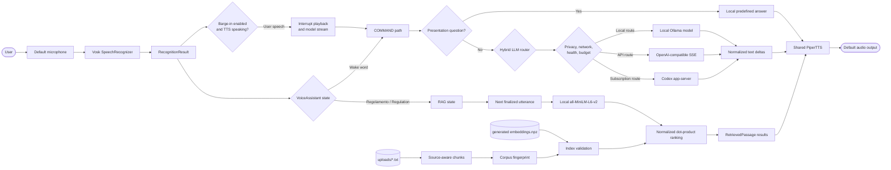
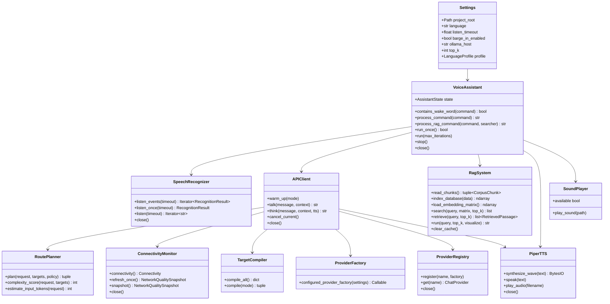
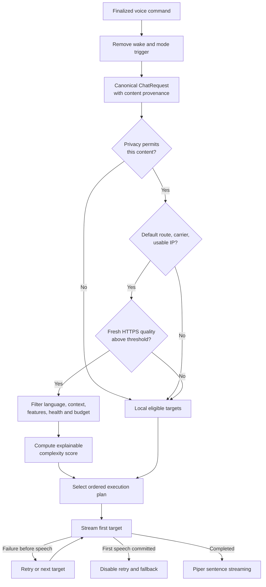
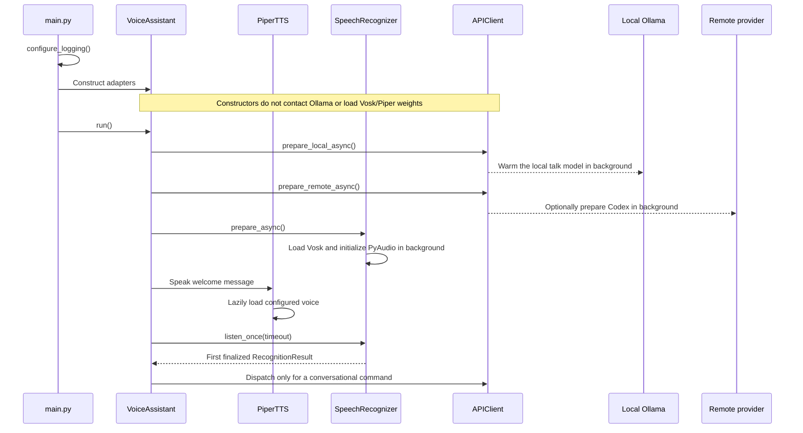
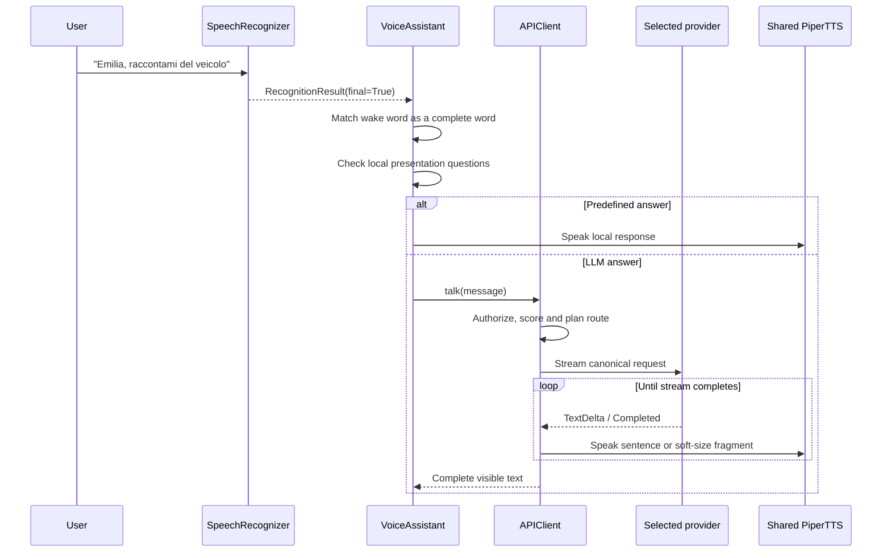
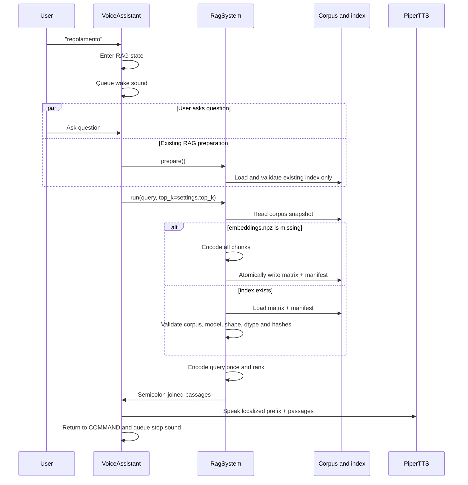

# Architecture




### Design and responsibilities

The application uses a small composition-root architecture:

- `main.py` configures logging and owns the top-level application lifecycle.
- `VoiceAssistant` coordinates state without implementing hardware details.
- `SpeechRecognizer` isolates PyAudio and Vosk.
- `BargeInDetector` identifies sustained PCM energy or non-empty Vosk events,
  with an injected pure echo-suppression policy.
- `APIClient` preserves the public `talk()`/`think()` API while provider
  adapters, connectivity, routing, streaming safety, privacy, health, budget,
  and metrics remain internal.
- `RagSystem` owns corpus chunking, index generation, integrity validation, and
  ranking.
- `PiperTTS` isolates voice loading, synthesis, WAV parsing, and playback.
- `SoundPlayer` delegates short cues to `aplay` with a bounded timeout.
- `Settings` and `LanguageProfile` centralize validated configuration.

Production services have defaults, but `VoiceAssistant` accepts injected
recognizer, TTS, sound, API, RAG, executor, random-choice, and sleep
implementations. This keeps the hardware path convenient while allowing the
same orchestration to be tested without opening a microphone, loading neural
models, or contacting Ollama.

Dependency direction is intentionally one-way:

```text
main.py
  `-- VoiceAssistant
      |-- SpeechRecognizer
      |-- APIClient
      |   `-- shared PiperTTS
      |-- RagSystem (created only when RAG is first used)
      `-- SoundPlayer
```

### Component interaction



## Hybrid inference and data flow

The repository defaults to the Codex/ChatGPT-subscription profile with
`remote_first` routing and local Ollama fallback. Remote transmission still
passes through the same sequence of fail-closed checks:



Helios owns an in-memory logical conversation session above the providers. It
commits each finalized user turn once and commits assistant text only after a
successful completion. Ollama receives the bounded canonical user/assistant
history on every turn, including after provider fallback. When
`HELIOS_LLM_ALLOW_REMOTE_CONTEXT=true`, Codex resumes a healthy ephemeral thread
and recovers an interrupted, stale, idle, or capped physical thread by starting
a replacement and rehydrating it from the same canonical history. The session
is intentionally not persisted across process restarts.

Natural barge-in and Codex multi-turn context are enabled by default in the
application and bundled Codex profile; no environment overrides are required.
Set `HELIOS_BARGE_IN_ENABLED=false` or
`HELIOS_LLM_ALLOW_REMOTE_CONTEXT=false` to opt out. Remote context means prior
in-session turns may be transmitted remotely. Startup logs explicitly report
whether Codex context is enabled and warn when each remote request will use a
fresh physical thread. A `local_only` turn,
local-document-derived answer, or unredacted `remote_redacted` turn remains
ineligible for later remote history until an explicit session reset.

### Routing and model selection

`RoutePlanner` supports five policies:

| Policy | Eligible-target order |
|---|---|
| `local_only` | Local targets only |
| `remote_only` | Remote targets only |
| `local_first` | Local targets, then remote targets |
| `remote_first` | Remote targets, then local targets |
| `auto` | Complexity score chooses local-first or remote-first |

Candidate order is declared separately for `talk` and `think`. Eligibility
checks target/provider enablement, allowlists and denylists, language,
capabilities, conservative context size, health, privacy authorization,
connectivity, and—when enabled—catalog and budget state.

The complexity score adds:

- 2 points when input plus reserved output exceeds 80% of the largest eligible
  local context;
- 1 point for `think`;
- 1 point above 160 conservatively estimated input tokens;
- 1 point for an Italian or English reasoning cue;
- 1 point for at least three connectors or question separators;
- 1 point for more than 64 estimated context tokens;
- 2 points when an API caller supplies `request_options={"complex": true}`.

For `auto`, the mode's `complexity_threshold` controls local-versus-remote
order. Independently, remote targets with `min_complexity_score` form a model
cascade: the planner keeps only the healthy tier with the highest floor not
exceeding the score. The committed Codex profile maps scores as follows:

| Score | Talk/think remote model | Typical intent |
|---:|---|---|
| 0–2 | `gpt-5.6-luna` | Short, direct requests |
| 3–4 | `gpt-5.6-terra` | Explanations and moderate reasoning |
| 5+ | `gpt-5.6-sol` | Longer, multi-step work |

Only one remote tier is attempted before the local fallback. Helios does not
try all three remote models serially during an outage. Model availability is
account-dependent and must be checked on the deployment device.

See [Adaptive remote model routing and latency](docs/ADAPTIVE_REMOTE_ROUTING.md)
for scoring, calibration, speech chunking, and benchmark guidance.

### Connectivity gate

When network monitoring is enabled, a request never waits for a new Internet
probe. A synchronous Linux-only passive check reads kernel route/address state
and requires:

1. an IPv4 or IPv6 default route;
2. an allowed interface, and Wi-Fi when configured;
3. `operstate` equal to `up` or `unknown`;
4. no explicit `carrier=0`;
5. a usable non-loopback, non-link-local address.

Failure removes remote targets immediately. A background monitor then validates
the real HTTPS path with bounded DNS, TCP, TLS, time-to-first-byte, and
application payload measurements. It smooths TTFB, variation, success ratio,
payload rate, and available Wi-Fi signal into a zero-to-one quality score with
hysteresis. Netlink route events wake the monitor when Linux link state changes.
A failed probe, stale result, captive/intercepted TLS path, changed interface,
or sub-threshold score fails closed.

Run the sanitized diagnostic with the active routing profile:

```bash
export HELIOS_LLM_CONFIG="$PWD/examples/llm-routing.codex-subscription.toml"
export HELIOS_LLM_REMOTE_ENABLED=true
python scripts/network_diagnostics.py
```

Exit status is zero only when the remote path is admitted. The JSON deliberately
omits addresses, URLs, prompts, responses, tokens, and credentials. Detailed
tuning is in
[Fast connectivity and network-quality routing](docs/NETWORK_CONNECTIVITY_ROUTING.md).

### Privacy, cost, and failure safety

Remote content is labeled by origin. Raw transcripts, conversation/tool
context, and local documents have independent permission gates; unknown-origin
content never leaves the device. `remote_redacted` additionally requires every
non-static message to be explicitly marked as already redacted. Helios does not
implement a general-purpose redactor.

When budget enforcement is enabled, a strict expiring JSON catalog defines the
exact provider/model identity, context limits, output limits, and decimal token
prices. An append-only ledger reserves the conservative maximum before
dispatch, then settles returned usage. Missing usage settles the full
reservation. A missing/stale catalog, corrupt/unwritable ledger, price mismatch,
clock rollback, or exceeded per-request/daily/monthly limit blocks remote
execution.

Every provider adapter performs one transport attempt; retry and fallback are
owned centrally. Text received before speech is discarded if an attempt fails.
After Helios commits the first fragment to Piper, retry and fallback are
disabled because replaying another answer could duplicate speech already heard.
Reasoning deltas are neither spoken nor returned as visible text. Refusal,
cancellation, and TTS errors are terminal.

## Runtime workflows

### Startup



The constructor establishes the dependency graph without performing network
requests or opening audio devices. The first welcome message loads Piper, and
the runtime begins loading Vosk and initializing PyAudio in a background thread
at the same time. The input stream is opened only when listening begins. The
Ollama SDK client remains lazy until an explicit warm-up or an inference turn.
At runtime, Helios starts one local, empty-prompt warm-up in a background
thread before the greeting, so the first real command does not compete with a
cold model load. The adapter admits only one Ollama request at a time until its
worker has actually exited. If the current network gate admits a configured
Codex route, app-server startup and ChatGPT account validation also begin in a
background thread while the welcome message is spoken. Preparation sends no
user transcript and starts no conversation turn.

The embedding model and corpus are not loaded during normal startup. When the
user enters RAG mode, Helios prepares the model and any existing validated
index in the background while the user asks the question. A missing index is
not built during listening; that expensive operation remains part of the query
path or the explicit index-building command.

### Conversational command



Only finalized recognition results are executed. Partial phrases and measured
PCM energy are available through `listen_events()` and, while default-on barge-in is
active, can duck current playback for a plausible speech candidate. Confirmed
final speech cancels the response. One continuous microphone/Vosk
session then flushes the finalized interruption utterance, which is executed as
an immediate follow-up without another wake word. A finalized utterance during
model generation or TTS synthesis also supersedes that response instead of
being discarded. After a response completes normally, finalized follow-ups are
accepted without another wake word until the configured conversation idle
timeout. Partial text is never sent to a model as a normal idle command.

Provider failures are retried or routed to the next target only while doing so
is safe. Once speech has started, a failed stream is not replayed because doing
so could duplicate audio already heard by the user. TTS failures are preserved
as TTS errors rather than being relabeled as network failures.

### Interruptible conversation

Barge-in is enabled by default (`HELIOS_BARGE_IN_ENABLED=true`). It keeps one
Vosk capture session active during response generation, synthesis, and playback.
Plausible speech first ducks playback; a confirmed final interrupts speech and
cancels model work. Cached neutral backchannels may play after a configurable
700 ms delay while a response is pending. Fast real speech supersedes the cue,
and a playing cue is cancelled before response speech. Local controls and
sensitive-confirmation modes suppress cues. Acoustic thresholds still require
calibration on the deployed microphone, speaker, enclosure, and playback level.

```mermaid
sequenceDiagram
    participant User
    participant VA as VoiceAssistant
    participant STT as Vosk
    participant API as APIClient
    participant TTS as PiperTTS

    VA->>API: Run response on two-worker conversation executor
    API->>TTS: Speak streamed fragment
    par Playback
        TTS-->>User: Response audio
    and Barge-in monitoring
        User->>STT: Begin follow-up while audio plays
        STT-->>VA: Provisional revision
    end
    VA->>TTS: duck() for plausible candidate
    STT-->>VA: Authoritative final
    VA->>TTS: interrupt() after confirmation
    VA->>API: cancel_current() after confirmation
    Note over API: Cancellation is terminal; no retry/fallback
    STT-->>VA: Finalized follow-up
    VA->>API: Process follow-up without another wake word
```

Playback uses 100 ms output chunks, allowing another thread to stop between
writes and leaving the stream reusable for the next response. Backchannels are
cached WAVs rather than on-demand synthesis. The detector uses measured PCM RMS
and a conservative software echo gate; see
[`docs/BARGE_IN_DESIGN.md`](docs/BARGE_IN_DESIGN.md) for calibration guidance,
the scripted first-audio benchmark, rejected AEC alternatives, and the
cancellation/budget contract.

The current floor, task-state, migration and 45-requirement audit is in
[`docs/live-conversation-final-audit.md`](docs/live-conversation-final-audit.md).
The optional task API operates on injected fake work only; it does not connect
calendar, messaging, booking, vehicle or robot services.

### RAG query



The active RAG path is extractive. It returns matching source passages directly
and does not send them to Ollama for generative synthesis. The structured
`retrieve()` API retains source filenames and scores; the compatibility
`run()` method returns plain semicolon-joined text.

### Shutdown

`Ctrl+C`, `VoiceAssistant.stop()`, context-manager exit, or the end of a bounded
test run reaches the same idempotent cleanup path:

1. stop the assistant loop;
2. wait for the single notification-sound worker;
3. close the microphone recognizer;
4. terminate owned PyAudio resources;
5. close the API/TTS adapters without closing shared instances twice;
6. mark the assistant closed so it cannot be restarted accidentally.

Each `aplay` operation has a default ten-second timeout, preventing a wedged cue
process from blocking shutdown indefinitely.

## Repository structure

```text
.
|-- main.py                         Application entry point and logging setup
|-- assistant.py                    Dependency composition and state machine
|-- config.py                       Settings, language profiles, compatibility aliases
|-- pyproject.toml                  Pytest/Ruff configuration; source-checkout contract
|-- requirements.txt                Portable desktop dependency entry point
|-- requirements-runtime.txt        Platform-neutral direct dependencies
|-- requirements-jetson.txt         Jetson-specific installation contract
|-- requirements-remote.txt         Optional remote SSE and Codex dependencies
|-- requirements-dev.txt            Model-free test and quality dependencies
|-- assets-manifest.json            Machine-readable asset inventory and hashes
|-- THIRD_PARTY_NOTICES.md          Provenance and redistribution gaps
|-- api/
|   |-- api_client.py               Public talk/think facade and composition
|   |-- provider_factory.py         Lazy configured-adapter construction
|   |-- target_compiler.py          Settings-to-execution-target compilation
|   |-- routing.py                  Eligibility, policies, complexity scoring
|   |-- streaming.py                Retry, fallback, speech and settlement
|   |-- connectivity.py             Linux passive gate and HTTPS quality monitor
|   |-- privacy.py                  Provenance-aware remote authorization
|   |-- health.py                   Provider/model circuits and cooldowns
|   |-- catalog.py                  Strict expiring model/price catalog
|   |-- budget.py                   Durable reservation and settlement ledger
|   |-- metrics.py                  Content-free metric schema and recorder
|   |-- providers/
|   |   |-- contracts.py            Provider-neutral requests and stream events
|   |   |-- ollama.py               Local or explicitly trusted Ollama adapter
|   |   |-- openai_chat_sse.py      Strict Chat Completions SSE adapter
|   |   `-- codex_app_server.py     ChatGPT-subscription Codex adapter
|   |-- Modelfile-IT                Italian Emilia Ollama definition
|   `-- Modelfile-EN                English Emilia Ollama definition
|-- audio/
|   |-- tts.py                      Piper synthesis and PCM playback
|   |-- sound_player.py             Bounded ALSA cue playback
|   |-- playback.py                 Compatibility exports for historical imports
|   `-- models/                     Bundled Italian and English Piper voices
|-- document/
|   `-- rag_system.py               Chunking, indexing, validation, and retrieval
|-- models/
|   `-- all-MiniLM-L6-v2/           Bundled SentenceTransformer model
|-- recognizer/
|   |-- speech_recognizer.py        Vosk/PyAudio recognition boundary
|   `-- models/                     Bundled Italian and English Vosk models
|-- observability/
|   |-- activity.py                 Local/remote inference activity correlation
|   |-- service.py                  Optional KPI lifecycle and composition
|   |-- storage.py                  Versioned SQLite storage and retention
|   |-- aggregate.py                Bounded summaries, percentiles, and series
|   |-- resources.py                Cross-platform and Jetson resource sampling
|   |-- dashboard.py                Local-first read-only HTTP API
|   `-- static/                     Dependency-free dashboard assets
|-- scripts/
|   |-- build_index.py              Explicit RAG index builder
|   |-- doctor.py                   Environment and asset validator
|   |-- run_jetson.py               Virtualenv/OpenMP-aware Jetson launcher
|   |-- network_diagnostics.py      Sanitized route and HTTPS quality report
|   |-- codex_subscription.py       Device login, status, and model listing
|   |-- kpi.py                      KPI status, clear, export, and dashboard CLI
|   |-- benchmark_kpi.py            Synthetic KPI performance benchmark
|   `-- smoke_tts.py                Manual Piper/audio smoke command
|-- docs/
|   |-- HYBRID_LLM_OPERATIONS.md    Security, deployment, live-test checklist
|   |-- CODEX_SUBSCRIPTION.md       ChatGPT sign-in and Codex operation
|   |-- ADAPTIVE_REMOTE_ROUTING.md  Complexity tiers and latency tuning
|   |-- KPI_OBSERVABILITY.md        KPI definitions, dashboard, privacy, operations
|   `-- NETWORK_CONNECTIVITY_ROUTING.md
|                                    Network decision and calibration details
|-- examples/
|   |-- llm-routing.offline.toml    Explicit local-only policy
|   |-- llm-routing.codex-subscription.toml
|   |                                Remote-first ChatGPT/Codex policy
|   |-- llm-routing.free-tier-first.toml
|   |-- llm-routing.paid-first.toml
|   |-- llm-routing.local-first-escalation.toml
|   `-- model-catalog.example.json  Deliberately stale fail-closed template
|-- tests/
|   `-- test_*.py                   Model-free unit/integration-style coverage
|-- uploads/
|   |-- qa_pairs.txt                Question-and-answer knowledge
|   |-- regolamento.txt             Competition regulations
|   `-- team_notice.txt             Control-stop notice
|-- sounds/
|   |-- wake_up.wav                 RAG-entry cue
|   `-- stop.wav                    RAG-completion cue
|-- pictures/
|   |-- heliosAI.png                Project logo
|   `-- emilia5.9.bmp               Emilia 5.9 photograph
|-- prompts/
|   `-- update_readme.txt           Technical-writing prompt for this README
|-- .env.example                    Non-secret deployment variable template
|-- .github/workflows/quality.yml   Cross-platform quality workflow
|-- .gitattributes                  Line-ending and future LFS policy
|-- .gitignore                      Generated/runtime artifact exclusions
`-- LICENSE                         MIT license
```

Generated files such as `embeddings.npz`, logs, caches, virtual environments,
and synthesized audio are intentionally ignored.

Helios currently runs from a source checkout. The bundled models, corpus, and
audio assets are not packaged into a Python wheel, so `pyproject.toml`
deliberately configures repository tools without advertising an installable
console command.

## Technology stack and dependencies

| Technology | Role in the active runtime |
|---|---|
| Python 3.10+ | Application, orchestration, adapters, scripts, and tests |
| Vosk | Offline Italian/English speech recognition |
| PyAudio / PortAudio | 16 kHz mono microphone capture |
| Ollama Python SDK | Streaming communication with a local chat model |
| HTTPX | Optional timed HTTPS and OpenAI-compatible SSE transport |
| `openai-codex` | Optional native Codex app-server and ChatGPT authentication |
| Gemma 3 GGUF | Base model referenced by the included Ollama Modelfiles |
| Piper | Offline neural text-to-speech |
| ONNX Runtime | Piper inference backend |
| `sounddevice` | Playback of synthesized PCM audio |
| ALSA `aplay` | Wake and completion cue playback |
| SentenceTransformers | Local corpus and query encoding |
| PyTorch | SentenceTransformer inference backend |
| NumPy | Matrix storage, validation, normalization, and ranking |
| SQLite / Python HTTP server | Optional KPI persistence and local dashboard, using only the standard library |
| Pytest | Model-free unit tests |
| Ruff | Linting and formatting checks |
| GitHub Actions | Linux/Windows automated quality checks |

No inbound listener starts by default. The optional KPI dashboard exposes only a
versioned, read-only operational API; it is disabled by default and binds to
`127.0.0.1` unless explicitly reconfigured. `APIClient` remains an in-process
facade, and provider integrations remain outgoing clients behind typed
contracts. The dashboard adds no third-party runtime or frontend dependency.

### Dependency files

| File | Intended use |
|---|---|
| `requirements-runtime.txt` | Dependencies that resolve consistently across desktop and Jetson |
| `requirements.txt` | Desktop install, adding generic Torch, ONNX Runtime, and Piper |
| `requirements-jetson.txt` | Shared dependencies after platform backends are provisioned |
| `requirements-remote.txt` | Optional HTTP/SSE and native Codex app-server clients |
| `requirements-dev.txt` | Model-free test and lint dependencies, including the fake-transport HTTP surface |

Jetson inference packages are deliberately not pinned to guessed public wheel
URLs. Torch and ONNX Runtime must match the exact JetPack/L4T image.

## Main components

### `main.py`

`main.py` is intentionally small:

1. configure file or stream logging from `Settings`;
2. construct `VoiceAssistant` as a context manager;
3. call `run()`;
4. return through deterministic cleanup.

The default log is `app.log` under the project root. It is opened in append mode
and library logging is not globally disabled.

### `VoiceAssistant`

`VoiceAssistant` implements two states:

- `COMMAND` accepts wake-word commands and the RAG trigger;
- `RAG` treats the next finalized utterance as a retrieval query and then always
  returns to `COMMAND`.

Its most important methods are:

- `run_once()` — consume and route at most one finalized utterance;
- `process_command()` — remove the wake word, select talk/think, and dispatch
  the model request;
- `process_rag_command()` — execute retrieval and speak the localized result;
- `run()` — speak the greeting and maintain the recoverable main loop;
- `close()` — release owned resources exactly once.

Wake words are matched as complete words, avoiding accidental activation by
larger words such as `emiliana`. The activation occurrence is removed before
inference. Italian commands prefixed with `pensa` or `ragiona` use `think`;
English commands use `think` or `reason`.

### `SpeechRecognizer`

The active recognizer:

- lazily loads the selected Vosk model;
- lazily creates the PyAudio interface;
- opens a configured input, or the platform default, as 16 kHz, 16-bit mono PCM;
- reads 1,600 frames per iteration (100 ms at 16 kHz);
- emits `RecognitionResult(text, is_final)` values;
- returns from `listen_once()` on the first final phrase;
- can retain the historical text-only `listen()` generator interface;
- stops and closes every stream in a `finally` block;
- terminates an owned PyAudio instance during `close()`;
- resolves `HELIOS_AUDIO_INPUT_DEVICE` by index or by one unambiguous
  capture-capable device name, and fails instead of silently falling back when
  the requested microphone is absent.

### `APIClient`

The compatibility boundary:

- defaults to the same lazy Ollama client and model payloads;
- keeps `talk()`, `think()`, `warm_up()`, shared Piper, and idempotent cleanup;
- normalizes provider streams before sentence-level speech;
- registers provider adapters lazily and builds per-language execution targets;
- constructs canonical, provenance-labeled messages and applies the shared
  Emilia system instruction only when a hybrid routing file is active;
- supports Ollama, OpenAI-compatible Chat Completions SSE, and Codex app-server
  providers;
- retries or switches targets only before speech is committed; a request that
  may already have been transmitted is never retried on the same provider;
- warms the local talk model once in the background at assistant startup,
  without sending a user transcript;
- supports strict remote privacy authorization, health cooldowns, an expiring
  price catalog, durable budgets, and content-free metrics;
- never performs remote warm-up;
- raises sanitized `APIClientError` values after routing is exhausted.

The configured host defaults to `http://localhost:11434`.

The supporting modules separate policy from transport:

| Module | Responsibility |
|---|---|
| `providers/contracts.py` | Typed messages, requests, deltas, completion metadata, usage, errors, cancellation, and capabilities |
| `provider_factory.py` | Converts validated provider settings into lazy adapter factories without importing optional transports at startup |
| `target_compiler.py` | Compiles talk/think candidate chains, limits, prices, language models, priorities, and emergency-local behavior into execution targets |
| `routing.py` | Lazy registry, eligibility, policy ordering, input estimation, and adaptive tier selection |
| `streaming.py` | Attempt loop, text buffering, speech commit, retry/fallback, health, metrics, and budget settlement |
| `connectivity.py` | Passive Linux path inspection, active TLS/HTTPS probe, smoothing, and hysteresis |
| `privacy.py` | Origin-specific authorization and dispatch-time revalidation |
| `health.py` | Exponential provider/model circuits, quota/auth state, and latency EWMA |
| `catalog.py` / `budget.py` | Strict model identity/pricing and durable spending limits |
| `metrics.py` | Validated content-free operational events |

### `RagSystem`

`RagSystem` uses the bundled `all-MiniLM-L6-v2` model:

1. read top-level `uploads/*.txt` files in deterministic filename order;
2. split each source independently at sentence boundaries;
3. retain source filename and ordinal for every chunk;
4. encode chunks in configurable batches;
5. explicitly L2-normalize every vector;
6. write an atomic compressed NPZ containing the matrix and manifest;
7. validate the complete index before searching;
8. encode each query once;
9. rank by normalized dot product with deterministic tie ordering;
10. cache the corpus and matrix for subsequent queries.

The current corpus produces 1,115 deterministic chunks. At this size a stable
full ranking is simpler and sufficiently fast; an approximate-nearest-neighbor
service is not justified without a substantially larger measured corpus.

### Audio

`PiperTTS` synthesizes into an in-memory WAV buffer, reopens the buffer with the
standard `wave` module, and passes only PCM frames plus their format metadata to
`sounddevice`. It does not write a shared `output.wav` file and does not treat
the WAV header as audio samples.

The old public name `Pyttsx3TTS` remains as an alias to `PiperTTS` for
compatibility. It does not import or use `pyttsx3`.

The public `PiperTTS.speak(text)` method also retains its historical `None`
return value. KPI instrumentation uses the internal `speak_with_timing(text)`
path to collect content-free synthesis and playback timing without changing the
legacy caller contract.

`SoundPlayer` resolves `aplay` only when a cue is requested. Cue playback runs
on one reusable assistant worker and has a configurable timeout.

`SoundDeviceBackend` uses a conservative `high` output latency by default to
avoid underruns on ALSA/PulseAudio bridges. Set `HELIOS_AUDIO_OUTPUT_DEVICE` to
an index or a sounddevice name to pin the speaker, and set
`HELIOS_AUDIO_OUTPUT_LATENCY=low` only after measuring reliable playback.

