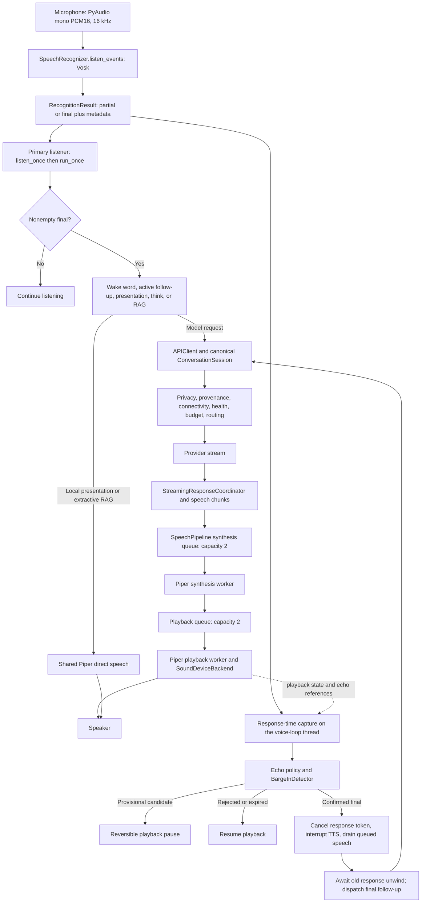

# Live conversation implementation checkpoint

The 2026-09-24 field-defect remediation and the closing work order are tracked in
[`prompts/finalize_helios_voice_stack.md`](../prompts/finalize_helios_voice_stack.md) and
[`docs/voice-test-suite-progress.md`](voice-test-suite-progress.md).

## Resume state

- Task: **16 - Documentation and final audit**.
- Status: **completed**. Task 15 local and Emilia gates and the Task 16 final documentation gate passed.
- Completed task IDs: **00, 01, 02, 03, 04, 05, 06, 07, 08, 09, 10, 11, 12, 13, 14, 15, 16**.
- Next execution task: **none**. The numbered plan is complete; optional tracks remain deferred.
- Execution policy: the latest user instruction (2026-09-23) authorizes sequential work through Task 16. The previous Task 10 stop instruction is superseded. No sub-agents or optional tracks are authorized.
- Task 02 passed mandatory Emilia validation on 2026-09-19. Its verified source hashes, test/resource results, synthetic native-inference evidence, and earlier resolved authentication failure are retained below. Historical handoff text does not override this current resume state.

## Task 11 - completed implementation and validation

Added `api/task_manager.py`: bounded, lock-linearized provider-neutral task states; stable IDs; cancellation tokens; immutable content-free snapshots; validated transitions; confirmed-only completion; bounded terminal retention; and a deterministic fake backend. No external service, floor-state change, model call, or task delegation was added. `tests/test_task_manager.py` covers lifecycle, invalid transitions and bounds, retention, parent links, cancellation and concurrent terminal races.

Local gate: `py_compile api/task_manager.py tests/test_task_manager.py` passed; `ruff check api/task_manager.py tests/test_task_manager.py` passed; `pytest -q tests/test_task_manager.py` **6 passed**; `pytest -q` **2,049 passed, 2 skipped in 22.08 s**. The two existing skips are Windows symlink privilege and disabled live provider requests. Target validation is not applicable: the added state core touches no audio, native inference, device resources, networking or shutdown. Task 12 is next.

## Task 12 - completed implementation and validation

Added `api/task_delegation.py` with bounded worker execution of injected fake work, explicit confirmation before commit, cancellation and content-free status messages. `VoiceAssistant` accepts an optional injected delegator; its local `CANCEL_TASK` command targets the active delegated task without cancelling model work or speech. The fake backend only reports completion after the injected work returns success. No real service or automatic language-model task inference is connected.

Local gate: `py_compile assistant.py api/task_delegation.py tests/test_task_delegation.py` passed; Ruff passed; focused delegation/control tests **61 passed** after the status-message and steering additions; complete suite **2,054 passed, 2 skipped in 22.13 s**. Target validation is not applicable because this step uses fake work and does not touch device audio, native inference or networking.

## Task 13 - completed implementation and validation

Explicit steering uses a replace policy: `VoiceAssistant.steer_task` supersedes the named task and starts injected replacement work with a parent ID. A late result from superseded work is ignored. The assistant's canonical conversation history is untouched. The shared 61-test focused and 2,054-test full gate above covers replacement, causal links, late completion and local control; no automatic speech-based task interpretation was added.

## Task 14 - completed verification

No production defect was found, so no Task 14 runtime edit was made. Focused `pytest -q tests/test_privacy.py tests/test_routing.py tests/test_hybrid_api_client.py tests/test_streaming.py tests/test_conversation_continuity.py tests/test_control_intents.py tests/test_task_delegation.py tests/test_task_manager.py`: **161 passed in 1.28 s**. The complete 2,054-test gate above also passed. The new task boundary uses injected fake work only, and exact local controls do not enter model history. Task 15 is next.

## Task 15 - completed implementation and validation

Added `tests/test_task_stress.py`: 50 linked fake tasks with bounded retained snapshots, 20 repeated cancellations with late-result rejection, a bounded-close timeout, and a cooperative no-surviving-task-worker assertion. `TaskDelegator` now prunes evicted futures and records content-free terminal state and task latency. `VoiceAssistant` records content-free response cancellation, candidate expiry and endpoint events. The API already records request-relative actual first audio and fallback/error fields; task-specific metrics remain separate from canonical history. The deterministic task gate checks bounds and cancellation under repeat use; it does not simulate an uncooperative native backend safely terminating its worker.

Local final Task 15 gate: `py_compile assistant.py api/task_manager.py api/task_delegation.py tests/test_task_manager.py tests/test_task_delegation.py tests/test_task_stress.py scripts/validate_task15_resources.py`; Ruff on the same files; full `pytest -q`: **2,057 passed, 2 existing skips in 21.60 s**. `git diff --check` passed. The two skips remain Windows symlink privilege and disabled opt-in live provider requests.

The prior SSH denial was sandbox network policy, before authentication. With user authorization, an escalated public-key connection succeeded using the existing key and stored ED25519 fingerprint `SHA256:Q5XLVdyAxGurG7fmlQ0npEbJzA19vVtwB+sBFmyMl0s`. The corrected password was not used or stored. The isolated `/home/emilia/helios-live-conversation-validation-20260923-task15` copy was created from the verified Task 10 directory after absence was checked. Only the changed assistant/task source, focused tests and resource helper were overlaid. Local and target SHA-256 hashes matched for all six transferred source/test files; the final assistant overlay was revalidated by static and full target gates. No device configuration, credentials, models, corpus, user audio, service or real provider were changed.

Emilia: Linux `4.9.253-tegra-aarch64`, Python from `/home/emilia/helios-ai-jetson-framework/venv/bin/python3`, pytest **8.4.2**. Static compile and Ruff passed with 30-second command bounds. The measured focused gate ran under a 240-second bound with sanitized environment: **14 passed in 1.92 s**, wrapper wall **3.114 s**, CPU user/system **2.944/0.140 s**, peak child RSS **47,640 KiB**. The final complete target suite under a 240-second bound: **1,140 passed in 21.85 s**. These are synthetic software tests, not physical acoustic, sustained thermal/power or production latency certification. Task 15 is complete under its local and target gates.

## Task 16 - completed documentation and final audit

Updated `README.md` for default-on barge-in, candidate duck before confirmed cancellation, activation timeout, in-process memory and fake-only task API. Added `docs/live-conversation-final-audit.md` with architecture, migration, 45 requirement ratings/evidence, explicit deferrals and the limits of Jetson acoustic, latency, resource, thermal and power evidence. A final checker matched all 45 unique ordered requirement IDs and exact titles to the historical source matrix, found 6 supported, 24 partial and 15 unsupported, and verified trailing whitespace/final newline. The complete Task 16 local `pytest -q` passed **2,057 tests, 2 existing skips in 21.97 s**. `git diff --check` passed with only ordinary CRLF normalization notices. No optional track was started. **Task 16 complete. STOP.**

## Task 10 - completed implementation and validation

### Scope, decisions and interfaces

Validation HEAD: `d0446f0bb04ac74aaebd59f858ee0ba5170a4fb2`, plus the uncommitted worktree identified by the validation manifest. Existing commits, user deletions/audit files, dependencies, model/corpus assets and device configuration were preserved. The latest instruction authorizes Task 10 and stopping before Task 11.

- `audio/backchannel.py`: `BackchannelSession` retains delayed, cached-only playback and scoped cancellation. Its cooperative stop signal now includes request cancellation and an admission predicate, checked while waiting and during native playback. Suppression is terminal for that cue. Invalid/non-finite delay and supersession timeout inputs are rejected. `before_first_speech` requires the worker to stop within **2 seconds**, otherwise it raises a content-free timeout and prevents real speech from being queued. The response cleanup barrier also has a **2-second** bound; an unreleased cue stops the assistant. Legacy direct `supersede(timeout=None)` remains available, while runtime barriers use finite bounds.
- `assistant.py`: cue admission requires the current response ID, the `THINKING` floor, no provisional revision, normal pacing mode and enabled speech output. A provisional event immediately cancels an optional cue without dispatching text or cancelling model/history. Candidate floor changes, interruption, controls and request cancellation also suppress playback. `set_backchannel_mode(BackchannelMode.DICTATION | SENSITIVE_CONFIRMATION | NORMAL)` provides a typed local flow hook; changing to a suppressing mode cancels an active cue, and returning to normal permits only future cues. `suppress_backchannel_for` applies conservative Italian/English dictation/confirmation prefixes to authoritative requests before cue scheduling. It never authorizes an action or changes the request.
- Fresh wake-plus-command input no longer plays an immediate filler before the delay. Wake-only activation uses the separate localized acknowledgement **"Ti ascolto." / "I'm listening."**, preloaded at startup and never sent to a model. Cached thinking cues are neutral: Italian **"Un momento.", "Vediamo.", "Sto valutando la richiesta."**; English **"One moment.", "Let's see.", "I'm considering that."**. The existing cache-ready selection, rotation and scoped playback-start race protection remain intact.
- `config.py` and `api/api_client.py`: static localized `spoken_response_instruction(language)` requests concise answers by default, expansion when requested or required, preservation of essential detail/uncertainty/safety, and no action-completion claim without backend confirmation. Additive `APIClient(spoken_response_style=False)` preserves standalone/injected client compatibility; the assistant enables it on the client it constructs. Embedders providing their own API client opt in explicitly. Style is a `STATIC_INSTRUCTION` system message on spoken requests only, survives eligible provider fallback, and never enters canonical history. Silent `think` requests retain their existing behavior. No output truncation, token cap, model change, or weakening of routing/privacy/provenance/budget/health/no-replay gates was introduced. `SpeechChunker` was reviewed and its existing whole-word/soft-boundary behavior retained.
- `tests/test_backchannel_policy.py`: **51 additional cases** cover bilingual admission/false matches, typed modes, provisional/silent pauses, active-cue interruption, delayed-start cancellation, dependency failure, bounded failure with an uncooperative backend, cleanup, malformed timing, static provenance, fallback, canonical history and complete detailed output. `tests/test_conversational_pacing.py` updates bilingual rotation expectations while retaining fast/slow and pre-playback race assertions. `tests/test_assistant.py` distinguishes wake-only acknowledgement from delayed command cues and verifies startup preload ordering.

Suppression prefixes are conservative local heuristics, not general dictation or sensitive-action understanding. Local flows must set the explicit mode when context requires suppression without a recognizable prefix; full dictation/task/confirmation workflows remain future work. Cues still require barge-in enabled and a cancellation-aware cached backend. No cue is scheduled while the user retains a provisional/paused primary turn. Cooperative cancellation cannot recall frames already submitted by a backend, and a blocked native call retains the existing bounded terminal-shutdown limitation. No task manager, external action or Task 11 behavior was added.

### Exact local gate

```powershell
$taskPython = Join-Path $env:TEMP 'helios-live-conversation-task00-20260918/Scripts/python.exe'
& $taskPython -m py_compile assistant.py api/api_client.py config.py audio/backchannel.py tests/test_assistant.py tests/test_conversational_pacing.py tests/test_backchannel_policy.py
& $taskPython -m ruff check assistant.py api/api_client.py config.py audio/backchannel.py tests/test_assistant.py tests/test_conversational_pacing.py tests/test_backchannel_policy.py
& $taskPython -m pytest -q tests/test_backchannel_policy.py tests/test_wake_sessions.py tests/test_control_intents.py tests/test_interruption_candidates.py tests/test_full_duplex_capture.py tests/test_realtime_conversation.py tests/test_turn_endpoint_detector.py tests/test_transcripts.py tests/test_conversation_control.py tests/test_assistant.py tests/test_conversation_continuity.py tests/test_recognizer.py tests/test_barge_in_detector.py tests/test_barge_in_integration.py tests/test_echo_suppression_policy.py tests/test_tts.py tests/test_tts_interrupt.py tests/test_speech_pipeline.py tests/test_speech_chunker.py tests/test_conversational_pacing.py tests/test_cancellation_contract.py tests/test_streaming.py tests/test_remote_context_continuity.py tests/test_remote_context_wiring.py tests/test_api_client.py tests/test_hybrid_api_client.py tests/test_routing.py tests/test_privacy.py tests/test_main.py tests/test_rag_system.py tests/test_provider_contracts.py tests/test_metrics.py tests/test_kpi_metrics.py tests/test_config_llm.py --tb=short
& $taskPython -m pytest -q
git diff --check
```

Final syntax/Ruff passed for all **7** changed/new Python files. Focused: **1,126 passed in 11.69 s**, exit 0. Full suite: **1,360 passed, 2 skipped in 23.08 s**, exit 0. Existing skips remain Windows symlink privilege and disabled opt-in live provider requests. No tests were skipped, weakened, removed or marked xfail to obtain a pass.

Initial test corrections used the existing `TranscriptBoundaryError` name, preserved propagation of a speech-barrier `TimeoutError`, and asserted the existing failed-turn history contract (retained user request, no assistant answer). The prior immediate-filler test was updated for the intended delayed-command behavior. All new behavior and pre-existing timing/streaming/control/privacy regressions passed afterward. The native-helper rehearsal initially used an incorrect adapter method name; correcting it to `play_interruptibly` passed both languages with a synthetic voice and zero new Python threads.

The first complete gate passed **1,126 focused tests in 12.70 s**, then reported **1 failed, 1,359 passed, 2 skipped in 23.79 s** in `tests/test_kpi_dashboard.py:test_cli_dashboard_json_export_is_an_array_not_a_json_string`. Its query returned an empty array. A separate `pytest -q tests/test_kpi_dashboard.py --tb=short` run passed **17 tests in 3.71 s**. Deterministic reproduction on unchanged HEAD code established an existing timestamp boundary: write one synthetic event at `timestamp_ms=2000000000000`; construct `KPIQueryService(store, clock=lambda: 2000000000.0)` and query `export` with `window_seconds=3600`, `format='json'`, `limit=25`: **0 rows**. Advance that query clock by **0.001 seconds**: **1 row**. The query end is exclusive, so the wall-clock test can miss a just-written event in the same millisecond. Normalized contents of `observability/storage.py`, `observability/aggregate.py`, `observability/dashboard.py` and `tests/test_kpi_dashboard.py` were compared byte-for-byte with `git show HEAD:<path>` and matched. These files were not modified. The entire static/focused/full gate above was then repeated without exclusions and passed; the pre-existing timing-sensitive test remains a recorded limitation.

### Mandatory Emilia gate on 2026-09-22

Authorized public-key-only SSH used strict stored host-key checking, one connection attempt and a five-second connect timeout. New isolated directory `/home/emilia/helios-live-conversation-validation-20260922-task10` was confirmed absent before creation. **88** allowlisted source/config/test files were transferred with SHA-256 verification; ZIP SHA-256: `f6fb69faafee4e0be74a47a6ffdcd52a8165885fb3af82bf17228ff8f94820e5`. Existing checkouts and prior validation reports remain untouched. No credentials, runtime configuration, model copies or user audio were transferred.

Python **3.10.0**, `Linux-4.9.253-tegra-aarch64-with-glibc2.27`; pytest **8.4.2**, numpy **2.2.6**, httpx **0.28.1**, Ruff **0.16.0**, tomli **2.4.1**, Vosk **0.3.45**, Piper **1.6.0**, PyAudio **0.2.14**. Target interpreter `/home/emilia/helios-ai-jetson-framework/venv/bin/python3` ran the same seven-file static commands and 34-module focused gate above, with pytest `--tb=short --basetemp=.test-tmp/task10`. Bounds were 30 seconds per static command, 240 seconds per pytest/native command and 600 seconds outer. Child environments stripped inherited `HELIOS_`/`LLM_` settings and set `PYTHONDONTWRITEBYTECODE=1`, `PYTEST_DISABLE_PLUGIN_AUTOLOAD=1`. Exact commands, versions and measurements are retained in `validation-task10-result.json`.

Target syntax/Ruff passed. Focused: **1,126 passed in 22.37 s**, exit 0; wrapper wall **24.226 s**, CPU user/system **19.960/0.784 s**, peak child RSS across static/test children **71,984 KiB**.

Native command: `/home/emilia/helios-ai-jetson-framework/venv/bin/python3 validate_task10_native.py`. The SHA-verified Task 09 helper retained real multilingual Piper-to-Vosk inference, exact native authoritative finals, same-stream decoder reset, concurrent lifecycle/drain, silence/early-close/pre-cancel, interruption candidates, local controls and activation/history-reset checks. Italian produced 7/8 partials and 1 final per capture (**3.048/2.977 s**); English produced 7 partials and 2 finals per capture (**4.461/4.521 s**). Phase checks took **4.334/5.229 s**, each with one input stream and five speech lifecycle events. Candidate expiry resumed complete buffered audio at **0.1657 s** under its 0.15-second setting. The 0.3-second activation fixture expired at **0.3038 s**, retained ten wake-free turns and reset history once.

New pacing checks used real Italian/English Piper synthesis and cached phrases, an interruptible memory backend, the actual assistant/API/pipeline, and synthetic provider results. Fast responses superseded the pending cue under a **2-second** test delay. With a **0.05-second** delay and an explicitly held provider result, cached playback began and was cancelled before real answer playback; no calls overlapped. Switching to sensitive-confirmation mode cancelled an active cached cue in **0.0103 s** for each language, and normal mode did not restart it. Each language made **4 memory playback calls** across these scenarios. No physical microphone/speaker, real user speech, live provider request or external action was involved. Measurements describe synthetic device fixtures and do not establish production acoustic quality or latency.

Native wall **76.295 s**, CPU user/system **115.376/1.620 s**, peak RSS **573,544 KiB**; wrapper wall **76.909 s**, exit 0. **Zero new Python threads** remained. Helper SHA-256: `553ade1c092055d9c183a9bac3c9da60f1144d615999cd8efffcb26f53e1c0b2`; sanitized native evidence: `validation-native-result.json`. All **88** target source hashes still matched after execution. SSH exited normally, and no target defect or subsequent implementation change was required.

### Documentation gate and disposition

All **45** source-matched FR rows, **95** AST file/symbol references, authoritative attachment hash and Markdown/rating/task constraints passed. Historical baseline ratings remain unchanged. All 88 validated source hashes matched locally and HEAD remained unchanged. `git diff --check` passed with ordinary CRLF normalization notices. The final checker verified Task 10 complete and Task 11 next/not started. The earlier KPI test failure and deterministic evidence remain recorded above. **Task 10 complete. Task 11 has not started. Stop under the latest user instruction.**

## Task 09 - completed implementation and validation

### Scope, decisions and interfaces

Validation HEAD: `d0446f0bb04ac74aaebd59f858ee0ba5170a4fb2`, plus the uncommitted worktree identified by the validation manifest. Existing commits, user deletions/audit files, dependencies, models/corpus and device configuration were preserved. The latest instruction authorizes completion of Task 09 and stopping before Task 10.

- `config.py`: additive `Settings.activation_timeout_seconds`, default **30.0 seconds**, configured by `HELIOS_ACTIVATION_TIMEOUT_SECONDS`. It requires a finite positive number, excluding booleans. It is independent of the one-call STT `listen_timeout` and canonical `llm.context_idle_timeout_seconds`; the field is appended to preserve existing positional construction.
- `assistant.py`: primary listening and public `process_command` share the monotonic activation window, including when barge-in is disabled. Wake-only activation makes no model/history turn. Accepted authoritative requests, successful response completion, explicit wake/RAG activation and suspended-session resume refresh activity. Silence, STT timeouts, provisional revisions, empty/whitespace-only input and output controls do not refresh it. Active responses retain activation until completion; expiry is inclusive at the deadline and checked before/after primary capture and at command admission. Ten successive wake-free follow-ups preserve canonical history across silent captures and local fallback.
- Voice expiry, `END_SESSION` and additive `VoiceAssistant.reset_conversation() -> bool` require a new wake and request canonical history reset. Reset stops speech, preserves ongoing model work, and returns `False` while the reset is pending. One pending reason coalesces repeated requests. `_finish_response` retries after success/failure unwinds; new requests call `_ensure_history_reset` and fail closed until reset succeeds. Reset clears history/provider-thread bindings and rejects late binding to the old session. Suspension/resume preserve history and remain distinct from ending a session.
- `api/api_client.py`: additive `try_reset_conversation(reason=...) -> str | None` acquires request ownership without waiting, returning `None` if busy or a canonical turn remains active. It returns the new session ID after reset. Existing blocking `reset_conversation` preserves its public contract but now resets canonical state before forgetting provider state, so a refused active-turn reset cannot discard a valid provider checkpoint. Existing canonical history bounds and idle retention remain unchanged.
- `tests/test_wake_sessions.py`: **28 additional cases** cover wake-only, ten follow-ups with barge-in on/off, public command admission, exact/just-before expiry, empty/provisional/silent input, independent history retention, termination/reactivation, suspension, provider fallback, concurrent reset during successful/failed generation, reset refusal/recovery, provider binding cleanup and invalid/environment configuration. `tests/test_assistant.py` updates the existing expiry regression to configure the new activation timeout explicitly.

Expiry is cooperative with capture/admission, not a background timer. A final arriving at or after expiry needs a new wake even if capture began earlier. Canonical retention remains separately configurable and may expire sooner than activation if configured that way. Legacy injected APIs with a reset method use that compatibility method; their callback's latency remains the embedder's responsibility. An injected API exposing canonical state without a reset interface fails closed; one without canonical state needs only local reset. No new worker, model call, external service, task manager or Task 10 behavior was added.

### Exact local gate

```powershell
$taskPython = Join-Path $env:TEMP 'helios-live-conversation-task00-20260918/Scripts/python.exe'
& $taskPython -m py_compile assistant.py api/api_client.py config.py tests/test_assistant.py tests/test_wake_sessions.py
& $taskPython -m ruff check assistant.py api/api_client.py config.py tests/test_assistant.py tests/test_wake_sessions.py
& $taskPython -m pytest -q tests/test_wake_sessions.py tests/test_control_intents.py tests/test_interruption_candidates.py tests/test_full_duplex_capture.py tests/test_realtime_conversation.py tests/test_turn_endpoint_detector.py tests/test_transcripts.py tests/test_conversation_control.py tests/test_assistant.py tests/test_conversation_continuity.py tests/test_recognizer.py tests/test_barge_in_detector.py tests/test_barge_in_integration.py tests/test_echo_suppression_policy.py tests/test_tts.py tests/test_tts_interrupt.py tests/test_speech_pipeline.py tests/test_speech_chunker.py tests/test_conversational_pacing.py tests/test_cancellation_contract.py tests/test_streaming.py tests/test_remote_context_continuity.py tests/test_remote_context_wiring.py tests/test_api_client.py tests/test_hybrid_api_client.py tests/test_routing.py tests/test_privacy.py tests/test_main.py tests/test_rag_system.py tests/test_provider_contracts.py tests/test_metrics.py tests/test_kpi_metrics.py tests/test_config_llm.py --tb=short
& $taskPython -m pytest -q
git diff --check
```

Syntax/Ruff passed for all **5** changed/new Python files. Focused: **1,075 passed in 9.94 s**, exit 0. Full suite: **1,309 passed, 2 skipped in 18.83 s**, exit 0. Existing skips remain Windows symlink privilege and disabled opt-in live provider requests; no added exclusions or xfails. The focused gate includes cancellation, concurrent capture/streaming, timeout, failed reset/provider, cleanup, canonical context, routing/privacy/provenance, budget/health and no-replay regressions.

Initial checks exposed an old fixture coupling activation to canonical idle retention and a new fallback assertion omitting its configured system message. The fixtures/assertions now express the independent activation setting and preserve the system message plus all 19 expected history/request messages. Review also found whitespace-only public input refreshing activity and acknowledging a wake; the empty-input guard now strips whitespace and has three regression cases. The complete gate above passed after all corrections. A separate rehearsal of the target timing helper passed with the real local monotonic clock and no surviving new Python threads.

### Mandatory Emilia gate on 2026-09-21

Authorized public-key-only SSH used strict stored host-key checking, one connection attempt and a five-second connect timeout. New isolated directory `/home/emilia/helios-live-conversation-validation-20260921-task09` was confirmed absent before creation. **87** allowlisted source/config/test files were transferred with SHA-256 verification; ZIP SHA-256: `9d682ff091eb4e315c2b6c81bd33cbceddcc50090b7817ad0257a8b2d6ee277f`. Existing checkouts and prior validation reports remain untouched. No credentials, runtime configuration, model copies or user audio were transferred.

Python **3.10.0**, `Linux-4.9.253-tegra-aarch64-with-glibc2.27`; pytest **8.4.2**, numpy **2.2.6**, httpx **0.28.1**, Ruff **0.16.0**, tomli **2.4.1**, Vosk **0.3.45**, Piper **1.6.0**, PyAudio **0.2.14**. Target interpreter `/home/emilia/helios-ai-jetson-framework/venv/bin/python3` ran the same five-file static commands and 33-module focused gate above, with pytest `--tb=short --basetemp=.test-tmp/task09`. Command bounds were 30 seconds per static check, 240 for pytest/native and 600 outer. Child environments stripped inherited `HELIOS_`/`LLM_` settings and set `PYTHONDONTWRITEBYTECODE=1`, `PYTEST_DISABLE_PLUGIN_AUTOLOAD=1`. Exact commands, identity, versions and measurements are retained in `validation-task09-result.json`.

Target syntax/Ruff passed. Focused: **1,075 passed in 21.57 s**, exit 0; wrapper wall **23.653 s**, CPU user/system **19.756/0.604 s**, peak child RSS across static/test children **70,140 KiB**.

Native command: `/home/emilia/helios-ai-jetson-framework/venv/bin/python3 validate_task09_native.py`. The SHA-verified Task 08 helper retained real multilingual Piper-to-Vosk inference, exact native authoritative finals, same-stream decoder reset, concurrent generation/synthesis/playback lifecycle and drain, silent capture, early close, pre-cancel, candidate expiry/confirmation and output-control regressions. Italian produced 7 partials/1 final per capture (**3.194/3.242 s**); English produced 6/5 partials and 2 finals per capture (**4.789/4.694 s**). Phase checks took **4.217/6.323 s**, each with one input stream and all five speech lifecycle events. Candidate expiry resumed complete buffered audio at **0.1517 s** under the 0.15-second test setting; confirmed interruption cancelled output. Persistent mute/unmute, active stop preserving model work, late cached-output suppression and next-response recovery passed.

The new target timing check used the real monotonic clock, synthetic recognition/provider fixtures and actual assistant/canonical-history code. One wake created zero model turns; ten wake-free follow-ups retained one session and 19 request/history messages on the tenth request despite intervening empty captures. A **0.3 s** activation setting, independent of the **0.005 s** STT timeout, expired at **0.3104 s** after 25 silent capture polls without activity refresh. Canonical reset occurred once; a bare late request was rejected and a new wake dispatched with clean history. No physical microphone/speaker, real user speech, live provider request or external action was involved. These checks do not establish physical acoustic accuracy or production latency.

Native wall **78.635 s**, CPU user/system **101.508/1.580 s**, peak RSS **586,280 KiB**; wrapper wall **79.151 s**, exit 0. **Zero new Python threads** remained. Helper SHA-256: `87d396219161d2712571a2ff01137940febcd94934e9559d30cc97f0491baa02`; sanitized native evidence: `validation-native-result.json`. All **87** target source hashes still matched after execution. SSH exited normally; no target defect was exposed and no implementation change was needed after the local gate.

### Documentation gate and disposition

All **45** source-matched FR rows, **95** AST file/symbol references, authoritative source hash and Markdown/rating/task constraints passed. Historical baseline ratings remain unchanged. All 87 validated source hashes matched locally, and HEAD remained unchanged. `git diff --check` passed with ordinary CRLF normalization notices. The final checker also verified the completed Task 09 resume state and Task 10 as next/not started. **Task 09 complete. Task 10 has not started. Stop under the latest user instruction.**

## Task 08 - completed implementation and validation

### Scope, decisions and interfaces

Validation HEAD: `d0446f0bb04ac74aaebd59f858ee0ba5170a4fb2`, plus the uncommitted worktree identified by the validation manifest. Existing commits, user deletions/audit files, dependencies, model/corpus assets and device configuration were preserved. The latest user instruction on 2026-09-21 changes the execution policy to finish this task and stop.

- `api/control_intents.py`: exact, local Italian/English grammar for `STOP_SPEAKING`, `MUTE`, `UNMUTE`, `SUSPEND_SESSION`, `RESUME_SESSION`, `END_SESSION`, and `CANCEL_TASK`, with optional leading configured wake aliases. Punctuation/case normalize for whole-utterance matching; embedded control words, negations and longer requests remain ordinary content. Provisional objects fail the existing authority guard. `SpeechOutputControl` holds only locked mute/response-stop flags; `ControlledSpeech` suppresses dispatch while preserving drain/cancel methods.
- `assistant.py`: primary listening, public command/RAG entry points, model dispatch and admitted authoritative barge-in controls route locally before model/history/RAG dispatch. `stop/basta/silenzio` stop current speech without cancelling model work, retrieval or tasks. Mute persists across responses; unmute restores speech output. Presentation, cached acknowledgements, errors, backchannels and streamed speech use the output control. Pending backchannels are superseded with a zero-wait bound. Controls remain usable offline. Existing acoustic/echo admission still guards speaking-time controls; provisional text cannot execute one.
- Session controls deactivate wake-free admission and reset the assistant's command/RAG mode. Suspension leaves capture available for local resume/end commands while preventing ordinary request dispatch. Resume applies only to a suspended session. End requires a fresh wake activation; a later bare resume cannot bypass it. `last_control_result` is an immutable, content-free `(ControlIntent, applied)` tuple. `CANCEL_TASK` returns `applied=False` because TaskManager does not exist yet; it does not silently become speech/model/session cancellation or claim a task was cancelled.
- `api/realtime_conversation.py`: owns the shared speech-output control, clears response-only stop at new response allocation, and provides suspend/resume/end floor operations. Capture continues during suspension, endpoint/provisional signals cannot move the suspended floor, and late response lifecycle events cannot reactivate an ended/suspended session.
- `api/api_client.py`: `set_output_control` shares controller state; `discard_speech` cancels queued/native speech without touching model cancellation tokens. Suppressed fragments never enter the speech pipeline. Standalone API requests reset their own response-only output state. A stopped answer can finish generation and enter canonical history normally; the control utterance never becomes a model turn.
- `audio/tts.py`: additive `set_output_control` applies at playback registration, including cached audio and delayed synthesis results. A combined cooperative stop signal closes the gap between a control arriving and playback registering. Default TTS behavior is unchanged when no output control is attached.
- `tests/test_control_intents.py`: **56 added cases** for bilingual grammar/false matches, authority, all dispatch boundaries, offline controls, session suspension/reactivation, persistent mute, generation-time stop without cancellation/history contamination, native-adapter cached/late audio and real RAG cancellation. Updated `tests/test_assistant.py` and `tests/test_full_duplex_capture.py` distinguish speech-only stop from actual response cancellation.

Mute is persistent assistant speech-output suppression; microphone capture remains active so unmute and other local controls can be heard. Notification sound effects retain their separate existing path. Cooperative legacy/non-interruptible audio backends cannot revoke frames already submitted. Model work and canonical context are intentionally preserved by speech-only stop; coordinated session/history reset and independent follow-up activation timing remain Task 09. Task cancellation execution remains Tasks 11-12. No task completion, external action, microphone privacy toggle or physical acoustic quality is claimed by these controls.

### Exact local gate

```powershell
$taskPython = Join-Path $env:TEMP 'helios-live-conversation-task00-20260918/Scripts/python.exe'
& $taskPython -m py_compile api/control_intents.py api/api_client.py api/realtime_conversation.py assistant.py audio/tts.py tests/test_control_intents.py tests/test_assistant.py tests/test_full_duplex_capture.py
& $taskPython -m ruff check api/control_intents.py api/api_client.py api/realtime_conversation.py assistant.py audio/tts.py tests/test_control_intents.py tests/test_assistant.py tests/test_full_duplex_capture.py
& $taskPython -m pytest -q tests/test_control_intents.py tests/test_interruption_candidates.py tests/test_full_duplex_capture.py tests/test_realtime_conversation.py tests/test_turn_endpoint_detector.py tests/test_transcripts.py tests/test_conversation_control.py tests/test_assistant.py tests/test_conversation_continuity.py tests/test_recognizer.py tests/test_barge_in_detector.py tests/test_barge_in_integration.py tests/test_echo_suppression_policy.py tests/test_tts.py tests/test_tts_interrupt.py tests/test_speech_pipeline.py tests/test_speech_chunker.py tests/test_conversational_pacing.py tests/test_cancellation_contract.py tests/test_streaming.py tests/test_remote_context_continuity.py tests/test_remote_context_wiring.py tests/test_api_client.py tests/test_hybrid_api_client.py tests/test_routing.py tests/test_privacy.py tests/test_main.py tests/test_rag_system.py tests/test_provider_contracts.py tests/test_metrics.py tests/test_kpi_metrics.py tests/test_config_llm.py --tb=short
& $taskPython -m pytest -q
git diff --check
```

Syntax/Ruff passed for all **8** changed/new Python files. Focused: **1,047 passed in 9.80 s**, exit 0. Full suite: **1,281 passed, 2 skipped in 25.83 s**, exit 0. The existing skips remain Windows symlink privilege and disabled opt-in live provider requests; no new exclusion/xfail/skip was introduced.

The first affected regression run had three failures because earlier stop/basta/fermati assertions required model cancellation. They now assert one TTS interruption, persistent suppression for the current response, no model cancellation and no control dispatch, as Task 08 explicitly requires. The prior RAG stop test likewise now checks silent retrieval completion. A separate explicit cancellation-token regression retains the guarantee that actual RAG cancellation prevents late speech/model dispatch. Another initial new-test failure used a nonexistent snapshot field; it now checks the existing turn/message counts. The final complete gate passed after these changes. No failure was ignored or classified as unrelated. The native helper was first rehearsed locally with a synthetic voice and passed.

### Mandatory Emilia gate on 2026-09-21

Authorized key-only SSH used strict stored host-key checking, one connection attempt and a five-second connect timeout. `/home/emilia/helios-live-conversation-validation-20260921-task08` was confirmed absent before creation. **86** allowlisted source/config/test files matched the SHA-256 manifest before/after validation; existing checkouts and prior reports were preserved. Transfer SHA-256: `72555efa78e7b8c4e25ea9815420a56eaf2183c239274f329b410ef5d8dafc0d`.

Python **3.10.0**, `Linux-4.9.253-tegra-aarch64-with-glibc2.27`; pytest **8.4.2**, numpy **2.2.6**, httpx **0.28.1**, Ruff **0.16.0**, tomli **2.4.1**, Vosk **0.3.45**, Piper **1.6.0**, PyAudio **0.2.14**. `/home/emilia/helios-ai-jetson-framework/venv/bin/python3` ran the eight-file static checks and 32 focused modules above, with pytest `--tb=short --basetemp=.test-tmp/task08`. Bounds: 30 seconds per static command, 240 seconds each for pytest/native and 600 outer. Child environment isolation retains Task 06 policy; no packages/services/configuration changed. Exact commands/versions/resources are retained in `validation-task08-result.json`.

Target syntax/Ruff passed. Focused: **1,047 passed in 19.87 s**, exit 0; wrapper wall **21.766 s**, CPU user/system **18.012/0.676 s**, peak child RSS across static/test children **62,608 KiB**.

Native command: `/home/emilia/helios-ai-jetson-framework/venv/bin/python3 validate_task08_native.py`. The verified Task 07 helper retained real Italian/English Piper-to-Vosk inference, exact final authority/dedup, same-stream decoder reset, all lifecycle/drain signals, silence, early-close and pre-cancel checks. Italian captures each produced 7 partials/1 final (**2.897/3.035 s**); English each produced 9 partials/1 final (**4.516/4.611 s**). Combined phase checks took **4.072/5.522 s** with one input stream per language. The candidate-expiry check resumed speech at **0.1516 s** under its 0.15-second test setting; confirmed non-control interruption still cancelled output and the injected model.

New native control checks used real Piper synthesis/preloaded audio, an interruptible memory backend and the actual assistant local parser. Mute suppressed cached output across response boundaries; unmute restored it. Stop interrupted active cached playback without cancelling the injected model, suppressed later cached playback for that response and allowed full playback after a new response began. All controls stayed out of the injected model; task cancellation was not falsely reported. There were **3 memory playback calls** across those cases and **zero new Python threads** remained. Synthetic recognition events test control admission separately from native recognition; no physical microphone/speaker, real user speech, live provider request or external action occurred.

Native wall **64.723 s**, CPU user/system **95.720/1.296 s**, peak RSS **588,544 KiB**; wrapper wall **65.209 s**, exit 0. Helper SHA-256: `6de1eecdced04fc696f1fb42d102ba9bbb0c83ae67538f77432a35c8e3234e5c`; sanitized evidence: `validation-native-result.json`. SSH exited normally and no target defect was exposed. Measurements include model loading/inference and do not establish production acoustic latency or accuracy.

### Documentation gate and disposition

All **45** source-matched FR rows, **95** file/symbol references, authoritative source hash and Markdown/rating/task constraints passed. Historical baseline ratings remain unchanged. All 86 validated source hashes still matched locally; HEAD remained unchanged. `git diff --check` passed with ordinary CRLF normalization notices. **Task 08 complete. Task 09 is recorded next but has not started. Stop under the latest user instruction.**

## Task 07 - completed implementation and validation

### Scope, decisions and interfaces

Validation HEAD: `d0446f0bb04ac74aaebd59f858ee0ba5170a4fb2`, with uncommitted changes and a manifest of exact source hashes. Existing commits, user deletions/audit files, dependencies, models and device state were preserved.

- `assistant.py`: `_BargeInCaptureStop` measures both candidate inactivity and absolute duration. Revisions refresh only inactivity. `_capture_barge_in` resumes immediately on pure-echo rejection or segment change, rejects late events from an expired segment, and retains at most eight echo references within the current capture/segment. References clear at a final even for metadata-free injected recognizers. A new segment can independently arm a new candidate. Duck remains reversible; only an accepted authoritative final interrupts TTS and cancels the model. The existing PCM-resume and failure/cancellation paths remain intact.
- `recognizer/barge_in_detector.py`: pending recognition evidence also records capture identity, preventing a reused segment number from confirming a prior capture's partial. Constructor validation rejects booleans, wrong types and non-finite numeric thresholds. `recognizer/echo_suppression_policy.py` applies the same strict type checks to its configurable acoustic policy.
- `config.py`: eight additive settings and matching `HELIOS_` uppercase environment variables: `barge_in_minimum_active_seconds` (**0.12**), `barge_in_minimum_partial_words` (**3**), `barge_in_minimum_recognition_confidence` (**0.5**), `barge_in_candidate_inactivity_seconds` (**1.5**), `barge_in_candidate_maximum_seconds` (**3.0**), `barge_in_echo_energy_ratio` (**1.5**), `barge_in_startup_window_seconds` (**0.4**), `barge_in_startup_energy_multiplier` (**1.5**). Inactivity must not exceed the absolute maximum. Existing energy settings and defaults are preserved; all thresholds are validated and wired into the default detector/policy.
- `tests/test_interruption_candidates.py`: **84 additional cases** covering exact/fuzzy echo revisions, immediate resume, segment/capture isolation, noise, repeated interruption, refreshed partials against an absolute deadline, late-final rejection, event-free expiry, environment wiring and invalid bounds/types. Existing detector, short-hallucination, TTS pause/resume, interruption failure and concurrency regressions also pass.

The absolute limit deliberately rejects a candidate whose final arrives too late; slow speech/decoding may require deployment tuning. Echo matching remains a conservative local heuristic, not acoustic echo cancellation or speaker identification. Bounds are checked cooperatively on capture polling/events; a blocked native read retains Task 06's terminal timeout limitation. Metadata-free injected recognizers cannot supply capture/segment identity, so final/capture boundaries and the fixed reference cap provide the fallback. No provisional text reaches model/history/RAG, and no later control-intent or optional feature was started.

### Exact local gate

```powershell
$taskPython = Join-Path $env:TEMP 'helios-live-conversation-task00-20260918/Scripts/python.exe'
& $taskPython -m py_compile assistant.py config.py recognizer/barge_in_detector.py recognizer/echo_suppression_policy.py tests/test_interruption_candidates.py
& $taskPython -m ruff check assistant.py config.py recognizer/barge_in_detector.py recognizer/echo_suppression_policy.py tests/test_interruption_candidates.py
& $taskPython -m pytest -q tests/test_interruption_candidates.py tests/test_full_duplex_capture.py tests/test_realtime_conversation.py tests/test_turn_endpoint_detector.py tests/test_transcripts.py tests/test_conversation_control.py tests/test_assistant.py tests/test_conversation_continuity.py tests/test_recognizer.py tests/test_barge_in_detector.py tests/test_barge_in_integration.py tests/test_echo_suppression_policy.py tests/test_tts.py tests/test_tts_interrupt.py tests/test_speech_pipeline.py tests/test_speech_chunker.py tests/test_conversational_pacing.py tests/test_cancellation_contract.py tests/test_streaming.py tests/test_remote_context_continuity.py tests/test_remote_context_wiring.py tests/test_api_client.py tests/test_hybrid_api_client.py tests/test_routing.py tests/test_privacy.py tests/test_main.py tests/test_rag_system.py tests/test_provider_contracts.py tests/test_metrics.py tests/test_kpi_metrics.py tests/test_config_llm.py --tb=short
& $taskPython -m pytest -q
git diff --check
```

Syntax/Ruff passed for all **5** changed/new Python files. Focused: **991 passed in 15.47 s**, exit 0. Full suite: **1,225 passed, 2 skipped in 26.51 s**, exit 0. Existing skips remain Windows symlink privilege and disabled opt-in live provider requests; no added exclusions/xfails. Initial new-test failures came from a mutable action list being changed by fixture teardown and passing environment settings as the positional project root; the fixture now snapshots actions before teardown and uses the existing `environ` keyword. Assertions were retained. The final complete gate passed after those corrections. A separate native-helper rehearsal with a synthetic voice also passed both expiry and confirmation scenarios before target execution.

### Mandatory Emilia gate on 2026-09-20

Authorized public-key-only SSH used strict stored host-key checking, one connection attempt and a five-second connect timeout. New isolated directory `/home/emilia/helios-live-conversation-validation-20260920-task07` was confirmed absent before creation. **84** allowlisted files matched the manifest before/after. Transfer SHA-256: `f189b1f69a90ea99d7ed6e0ae0252734894ea5e2b925e032196291cbab1e3ee3`. Existing target checkouts and earlier reports were preserved.

Python **3.10.0**, `Linux-4.9.253-tegra-aarch64-with-glibc2.27`; pytest **8.4.2**, numpy **2.2.6**, httpx **0.28.1**, Ruff **0.16.0**, tomli **2.4.1**, Vosk **0.3.45**, Piper **1.6.0**, PyAudio **0.2.14**. Target interpreter `/home/emilia/helios-ai-jetson-framework/venv/bin/python3` ran the same five-file static checks and 31-module focused gate above, with pytest `--tb=short --basetemp=.test-tmp/task07`. Command bounds were 30 seconds per static check, 240 for pytest/native and 600 outer; isolated child environment retained Task 06 policy. Exact commands and measurements are in `validation-task07-result.json`.

Target syntax/Ruff passed. Focused: **991 passed in 18.72 s**, exit 0; wrapper wall **20.331 s**, CPU user/system **17.124/0.596 s**, peak child RSS across static/test children **58,880 KiB**.

Native command: `/home/emilia/helios-ai-jetson-framework/venv/bin/python3 validate_task07_native.py`. The verified Task 06 helper retained real multilingual Piper-to-Vosk processing, same-stream decoder reset, exact native authority, lifecycle/drain, silence/early-close/pre-cancel checks. Italian: 6 partials/1 final each capture (**2.956/3.009 s**); English: 5 partials/2 finals each (**4.722/4.653 s**). Concurrent phase checks: **4.256/5.617 s**, one stream and all five lifecycle signals per language.

Additional checks used real Piper synthesis/playback APIs, an interruptible memory backend and synthetic recognition events through `VoiceAssistant`. With a **0.15 s** configured maximum and refreshed partials, expiry occurred at **0.1656 s**, resumed the complete buffered audio and did not cancel the model. A separate confirmed final cancelled both playback and the injected model API. No physical microphone/speaker, real user speech, real provider request or external action was involved; this does not establish acoustic latency/accuracy. No new Python threads remained.

Native wall **56.327 s**, CPU user/system **85.952/0.980 s**, peak RSS **574,288 KiB**; wrapper wall **56.862 s**, exit 0. Helper SHA-256: `a05f75898d3d9ecbc924c494638d4a9e35a40963982f8b5fbb77544d4dc11a20`; sanitized native evidence is in `validation-native-result.json`. SSH exited normally; no target defect was exposed.

### Documentation gate and disposition

All **45** authoritative FR rows, **95** file/symbol references, source hash and Markdown/rating/task constraints passed. Historical baseline ratings remain unchanged. All 84 target source hashes still matched locally and `git diff --check` passed with ordinary CRLF normalization notices. **Task 07 complete; Task 08 is next under the latest continuation instruction.**

## Task 06 - completed implementation and validation

### Scope, ownership and failure handling

Original base was `b23a53148fa14201d92a76403cc0a85a939fc1ce`. Two repository commits appeared during this work: `a4ac75b` (Tasks 01-06 in progress) and `d0446f0bb04ac74aaebd59f858ee0ba5170a4fb2` (field audit/preregistration). Both were preserved. The final validation manifest records the latter HEAD plus hashes of the current worktree. Existing user deletions and audit files were preserved; no commit, dependency/model/corpus or device configuration change was made by this task.

- `recognizer/speech_recognizer.py`: additive `listen_events(keep_open, reset_event, on_segment_reset)` supports endpoint flush, expiry and decoder reset within one owned input stream. Native finals alone may be promoted; capture identity is stable and segment/revision identities advance. Legacy default behavior remains available.
- `api/realtime_conversation.py`: `CaptureLease` adds cooperative decoder-reset/soft-stop signaling. `SpeechStopSignal` binds local playback cancellation to the response token without a monitor thread; `observed_speech_call` negotiates optional cancellation support.
- `assistant.py`: continuous native barge-in capture across playback onset and expired candidates, bounded post-EOF candidate capture, and response-time input for public command and RAG entry points. Legacy listeners can be reacquired while generation continues. Response waits use the configured provider total bound plus 30 seconds for audio drain, then bounded cancellation; uncooperative workers stop the runtime explicitly. Cancellation is checked before legacy model dispatch and before/after retrieval. Shutdown does not tear down resources underneath a timed-out native speech worker.
- `audio/speech_pipeline.py`: two bounded queues (default capacity 2 each), generation-scoped cancellation, bounded producer/drain waits (30 seconds default), shared worker-close deadline (5 seconds default), sticky current-generation errors and recovery through cancellation. Both workers exit cooperatively; no blocking sentinel insertion or unbounded queue join remains. In-flight old-generation failures cannot poison the next response. `audio/tts.py` accepts the cancellation signal before registering playback, preventing late audio after cancellation.
- `api/api_client.py`: propagates cancellation and handles native shutdown timeout while closing provider/network resources safely. `api/streaming.py`: EOF validation, final chunk dispatch and audio drain now retire pending speech on failure, fixing a reproduced sticky synthesis error that otherwise prevented the next turn from speaking. Routing, privacy, history and no-replay contracts retain their regression coverage.
- `tests/test_full_duplex_capture.py` plus changes to `tests/test_realtime_conversation.py`, `tests/test_assistant.py`, `tests/test_recognizer.py`, `tests/test_api_client.py`, `tests/test_speech_pipeline.py`, `tests/test_tts_interrupt.py`, and `tests/test_barge_in_integration.py`: **36 additional tests** beyond Task 05. Coverage includes generation/synthesis/playback/gaps/provider EOF, RAG, repeated use, same-stream decoder reset, failure recovery, bounded queue pressure, cancel-before-registration, and shutdown in each phase.

Native reads/inference remain cooperative: an unresponsive native call cannot be safely killed by Python. Timeout is a terminal runtime failure, and native resources remain owned until that call exits. Tests release injected stalls and verify worker cleanup. Legacy injected listeners/backends without the additive callbacks retain their compatibility limits. Acoustic echo quality, actual microphone/speaker behavior and production latency are not established by synthetic validation. Candidate policy refinements remain Task 07.

### Exact local gate

```powershell
$taskPython = Join-Path $env:TEMP 'helios-live-conversation-task00-20260918/Scripts/python.exe'
& $taskPython -m py_compile api/realtime_conversation.py assistant.py api/api_client.py audio/speech_pipeline.py audio/tts.py recognizer/speech_recognizer.py tests/test_full_duplex_capture.py tests/test_realtime_conversation.py tests/test_assistant.py tests/test_recognizer.py tests/test_api_client.py tests/test_speech_pipeline.py tests/test_tts_interrupt.py api/streaming.py tests/test_barge_in_integration.py
& $taskPython -m ruff check api/realtime_conversation.py assistant.py api/api_client.py audio/speech_pipeline.py audio/tts.py recognizer/speech_recognizer.py tests/test_full_duplex_capture.py tests/test_realtime_conversation.py tests/test_assistant.py tests/test_recognizer.py tests/test_api_client.py tests/test_speech_pipeline.py tests/test_tts_interrupt.py api/streaming.py tests/test_barge_in_integration.py
& $taskPython -m pytest -q tests/test_full_duplex_capture.py tests/test_realtime_conversation.py tests/test_turn_endpoint_detector.py tests/test_transcripts.py tests/test_conversation_control.py tests/test_assistant.py tests/test_conversation_continuity.py tests/test_recognizer.py tests/test_barge_in_detector.py tests/test_barge_in_integration.py tests/test_echo_suppression_policy.py tests/test_tts.py tests/test_tts_interrupt.py tests/test_speech_pipeline.py tests/test_speech_chunker.py tests/test_conversational_pacing.py tests/test_cancellation_contract.py tests/test_streaming.py tests/test_remote_context_continuity.py tests/test_remote_context_wiring.py tests/test_api_client.py tests/test_hybrid_api_client.py tests/test_routing.py tests/test_privacy.py tests/test_main.py tests/test_rag_system.py tests/test_provider_contracts.py tests/test_metrics.py tests/test_kpi_metrics.py tests/test_config_llm.py --tb=short
& $taskPython -m pytest -q
git diff --check
```

Final syntax/Ruff passed for all **15** changed Python files. Focused: **907 passed in 8.96 s**, exit 0. Complete suite: **1,141 passed, 2 skipped in 17.33 s**, exit 0. The two existing skips remain Windows symlink privilege and the disabled opt-in live provider request; no new exclusion, skip or xfail was introduced. The EOF drain regression first failed deterministically on the next request, then passed after the cleanup fix. The final complete gate above includes that fix and the cancellation regression.

### Mandatory Emilia gate and retained failed attempt

The first isolated target attempt, `/home/emilia/helios-live-conversation-validation-20260920-task06`, passed syntax/Ruff but failed the existing audible barge-in integration test: **904 passed, 1 failed in 18.25 s**. Its transfer SHA-256 was `723d883cb2cb66e26ec0935baaf286325de906bb9e2d60b3105494920ef699a7`; `validation-task06-result.json` retains the failure. Native validation did not run after that failed gate. The test then passed in isolation and **80 bounded repetitions** without reproducing the failure. A scheduling race before legacy playback start was inferred, not conclusively reproduced. The audible-interruption fixture now explicitly waits for playback start; its existing cancellation/playback assertions remain. A separate pre-cancelled legacy worker regression verifies that dispatch never occurs before startup. No failure was ignored or marked unrelated.

The final retry used authorized public-key-only SSH, strict stored host-key checks, one connection attempt and a five-second connect timeout. `/home/emilia/helios-live-conversation-validation-20260920-task06-retry01` was confirmed absent before creation; existing checkouts and the failed attempt were preserved. **83** allowlisted source/config/test files matched their SHA-256 manifest before and after validation. Transfer SHA-256: `c56a2e61ffb5c04f740f9dc7cabdaa3c8251b858bd6a71e7d2bce8fe34093c7d`.

Environment: Python **3.10.0**, `Linux-4.9.253-tegra-aarch64-with-glibc2.27`; pytest **8.4.2**, numpy **2.2.6**, httpx **0.28.1**, Ruff **0.16.0**, tomli **2.4.1**, Vosk **0.3.45**, Piper **1.6.0**, PyAudio **0.2.14**. Exact commands/versions are retained in `validation-task06-result.json`. The target used `/home/emilia/helios-ai-jetson-framework/venv/bin/python3` with the same static file list and 30 focused modules above; pytest added `--tb=short --basetemp=.test-tmp/task06`. Bounds: 30 seconds per static check, 240 each for pytest/native, 600 outer. Child environment removed inherited `HELIOS_`/`LLM_` values and disabled bytecode writes/plugin autoload. No packages or services changed.

Final target syntax/Ruff passed. Focused: **907 passed in 18.30 s**, exit 0; wrapper wall **20.272 s**, CPU user/system **16.508/0.620 s**, peak child RSS across static/test children **66,408 KiB**.

Native command: `/home/emilia/helios-ai-jetson-framework/venv/bin/python3 validate_task06_native.py`. Real Italian/English Vosk decoded synthetic Piper PCM in memory, with exact native final wording and authority/dedup checks across two captures per language. Italian: 5 partials/1 final each, **2.922/2.914 s**. English: 8 partials/1 final each, **4.726/4.746 s**. A concurrent synthesis/playback check per language explicitly reset the decoder after a provisional event and verified a later segment with one capture identity and **one input stream**, all five lifecycle events, one memory playback call and floor retention through drain. Those phase checks took **4.168/5.477 s**. Silence, early close and pre-cancel checks passed; **zero new Python threads** remained.

Native wall **49.926 s**, CPU user/system **74.844/1.132 s**, peak RSS **567,008 KiB**; wrapper wall **50.388 s**, peak child RSS **567,232 KiB**. Helper SHA-256: `ec0196f3de8b61009798df825a2257e0eb016035edc59ab00412e2b9eaed0b7a`. Sanitized report: `validation-native-result.json`. No real speech, physical capture/playback or provider request was used. Synthetic generation completion in the native helper is supplemented by deterministic real-coordinator EOF tests. SSH exited normally.

### Documentation gate and disposition

All **45** authoritative FR rows, **95** file/symbol citations, source hash, rating/task-ID constraints and Markdown checks passed again. Historical baseline ratings remain unchanged. `git diff --check` passed with ordinary CRLF normalization notices. The 83 validated source hashes still matched locally. **Task 06 complete; Task 07 is next under the latest continuation instruction.**

## Task 05 - completed implementation and validation

### Scope, ownership and interfaces

Base HEAD remains `b23a53148fa14201d92a76403cc0a85a939fc1ce`; work is uncommitted. User deletions/untracked files, dependencies, models, corpus, device configuration and existing target checkouts were preserved.

- `api/realtime_conversation.py`: `RealtimeConversationController` owns the floor, transcript aggregator, exclusive `CaptureLease`, response identity and immutable content-free snapshot. There is no new queue, thread, provider or persisted history. A lock serializes floor updates. Normal and barge-in capture share one lease contract; competing captures and primary capture during an active response fail explicitly. Stop signals the lease; ownership is released only after capture cleanup. Response IDs reject late worker events after interruption, stop or a newer response.
- `assistant.py`: legacy `conversation_state` derives from the controller; the old independent floor variable is removed. Normal and barge-in listening acquire leases, native callback support is selected without requiring it from injected doubles, and primary capture participates in bounded shutdown. `run_once` rejects concurrent iterations. Model, presentation and RAG responses use correlated lifecycle IDs; failed submission releases the floor and cancellation reference. Existing echo/intent decisions still own interruption admission; candidate rejection/confirmation signal the controller. Trusted legacy APIs remain supported.
- `recognizer/speech_recognizer.py`: additive `stop_event` and `on_frame` support on `listen_once`, and a per-frame callback on `listen_events`. The lease supplies Task 03 endpoint decisions from normalized PCM energy, recognition metadata and monotonic time. Stable silence/maximum bounds request one native flush; empty/late finals and inactivity cannot promote a partial. Frame callbacks also run when Vosk emits no changed text. Explicit native finals remain authoritative. The existing barge-in event-energy setting supplies the activity threshold; this is a local RMS activity heuristic, not a new neural/acoustic VAD or calibrated device guarantee.
- `api/api_client.py`, `api/streaming.py`: optional typed lifecycle observer propagation through `talk`/`think` and generation completion after valid provider EOF. EOF does not release the response floor while queued audio remains. Routing, privacy, provenance, budget, health, context and no-replay logic is unchanged.
- `audio/speech_pipeline.py`, `audio/tts.py`: bind the response observer to each queued fragment, with synthesis/playback success/failure events. Old queued/in-flight fragments retain their original callback across cancellation. Piper's synchronous timing API has an additive lifecycle callback. A legacy one-stage backend exposes one coarse speech phase. Playback events bracket backend invocation; they are not acoustic onset measurements.
- `tests/test_realtime_conversation.py` and changes to `tests/test_assistant.py`, `tests/test_recognizer.py`, `tests/test_api_client.py`, `tests/test_speech_pipeline.py`, `tests/test_tts.py`: **38 additional tests** for full lifecycle, capture contention, stop/close ordering, failure/recovery, endpoint/native flush integration, immutable snapshots, stale callbacks, observer correlation, generation EOF versus playback drain, and backward compatibility.

Primary endpoint silence starts being measured on the first audio frame; legacy recognizers without frame callbacks retain their existing timeout behavior. Endpoint construction is lazy so unsupported callbacks do not consume injected clocks. Capture leases do not preempt a blocked native read: shutdown remains cooperative and reports a bounded timeout rather than terminating PyAudio under an active read. The existing response-time capture restarts, pipeline queue waiting, direct/RAG input continuity, and worker-leak hardening remain Task 06. No new feature from Tasks 07 onward or optional track was started.

### Exact local gate

```powershell
$taskPython = Join-Path $env:TEMP 'helios-live-conversation-task00-20260918/Scripts/python.exe'
& $taskPython -m py_compile api/realtime_conversation.py assistant.py api/api_client.py api/streaming.py audio/speech_pipeline.py audio/tts.py recognizer/speech_recognizer.py tests/test_realtime_conversation.py tests/test_assistant.py tests/test_api_client.py tests/test_speech_pipeline.py tests/test_tts.py tests/test_recognizer.py
& $taskPython -m ruff check api/realtime_conversation.py assistant.py api/api_client.py api/streaming.py audio/speech_pipeline.py audio/tts.py recognizer/speech_recognizer.py tests/test_realtime_conversation.py tests/test_assistant.py tests/test_api_client.py tests/test_speech_pipeline.py tests/test_tts.py tests/test_recognizer.py
& $taskPython -m pytest -q tests/test_realtime_conversation.py tests/test_turn_endpoint_detector.py tests/test_transcripts.py tests/test_conversation_control.py tests/test_assistant.py tests/test_conversation_continuity.py tests/test_recognizer.py tests/test_barge_in_detector.py tests/test_barge_in_integration.py tests/test_echo_suppression_policy.py tests/test_tts.py tests/test_tts_interrupt.py tests/test_speech_pipeline.py tests/test_speech_chunker.py tests/test_conversational_pacing.py tests/test_cancellation_contract.py tests/test_streaming.py tests/test_remote_context_continuity.py tests/test_remote_context_wiring.py tests/test_api_client.py tests/test_hybrid_api_client.py tests/test_routing.py tests/test_privacy.py tests/test_main.py tests/test_rag_system.py tests/test_provider_contracts.py tests/test_metrics.py tests/test_kpi_metrics.py tests/test_config_llm.py
& $taskPython -m pytest -q
git diff --check
```

Syntax/Ruff passed for all **13** changed/new Python files. Focused gate: **871 passed in 7.57 s**, exit 0. Full configured suite: **1,105 passed, 2 skipped in 16.59 s**, exit 0. Skips remain Windows symlink privilege (`test_jetson_launcher`) and the disabled opt-in live provider request (`test_live_llm`). No new skip/xfail/exclusion was added.

The initial six-module integration run exposed six failures: the historical Task 01 test deliberately forbade controller wiring, and five injected clocks were consumed by eager endpoint construction. The former was updated to require controller events while retaining dispatch assertions; lazy endpoint creation fixed the latter without changing the clock tests. That check then passed 177 tests. Additional focused controller, pipeline, native-adapter, EOF, shutdown and submission-failure tests passed before the complete gate above. No failing test was classified as unrelated.

### Mandatory Emilia gate on 2026-09-20

Public-key-only SSH with the already authorized key, strict stored host-key checks, a five-second connect timeout and one connection attempt succeeded. `/home/emilia/helios-live-conversation-validation-20260920-task05` was confirmed absent before creation. Its **82** allowlisted source/config/test files plus manifest/helper/report are isolated from all existing device checkouts. Transfer SHA-256: `c63db35df25f34c25354164091a99571f308b1a04fd2f4f18c8f696ff7fe8b5b`; all 82 source hashes matched before/after and matched the local worktree.

Environment: Python **3.10.0**, `Linux-4.9.253-tegra-aarch64-with-glibc2.27`; pytest **8.4.2**, numpy **2.2.6**, httpx **0.28.1**, Ruff **0.16.0**, tomli **2.4.1**, Vosk **0.3.45**, Piper **1.6.0**, PyAudio **0.2.14**. The target ran the exact syntax/Ruff file list and 29 focused modules above using `/home/emilia/helios-ai-jetson-framework/venv/bin/python3`; pytest added `--tb=short --basetemp=.test-tmp/task05`. Deadlines: 30 s per static command, 240 s each for pytest/native validation, 600 s outer bound. Child environment isolation remains the Task 04 policy. No packages/services/device configuration changed.

Target syntax/Ruff: exit 0. Focused pytest: **871 passed in 16.08 s**, exit 0; wrapper wall **17.864 s**, CPU user/system **15.572/0.524 s**, peak child RSS across static/test children **69,384 KiB**. Exact commands, versions and measurements are retained in `validation-task05-result.json`.

Native command: `/home/emilia/helios-ai-jetson-framework/venv/bin/python3 validate_task05_native.py`. The verified Task 04 synthetic fixture was adapted to use controller capture leases and frame/endpoint callbacks. Italian/English Vosk finals still matched native output exactly over two captures each: Italian 7 partials/1 final per capture (**3.010/2.955 s**); English 7 partials/2 finals (**4.710/4.623 s**). Duplicate authority, silence, early close and pre-cancel checks passed.

A further capture per language ran alongside real Piper synthesis and pipeline playback into a memory backend. All five expected generation/synthesis/playback events occurred, capture produced **8 Italian / 9 English events**, the backend was invoked once per language while the floor was `ASSISTANT_SPEAKING`, and response identity remained active until explicit completion after pipeline drain. Combined phase checks took **3.643 s / 6.760 s**. Generation completion is synthetically signalled in this native check; deterministic API/provider integration separately validates the actual EOF callback. No physical microphone recording, speaker playback, real user speech, provider request or external action occurred.

No overlapping memory input streams or new Python threads remained. Native validator wall **50.658 s**, CPU user/system **73.232/1.172 s**, peak RSS **567,784 KiB**; wrapper peak child RSS **568,216 KiB**. These include multilingual loading/synthesis/decoding and do not establish production latency, thermal behavior or acoustic quality. Helper SHA-256: `e7fb58d86de1397680e140cc28f0ee2d9814ff53e3f82af473d45bd682cf5ec6`; sanitized evidence is retained in `validation-native-result.json`. SSH exited normally; no target defect was exposed.

### Documentation gate and disposition

All **45** authoritative/source-matched FR rows, **95** file/symbol citations, source hash, rating/task-ID constraints and Markdown checks passed again. Historical baseline ratings remain unchanged. `git diff --check` passed (Git also reported ordinary CRLF-to-LF normalization notices). All 82 source hashes remained unchanged after validation. Current resume state records completed 00-05 and Task 06 next. **Task 05 complete; continue to Task 06 under the latest user instruction.**

## Task 04 - completed implementation and validation

### Scope, decisions, and interfaces

Base HEAD remains `b23a53148fa14201d92a76403cc0a85a939fc1ce`. The current user instruction authorizes sequential continuation after each passed gate, superseding earlier per-turn stop instructions. Existing user deletions/untracked files remain untouched.

- `api/transcripts.py`: `TranscriptRevisionAggregator` retains one immutable provisional hypothesis, replacing previous wording rather than concatenating revisions. The existing promoter alone creates authority and atomically rejects stale/duplicate identified finals. A content-free snapshot exposes only length/identity; pending text is released on finalization or capture exit. A 32,768-character ceiling fails with `TranscriptCapacityError` instead of truncating speech.
- `recognizer/speech_recognizer.py`: live partial, final, and flush emissions preserve Vosk wording and repeated-word metadata. Legacy explicit deduplication helpers remain compatible but are no longer invoked by live recognition. Additive `listen_once(on_provisional=...)` observes local revisions on the capture thread; failure closes the generator and stream.
- `assistant.py`: use the aggregator across normal/barge-in recognition, connect the optional provisional observer when supported, reject oversized revisions as recoverable recognition errors, and clear pending text on completion/failure/partial-only expiry. Injected legacy recognizers remain supported. Only authoritative final wording reaches command/model/RAG dispatch.
- `tests/test_transcripts.py`, `tests/test_recognizer.py`, `tests/test_assistant.py`: 24 additional cases cover Italian/English corrections, full hypothesis replacement, repetitions and word metadata, exact final-only model input, concurrent/duplicate finals, invalid/capacity boundaries, observer failures, and cleanup. Existing native-output assertions were changed to require the original repeated wording; explicit deduplication-helper tests remain intact.

No semantic correction, intent guessing, finalized-segment joining, endpoint/controller wiring, new dependency, model/corpus edit, or optional track is included. Outer whitespace normalization and wake-word removal retain their existing behavior. Separate native finals remain separate turns; later-turn correction belongs to Task 13. Identity-free legacy finals cannot safely be deduplicated by wording. The transient local buffer is never logged or passed to providers, RAG, tools, history, or metrics. Endpoint decisions remain unwired until Task 05.

### Exact local gate

```powershell
$taskPython = Join-Path $env:TEMP 'helios-live-conversation-task00-20260918/Scripts/python.exe'
& $taskPython -m py_compile api/transcripts.py recognizer/speech_recognizer.py assistant.py tests/test_transcripts.py tests/test_recognizer.py tests/test_assistant.py
& $taskPython -m ruff check api/transcripts.py recognizer/speech_recognizer.py assistant.py tests/test_transcripts.py tests/test_recognizer.py tests/test_assistant.py
& $taskPython -m pytest -q tests/test_turn_endpoint_detector.py tests/test_transcripts.py tests/test_conversation_control.py tests/test_assistant.py tests/test_conversation_continuity.py tests/test_recognizer.py tests/test_barge_in_detector.py tests/test_barge_in_integration.py tests/test_echo_suppression_policy.py tests/test_tts.py tests/test_tts_interrupt.py tests/test_speech_pipeline.py tests/test_speech_chunker.py tests/test_conversational_pacing.py tests/test_cancellation_contract.py tests/test_streaming.py tests/test_remote_context_continuity.py tests/test_remote_context_wiring.py tests/test_api_client.py tests/test_hybrid_api_client.py tests/test_routing.py tests/test_privacy.py tests/test_main.py tests/test_rag_system.py tests/test_provider_contracts.py tests/test_metrics.py tests/test_kpi_metrics.py tests/test_config_llm.py
& $taskPython -m pytest -q
git diff --check
```

Syntax/Ruff passed for all six changed Python files. Focused gate: **833 passed in 5.11 s**, exit 0. Complete configured suite: **1,067 passed, 2 skipped in 15.83 s**, exit 0. Skips remain the Windows symlink privilege limitation and the opt-in live provider request. No new skips, xfails, or exclusions were added. Preliminary three-module checks also passed (203 tests before the final two cleanup/metadata cases).

### Mandatory Emilia gate on 2026-09-19

Strict host-key SSH authenticated with the authorized existing key, public-key-only authentication, one connection attempt, and a five-second connection timeout. `/home/emilia/helios-live-conversation-validation-20260919-task04` was verified absent before creation. Only 80 allowlisted source/config/test files plus validation metadata/helpers were deployed there; existing device checkouts, configuration, services, packages, assets and previous validation directories were preserved. Transfer SHA-256: `77240e7c8de1c7b5e67375be5c003ea2e056403c78b775647d887f6cd50dcebf`. All 80 file hashes matched before and after validation and matched the local worktree.

Environment: Python **3.10.0**, `Linux-4.9.253-tegra-aarch64-with-glibc2.27`, pytest **8.4.2**, numpy **2.2.6**, httpx **0.28.1**, Ruff **0.16.0**, tomli **2.4.1**, Vosk **0.3.45**, Piper **1.6.0**, PyAudio **0.2.14**. Exact commands and resource evidence are retained in `validation-task04-result.json` in that directory. The target ran the same six-file syntax/Ruff commands and 28-module focused list above using `/home/emilia/helios-ai-jetson-framework/venv/bin/python3`; pytest added `--tb=short --basetemp=.test-tmp/task04`. Child deadlines were 30 s for each static command, 240 s for pytest and 180 s for native inference, with a 500 s outer deadline. Only child environment variables beginning `HELIOS_`/`LLM_` were cleared; bytecode auto-writing and external pytest plugin autoload were disabled.

Target syntax/Ruff: exit 0. Focused pytest: **833 passed in 14.96 s**, exit 0; wrapper wall **16.543 s**, CPU user/system **14.692/0.536 s**, peak child RSS across static/test children **67,460 KiB**.

Native command: `/home/emilia/helios-ai-jetson-framework/venv/bin/python3 validate_task04_native.py`. It synthesizes fixed Italian/English correction/repetition fixtures into memory using the existing Piper voices, resamples to 16 kHz and decodes through the real Vosk models using an injected memory stream. It compares every emitted final with the corresponding raw native final without retaining wording or audio in evidence, checks final authority and duplicate rejection, and confirms pending cleanup. Each language runs twice. Italian: 7 provisional revisions and 1 final per capture, **3.044/3.046 s** recognition. English: 7 provisional revisions and 2 native finals per capture, **4.458/4.423 s** recognition. Multiple native segments are preserved independently; this does not establish acoustic endpoint accuracy or semantic intent recognition. Deterministic integration cases separately prove exactly one model call for a single revised utterance.

Silence created no authority; early close and pre-cancel cleaned up correctly; no overlapping memory streams or additional Python threads remained. No physical microphone capture, speaker playback, real user speech, provider call, or external action occurred. Native wall **39.479 s**, CPU user/system **45.048/1.264 s**, peak RSS **407,280 KiB**; these include synthesis/model loading and are not realtime latency guarantees. Script hash: `c836921218a1661b7bbfeb6d1d5e5b1a86fbe678edc15725ad7f454e48ed664c`; sanitized results retained in `validation-native-result.json`. SSH exited normally. No target defect or implementation-caused test failure was exposed.

### Documentation gate and disposition

The authoritative source hash, all **45** ordered/source-matched FR rows, **95** file/symbol citations, ratings/future-task IDs, Markdown fences/whitespace and final newline passed revalidation. The matrix remains the historical baseline (5 supported, 21 partial, 19 unsupported). `git diff --check` passed. Current resume state records completed tasks 00-04 and Task 05 next. **Task 04 complete; continue to Task 05 under the latest user instruction.**

## Task 03 - completed implementation and validation

Base HEAD remains `b23a53148fa14201d92a76403cc0a85a939fc1ce`. This task adds a pure endpoint policy and validated configuration; it does not wire that policy into microphone capture or alter the existing voice loop. Runtime controller wiring remains Task 05.

### Task 03 scope and changes

- `recognizer/turn_endpoint_detector.py`: `TurnEndpointConfig`, immutable content-free `EndpointObservation`/`EndpointSnapshot`/`EndpointDecision`, typed actions/states, and a single-owner `TurnEndpointDetector` for one utterance.
- `config.py`: additive `Settings.endpointing` and eight validated `HELIOS_ENDPOINT_*` environment settings. Invalid numeric/ordering inputs fail with a sanitized configuration error; no raw value is printed. Existing runtime behavior is unchanged with default settings.
- `tests/test_turn_endpoint_detector.py`: **83 tests** covering pause/resume, revision stability, energy re-emission, confidence/duration metadata, noise, inactivity/maximum duration, explicit finals, exact flush deadlines, stale observations, immutable/content-free data, malformed inputs/clocks, and settings integration.
- `docs/live-conversation-progress.md`: decisions, exact local evidence, target deployment/static evidence, and the current connection blocker.

No neural endpointing dependency, new worker, capture stream, provider call, text storage, task execution, or optional feature is introduced. The Task 02 transcript authority guard remains the only supported promotion path.

### Endpoint policy contract

`EndpointObservation.from_recognition(result, speech_active=...)` keeps only local activity, nonempty/final flags, capture/segment/revision identity, energy re-emission, confidence and speech-duration metadata. It discards the text itself. The caller supplies VAD/activity and ordered observations; this task does not implement an acoustic VAD classifier.

`TurnEndpointDetector.update(observation=None)` uses an injected monotonic clock and must also receive silence ticks. Short pauses enter `PAUSED`; resumed activity returns to `SPEAKING`. A longer quiet interval can request a recognizer final only when text revisions have stabilized and any supplied confidence/duration meet configured bounds. Increased-energy re-emissions do not reset text stability. Low-confidence, short, noisy hypotheses without activity do not activate a turn or extend inactivity.

A `REQUEST_FINAL_RESULT` action asks the future capture controller to flush Vosk. It does **not** promote a partial, dispatch a request, mutate history, or execute cancellation itself. An explicit nonempty native final produces `FINALIZE` once. An empty flush or missing final at the bounded deadline produces `DISCARD`. An inactive detector without speech emits `EXPIRE`. Continuing speech cannot postpone the maximum-utterance flush. Older identified observations cannot finalize, extend activity, or reset stability. Backwards/nonfinite clocks are rejected.

Each detector handles one utterance, stores constant-size metadata, and has no worker or I/O. After a terminal action all later updates return `NONE`; create a new instance only when the controller starts another turn. A final at or after the final-result deadline is discarded. A flush request is latched; subsequent speech cannot reopen that instance. The future controller must handle any new speech in the next capture and serialize calls; this pure class does not claim concurrent-writer safety.

| Setting suffix after `HELIOS_ENDPOINT_` | Default | Meaning |
| --- | --- | --- |
| `SHORT_PAUSE_SECONDS` | 0.35 | Quiet interval treated as a resumable pause. |
| `FINALIZATION_SECONDS` | 1.2 | Quiet interval eligible to request final recognition. |
| `INACTIVITY_SECONDS` | 10.0 | Inactivity expiry or bounded flush for an open utterance. |
| `MAXIMUM_UTTERANCE_SECONDS` | 30.0 | Continuous-activity maximum before requesting a final. |
| `REVISION_STABILITY_SECONDS` | 0.35 | Required stable wording interval. |
| `FINAL_RESULT_TIMEOUT_SECONDS` | 1.0 | Maximum wait after the one flush request. |
| `MINIMUM_CONFIDENCE` | 0.6 | Conservative early endpointing threshold when confidence exists. |
| `MINIMUM_SPEECH_SECONDS` | 0.08 | Conservative early endpointing threshold when duration exists. |

All values must be finite/nonnegative, with positive short pause and final-result timeout; short pause must be shorter than finalization; inactivity and maximum utterance cannot be shorter than finalization; confidence cannot exceed one. These are initial configurable policy defaults, **not acoustic calibration or deployed endpoint timing**. Existing `listen_timeout` and barge-in thresholds remain unchanged.

### Task 03 final local gate

Exact commands, repository root:

```powershell
$taskPython = Join-Path $env:TEMP 'helios-live-conversation-task00-20260918/Scripts/python.exe'
& $taskPython -m py_compile config.py recognizer/turn_endpoint_detector.py tests/test_turn_endpoint_detector.py
& $taskPython -m ruff check config.py recognizer/turn_endpoint_detector.py tests/test_turn_endpoint_detector.py
& $taskPython -m pytest -q tests/test_turn_endpoint_detector.py tests/test_transcripts.py tests/test_conversation_control.py tests/test_assistant.py tests/test_conversation_continuity.py tests/test_recognizer.py tests/test_barge_in_detector.py tests/test_barge_in_integration.py tests/test_echo_suppression_policy.py tests/test_tts.py tests/test_tts_interrupt.py tests/test_speech_pipeline.py tests/test_speech_chunker.py tests/test_conversational_pacing.py tests/test_cancellation_contract.py tests/test_streaming.py tests/test_remote_context_continuity.py tests/test_remote_context_wiring.py tests/test_api_client.py tests/test_hybrid_api_client.py tests/test_routing.py tests/test_privacy.py tests/test_main.py tests/test_rag_system.py tests/test_provider_contracts.py tests/test_metrics.py tests/test_kpi_metrics.py tests/test_config_llm.py
& $taskPython -m pytest -q
git diff --check
```

| Gate | Result |
| --- | --- |
| Local syntax and Ruff | Repeated after target validation; all three Task 03 Python files passed, exit 0. |
| Focused unit/integration/failure/regression gate | Final post-target run: **809 passed, 0 failed, 0 skipped in 7.20 s**, exit 0. |
| Complete configured suite | Final post-target run: **1,043 passed, 0 failed, 2 skipped in 16.31 s**, exit 0; 1,045 collected. |
| Existing skips | Windows symlink privilege unavailable (`tests/test_jetson_launcher.py:45`); opt-in live provider request disabled (`tests/test_live_llm.py:22`). No new skips or weakened tests. |
| Emilia syntax and Ruff | Repeated through SSH key authentication on Python 3.10; both passed, exit 0. |
| Emilia focused pytest | **809 passed, 0 failed, 0 skipped in 15.16 s**, exit 0, through the authorized key session; all 80 source hashes matched before and after. |
| Overall Task 03 gate | **Passed**: mandatory target validation and final local regressions passed. Task 03 is complete; Task 04 has not started. |

### Earlier Task 03 Emilia deployment and connection blocker (resolved)

The same authenticated session and existing environment documented under Task 02 were used. `/home/emilia/helios-live-conversation-validation-20260919-task03` was confirmed absent before creation. It contains **80 verified source/configuration/test files**, copied from the verified Task 02 manifest plus nine changed/additional source/example files. Existing checkouts and Task 02 validation files were preserved. Transfer SHA-256: `142a18e255cbe8d31a89aacc06095983f235580d20a77dc402c26af58bc77f42`; `validation-manifest.json` records individual hashes and the base HEAD. All 80 hashes were checked against the current local files after the interrupted result retrieval and still matched.

In that directory, target syntax/Ruff ran the same three-file commands above with `/home/emilia/helios-ai-jetson-framework/venv/bin/python3`. Target pytest was launched with the same 28 focused modules listed in the local command, adding `--tb=short --basetemp=.test-tmp/task03`, under the same isolated child environment as Task 02. A bounded wrapper was to write the exact command, sanitized outcome and CPU/RSS/wall-time data to `validation-pytest-result.json`. At the earlier stopping point its existence/result had not been checked. The key-authenticated resumption below retrieved that report and repeated target validation successfully.

When retrieving the result, the tool reported `Unknown process id 15049`. One new SSH connection was then authorized using the same strict host-key, bounded connect and one-password-prompt settings. After the hidden prompt it exited **1** with `Connection closed by 192.168.1.100 port 22`. It did not return a shell, platform result, or explicit authentication-denial message, so the cause is unknown. No further credential or connection retry was attempted. This was a connection failure, not an automatic approval rejection. No credential was written to files or command arguments.

The latest user authorized key-based reconnection for Task 03 validation only. That resumption verified the directory, manifest, prior report and current target result, resolving this blocker without changing implementation. Task 04 remains unstarted.

### Task 03 key-authenticated validation on 2026-09-19

The stored host fingerprints were unchanged: ED25519 `SHA256:Q5XLVdyAxGurG7fmlQ0npEbJzA19vVtwB+sBFmyMl0s` and ECDSA `SHA256:Q1vorxqvTCN0ksWMr8TwCZBjbXQymtsPOUc58FYvlRE`. The authorized `~/.ssh/id_ed25519_emilia` key authenticated successfully with `IdentitiesOnly=yes`, `BatchMode=yes`, `PreferredAuthentications=publickey`, password/keyboard-interactive authentication disabled, strict host-key checking, a five-second connect timeout and one connection attempt. No password was used or private-key content read into the conversation. Commands ran through bounded noninteractive SSH sessions, which exited after validation.

The first read verified the dedicated Task 03 directory and retrieved the previously inaccessible `validation-pytest-result.json`: **809 passed in 14.74 s**, exit **0**, wrapper wall **16.258 s**, user/system CPU **14.688/0.632 s**, peak child RSS **60,988 KiB**. The 80 manifest file hashes matched the deployed bytes and the current local worktree; the base remained `b23a53148fa14201d92a76403cc0a85a939fc1ce`. The old report is retained.

Fresh mandatory target validation then repeated the three-file syntax/Ruff checks and all 28 focused modules. Environment remained Python **3.10.0**, `Linux-4.9.253-tegra-aarch64-with-glibc2.27`; pytest **8.4.2**, numpy **2.2.6**, httpx **0.28.1**, Ruff **0.16.0**, tomli **2.4.1**. No package, service, model, corpus, device configuration, implementation or test file was changed.

Exact target pytest command, run in `/home/emilia/helios-live-conversation-validation-20260919-task03`:

```sh
/home/emilia/helios-ai-jetson-framework/venv/bin/python3 -m pytest -q --tb=short --basetemp=.test-tmp/key-resume-01 tests/test_turn_endpoint_detector.py tests/test_transcripts.py tests/test_conversation_control.py tests/test_assistant.py tests/test_conversation_continuity.py tests/test_recognizer.py tests/test_barge_in_detector.py tests/test_barge_in_integration.py tests/test_echo_suppression_policy.py tests/test_tts.py tests/test_tts_interrupt.py tests/test_speech_pipeline.py tests/test_speech_chunker.py tests/test_conversational_pacing.py tests/test_cancellation_contract.py tests/test_streaming.py tests/test_remote_context_continuity.py tests/test_remote_context_wiring.py tests/test_api_client.py tests/test_hybrid_api_client.py tests/test_routing.py tests/test_privacy.py tests/test_main.py tests/test_rag_system.py tests/test_provider_contracts.py tests/test_metrics.py tests/test_kpi_metrics.py tests/test_config_llm.py
```

The test child retained the 240-second deadline within a 300-second outer bound. Inherited `HELIOS_*`/`LLM_*` settings were removed only in the validation process; bytecode auto-writing and external pytest plugin auto-loading were disabled. Syntax checks wrote only generated cache files in the dedicated directory. Fresh result: **809 passed, 0 failed, 0 skipped in 15.16 s**, exit **0**. Wrapper wall **16.945 s**, user/system CPU **14.476/0.636 s**, peak child RSS **61,180 KiB**. All 80 source/config/test hashes still matched after the run.

A bounded, synthetic-metadata check exercised the pure detector with Emilia's real `time.monotonic()`, backed by `clock_gettime(CLOCK_MONOTONIC)` (reported resolution **1 ns**). It used a configurable policy of short pause **0.15 s**, finalization **0.5 s**, inactivity **1.0 s**, maximum utterance **1.5 s**, revision stability **0.1 s**, and final-result wait **0.3 s**. Four scenarios passed:

1. Activity, short pause, resumption, stable-pause flush request, one explicit finalization, and duplicate-final suppression.
2. A partial-only flush followed by bounded discard when no final arrives.
3. Continuous activity reaching the maximum-utterance bound, followed by an empty-final discard.
4. Inactivity expiry and terminal idempotence.

Observed quiet-to-flush interval **0.511492 s**, missing-final deadline observation **0.011231 s** after the deadline, continuous-activity maximum flush **1.519886 s**, and total real-clock check **4.030 s**. No additional Python thread remained; validator peak RSS was **17,744 KiB**. The observation delays include the check's sleep/poll intervals and scheduler delay; they are not detector overhead or hard realtime guarantees. These checks opened no microphone, playback stream, model, or provider connection and retained no audio or transcript. The detector remains unwired to the live voice loop until Task 05.

Fresh sanitized evidence, including exact static/pytest commands and measurements, is retained on Emilia at `/home/emilia/helios-live-conversation-validation-20260919-task03/validation-key-resume-01.json`. The previous report and temporary test runs were preserved; a new `.test-tmp/key-resume-01` directory was used. No real defect was exposed and no implementation change was made during this validation-only turn.

### Task 03 completion scope and documentation checks

Only this checkpoint was changed in the repository during the key-authenticated validation turn. The source/configuration/test inventory saved before validation remains byte-for-byte unchanged. All target implementation files also retained their manifest hashes. No real defect was exposed, so no implementation or test fix was made. The earlier local gate (809 focused / 1,043 full-suite passes) was repeated after target validation with the exact commands above; the table records the final 7.20 s / 16.31 s runs. The same two pre-existing Windows/live-provider skips remain explicit.

The authoritative Task 00 source hash, all **45** ordered requirements and **95** file/symbol citations, allowed support ratings/future task IDs, current completed Task 03/stopped-before-Task-04 state, Markdown fences, final newline and whitespace were rechecked. Baseline ratings remain **5 supported, 21 partial, 19 unsupported**; they are historical baseline assessments, not a new final-audit claim. `git diff --check` passed. A preparatory local hash-check command initially hit PowerShell/native quoting; it was corrected to a Python stdin script, and all 80 local/deployed hashes matched. This was a command-quoting issue, not an implementation or test failure.

**Task 03 complete. STOP: Task 04 is recorded next but remains unstarted, per the latest user instruction.**

## Task 02 - completed implementation and validation

Base HEAD remains `b23a53148fa14201d92a76403cc0a85a939fc1ce`; all changes are uncommitted. The pre-existing deletions and untracked files recorded under Task 00 remain untouched. No dependencies, model/voice assets, corpus, existing device checkout, or device configuration were changed. Validation source and content-free evidence were written only to the dedicated device project path recorded below.

### Task 02 scope and invariants

- Separate immutable provisional revisions from authoritative utterances using one promotion path.
- Preserve capture/segment/revision identity where supplied; reject stale and repeated identified finals before dispatch or response cancellation.
- Guard API, retrieval, canonical history, provider/tool context, and metrics boundaries without sending provisional text downstream.
- Preserve trusted legacy string APIs, one microphone owner, existing acoustic/endpoint thresholds, cancellation, and routing/privacy/provenance/health/budget/no-replay behavior.
- Leave adaptive endpointing, self-correction aggregation, floor-controller integration, and real/fake task execution to their numbered tasks.

### Changed files and interfaces

| File | Task 02 change |
| --- | --- |
| `api/transcripts.py` | New frozen `TranscriptSegment`, `ProvisionalRevision`, and `AuthoritativeUtterance`; `TranscriptPromoter.observe()` is the sole supported final-utterance construction path; `authoritative_text()` rejects provisional/unknown objects without stringifying them. |
| `recognizer/speech_recognizer.py` | Add optional `RecognitionResult.capture_id` and `revision`; `SpeechRecognizer.listen_events()` emits monotonic capture IDs and per-segment revisions for partials, ordinary finals, and flush finals. Existing native capture/inference calls and cleanup remain intact. |
| `assistant.py` | Preserve all recognition metadata in the primary adapter; require explicit boolean finality on structured events; retain text-only iterator output as provisional; use one promoter across primary/barge-in capture; guard command/model/RAG entry points. Confirmed barge-in finals are promoted after echo filtering and before cancellation. |
| `api/api_client.py` | `APIClient._stream()` validates message and optional context before canonical-history mutation, routing, provider access, or speech. |
| `api/conversation.py` | `ConversationSession.begin_turn()` and `complete_turn()` validate authority before mutating history. |
| `api/providers/contracts.py` | `ChatMessage.__post_init__()` guards content for every origin, including `TOOL_RESULT`, document context, and history. No tool executor is introduced. |
| `document/rag_system.py` | `RagSystem.search()` and `retrieve()` reject provisional input before model/index/corpus access; `run()` delegates through the guarded retrieval path. |
| `tests/test_transcripts.py` | New type, identity, stale/duplicate, concurrency, failure-recovery, boundary, privacy/logging, and metrics-sink tests. Existing metric validators already reject transcript objects, so metrics production code required no change. |
| `tests/test_assistant.py` | Final-only primary/RAG dispatch, shared primary/barge-in deduplication, metadata preservation, legacy iterator/`listen_once()` compatibility, malformed finality, and authoritative command input. |
| `tests/test_recognizer.py` | Capture restart/early-close identity and partial/final revision progression across segment boundaries. |
| `tests/test_api_client.py` | Positive authoritative-input integration through provider dispatch and canonical history. |
| `docs/live-conversation-progress.md` | Current resume state, decisions, exact validation evidence, and SSH blocker. |

The promoter retains one content-free identity/revision watermark under a lock, with no transcript history, callbacks, worker, queue, or I/O. A successfully constructed final consumes its identified segment atomically. Identical concurrent final deliveries produce one authoritative value. Older captures, segments, revisions, and any post-final events for that segment are ignored. A later capture may restart segment numbering. Anonymous legacy events cannot reset the identified watermark.

Text is excluded from both transcript value representations; neither type subclasses `str`. Invalid inputs fail with content-free messages. Existing public string callers remain trusted; the guard accepts authoritative values and unwraps them only at a downstream boundary. The assistant never turns a typed provisional value into downstream text.

### Task 02 final local validation

Commands (PowerShell, repository root):

```powershell
$taskPython = Join-Path $env:TEMP 'helios-live-conversation-task00-20260918/Scripts/python.exe'
& $taskPython -m py_compile api/transcripts.py api/api_client.py api/conversation.py api/providers/contracts.py assistant.py document/rag_system.py recognizer/speech_recognizer.py tests/test_transcripts.py tests/test_recognizer.py tests/test_assistant.py tests/test_api_client.py
& $taskPython -m ruff check api/transcripts.py api/api_client.py api/conversation.py api/providers/contracts.py assistant.py document/rag_system.py recognizer/speech_recognizer.py tests/test_transcripts.py tests/test_recognizer.py tests/test_assistant.py tests/test_api_client.py
& $taskPython -m pytest -q tests/test_transcripts.py tests/test_conversation_control.py tests/test_assistant.py tests/test_conversation_continuity.py tests/test_recognizer.py tests/test_barge_in_detector.py tests/test_barge_in_integration.py tests/test_echo_suppression_policy.py tests/test_tts.py tests/test_tts_interrupt.py tests/test_speech_pipeline.py tests/test_speech_chunker.py tests/test_conversational_pacing.py tests/test_cancellation_contract.py tests/test_streaming.py tests/test_remote_context_continuity.py tests/test_remote_context_wiring.py tests/test_api_client.py tests/test_hybrid_api_client.py tests/test_routing.py tests/test_privacy.py tests/test_main.py tests/test_rag_system.py tests/test_provider_contracts.py tests/test_metrics.py tests/test_kpi_metrics.py
& $taskPython -m pytest -q
git diff --check
```

| Gate item | Result |
| --- | --- |
| Syntax/static checks | All 11 new/changed Task 02 Python files passed `py_compile` and Ruff, exit 0. |
| Focused unit/integration/failure/concurrency/regression gate | **685 passed, 0 failed, 0 skipped in 5.07 s**, exit 0. |
| Complete configured suite | **960 passed, 0 failed, 2 skipped in 16.67 s**, exit 0; 962 collected. |
| Existing skips | Windows symlink privilege unavailable (`tests/test_jetson_launcher.py:45`, WinError 1314); opt-in remote request disabled (`tests/test_live_llm.py:22`). No skips, xfails, weakened assertions, or discovery changes were added. |
| Documentation checks | **Passed**, exit 0: 45 source-matched requirements, 95 valid file/symbol citations, allowed ratings and future task IDs, the then-current Task 02 blocked/completed 00-01/Task 03 unstarted state (superseded by the successful target validation below), balanced fences, and whitespace. `git diff --check` passed. The authoritative source hash still matches the Task 00 record; ratings remain 5 supported, 21 partial, 19 unsupported. |
| Emilia validation | **Passed on 2026-09-19** after the user supplied authorized interactive authentication: 685 tests, syntax/lint, and native Vosk/synthetic Piper checks. See evidence below. |
| Overall Task 02 gate | **Passed**. Local gate plus required target validation passed; Task 03 may begin. |

Coverage includes revised hypotheses, empty final flush/partial-only timeout, segment/capture restart, stale/replayed final rejection, eight simultaneous final deliveries, construction failure with unchanged watermark and usable lock, actual primary and RAG exactly-once successful dispatch, duplicate/stale barge-in rejection before cancellation, cross-listener replay rejection, native capture cleanup, and positive provider/history integration. All existing affected cancellation, echo, playback, fallback, privacy, shutdown, and context regressions passed. A development run exposed one error in a newly added test: it referenced a nonexistent `ConversationSession.turns` accessor. The test now checks the public `history_before()` interface; the complete gate above was rerun after that fix and all final edits.

### Earlier Emilia authentication blocker (resolved 2026-09-19)

Task 02 changes the recognizer event boundary and response-time processing, so target validation is required by the supplied prompt. Local deterministic checks were completed first. The saved host fingerprints were read with:

```powershell
$knownHosts = Join-Path $env:USERPROFILE '.ssh/known_hosts'
ssh-keygen -F 192.168.1.100 -l -f $knownHosts
```

Saved trusted keys: ED25519 `SHA256:Q5XLVdyAxGurG7fmlQ0npEbJzA19vVtwB+sBFmyMl0s`; ECDSA `SHA256:Q1vorxqvTCN0ksWMr8TwCZBjbXQymtsPOUc58FYvlRE`. One bounded connection, with strict host-key checking and noninteractive authentication, attempted only a read-only platform query:

```powershell
ssh -o BatchMode=yes -o StrictHostKeyChecking=yes -o ConnectTimeout=5 -o ConnectionAttempts=1 -o RequestTTY=no emilia@192.168.1.100 'python3 -m platform'
```

Result: exit **1**, `Permission denied (publickey,password)`. No host-key-change warning was returned. Authentication failed before remote command execution; target identity/platform/dependency versions and resource/latency evidence are unavailable. No credentials were written or placed in arguments; no authentication retry, deployment, system change, audio capture, or live inference was performed. Tool approval was granted; this is an SSH authentication blocker, not an automatic approval rejection.

Execution stopped at that failure. On 2026-09-19 the user supplied a password and explicitly authorized resuming SSH validation. The following successful session supersedes that blocker; the credential was entered only at the hidden interactive prompt and was never placed in a command, file, repository artifact, or captured output.

### Emilia validation completed on 2026-09-19

The saved host keys matched the earlier ED25519/ECDSA fingerprints. An interactive session used strict host-key checking, a five-second connect timeout, one connection attempt and one password prompt. Password authentication succeeded; the password was entered through the hidden prompt only. The session command was:

```powershell
ssh -tt -o StrictHostKeyChecking=yes -o ConnectTimeout=5 -o ConnectionAttempts=1 -o NumberOfPasswordPrompts=1 -o PreferredAuthentications=password -o PubkeyAuthentication=no emilia@192.168.1.100
```

Both existing project checkouts were inspected before deployment. They had base commit `b86781c7c424ce3a9972198b3a8f0470025461f1` and pre-existing untracked/modified files. Neither checkout was overwritten. A previously absent dedicated path was created: `/home/emilia/helios-live-conversation-validation-20260919-task02`.

Only 73 source/configuration/test files needed by the 26 focused test modules and their local import dependencies were deployed, using current local source based on `b23a53148fa14201d92a76403cc0a85a939fc1ce`. No model, corpus, credential, runtime log, or device-specific configuration was copied. Each file was SHA-256 verified against `validation-manifest.json` before use; the compressed transfer hash was `d8432c540c6bf6e1a88b098f1e0000acef0ff21077903d80da03f4c0d7bc2329`. The 73 deployed hashes were rechecked against the local worktree after validation and still matched.

Target environment: Ubuntu 18.04.6; `Linux-4.9.253-tegra-aarch64-with-glibc2.27`; NVIDIA L4T R32 revision 7.1, board `t210ref`. Interpreter: `/home/emilia/helios-ai-jetson-framework/venv/bin/python3`, Python **3.10.0**. Existing dependencies: pytest **8.4.2**, numpy **2.2.6**, httpx **0.28.1**, Ruff **0.16.0**, tomli **2.4.1**, Vosk **0.3.45**, PyAudio **0.2.14**, Piper **1.6.0**, sounddevice **0.5.5**. No packages or services were changed.

From the dedicated project directory, target static validation ran the same 11-file `py_compile` and Ruff commands recorded in the local gate, using the target interpreter. Both exited **0**. Target pytest ran the same 26 focused modules listed above:

```sh
/home/emilia/helios-ai-jetson-framework/venv/bin/python3 -m pytest -q --tb=short --basetemp=.test-tmp/task02 tests/test_transcripts.py tests/test_conversation_control.py tests/test_assistant.py tests/test_conversation_continuity.py tests/test_recognizer.py tests/test_barge_in_detector.py tests/test_barge_in_integration.py tests/test_echo_suppression_policy.py tests/test_tts.py tests/test_tts_interrupt.py tests/test_speech_pipeline.py tests/test_speech_chunker.py tests/test_conversational_pacing.py tests/test_cancellation_contract.py tests/test_streaming.py tests/test_remote_context_continuity.py tests/test_remote_context_wiring.py tests/test_api_client.py tests/test_hybrid_api_client.py tests/test_routing.py tests/test_privacy.py tests/test_main.py tests/test_rag_system.py tests/test_provider_contracts.py tests/test_metrics.py tests/test_kpi_metrics.py
```

The subprocess had a **240-second deadline** under a **300-second outer timeout**. `PYTHONDONTWRITEBYTECODE=1` and `PYTEST_DISABLE_PLUGIN_AUTOLOAD=1` were set; inherited `HELIOS_*`/`LLM_*` configuration was removed only from the test child environment. Target configuration files were untouched. Result: **685 passed, 0 failed, 0 skipped in 13.56 s**, exit **0**. Measured wrapper wall time **15.299 s**, user/system CPU **13.048/0.484 s**, peak child RSS **58,924 KiB**. Content-free results and the exact expanded command remain in `validation-pytest-result.json` within the dedicated directory.

Native validation used the existing Italian Piper voice and Vosk model read-only. `validate_task02_native.py` (SHA-256 `b18f5fa605e0273e828b6f72cc4b41f4ff9da18f94804e67163fc51f443b8453`) generated a fixed synthetic phrase into an in-memory WAV, resampled it to 16 kHz, and fed it through the changed `SpeechRecognizer.listen_events()` using real `vosk.KaldiRecognizer` and a memory-only audio adapter. A playback backend rejected any physical playback attempt. No microphone or loudspeaker stream was opened; generated audio and recognized text were never written or reported. Exact rerun command, from that directory:

```sh
timeout 120s /home/emilia/helios-ai-jetson-framework/venv/bin/python3 validate_task02_native.py
```

Native result: **passed**, exit **0**. Each of two captures emitted **three provisional revisions and one authoritative final**, with capture IDs advancing, segment revisions ordered, duplicate finals rejected, and the repeated synthetic wording accepted as a new capture. Additional checks proved silence creates no authority, closing after a partial closes/stops the stream, and pre-cancelled listening opens no stream. All **four** synthetic capture streams were closed and no additional Python thread remained. The content-free report is `validation-native-result.json` in the dedicated directory.

Measured native process results: synthesis **6.783 s**, Vosk model load **2.396 s**, recognition passes **2.399 s** and **2.385 s**, total **17.613 s**, user/system CPU **18.488/0.684 s**, peak RSS **398,836 KiB**. These are bounded synthetic validation measurements, not microphone-to-speaker latency, acoustic quality, long-run resource certification, or product-parity claims. No real Ollama/provider request was required for this transcript-boundary change.

### Task 02 limitations and handoff

- Deduplication requires both capture and segment IDs from the same recognizer lifetime. Unidentified legacy finals cannot be safely deduplicated by wording; users can deliberately repeat an utterance. No durable or cross-process exactly-once guarantee is claimed.
- Once an identified final is promoted, dispatch failure does not make that segment replayable. This is a single dispatch-attempt guard, not a guarantee that a provider completes a response.
- Capture IDs are per recognizer instance. A future controller that replaces the recognizer must establish a fresh corresponding identity/promoter lifetime; arbitrary hot swapping is not implemented here.
- For compatibility, a plain string returned by legacy `listen_once()` retains its existing trusted-final contract. Plain strings from a mixed partial/final `listen()` iterator, or unmarked event strings, cannot establish finality and are now provisional. Those adapters must expose `RecognitionResult(..., is_final=True)` through a final-aware interface to dispatch speech.
- Plain strings supplied directly by embedders remain caller-authorized text. Python types cannot prevent a caller intentionally extracting `.text` and bypassing the guard; no security claim against malicious in-process code is made.
- The `TOOL_RESULT` context seam is guarded, but no executable tool/task backend exists yet. Persistent memory, real tools, and optional tracks remain deferred.
- Endpointing and revision aggregation remain Tasks 03-04; Vosk final wording still goes through existing duplicate removal and barge-in echo filtering. The Task 01 model remains unwired until Task 05. The baseline FR matrix remains historical; the final implementation re-audit belongs to Task 16.
- **Task 02 is complete. Next numbered task: 03.** Continue sequentially; no optional track is authorized.

## Task 01 — completed implementation and evidence

Base HEAD remains `b23a53148fa14201d92a76403cc0a85a939fc1ce`; changes are uncommitted in the shared working tree. The pre-existing deletions and untracked files recorded under Task 00 remain untouched. The same Python 3.12.10 temporary test environment and development dependencies were reused.

### Changed files and interfaces

| File | Task 01 change |
| --- | --- |
| `api/conversation_control.py` | New provider-neutral, standard-library-only control vocabulary and synchronized state model. |
| `assistant.py` | Adds `VoiceConversationState.to_floor_state()` and its enum import; existing enum members and `VoiceAssistant` implementation remain unchanged. |
| `tests/test_conversation_control.py` | State/event contract, terminal idempotence, malformed inputs, immutable/content-free snapshots, failure injection, canonical-history independence, and deterministic/concurrent snapshot tests. |
| `tests/test_assistant.py` | Tests all nine legacy mappings and verifies existing wake/final-only/follow-up dispatch does not invoke the new model. |
| `docs/live-conversation-progress.md` | Records Task 01 decisions, validation, limitations, and Task 02 as next. |

`ConversationFloorState` has exactly `IDLE`, `ARMED`, `USER_SPEAKING`, `USER_PAUSED`, `FINALIZING`, `THINKING`, `ASSISTANT_SPEAKING`, `BARGE_IN_CANDIDATE`, `INTERRUPTED`, and `SUSPENDED`.

`ConversationEventKind` defines 19 typed signals: activation; provisional/final speech; silence; generation and playback start/completion/cancellation/failure; response finish; interruption candidate/rejection/confirmation; suspend/resume; session end. `ConversationEvent(kind)` is frozen, uses slots, validates the enum, and has **no text, audio, provider payload, reason string, or transcript authority**. Task 02 must define authoritative transcript promotion separately.

`ConversationFloor.apply(event)` validates transitions and returns a `ConversationFloorSnapshot(state, revision, candidate_return_state)`. `snapshot()` returns the current immutable record under the same lock. The revision increments only when the floor or candidate return state changes; no-op repetitions return the same snapshot. Invalid inputs/transitions do not mutate state. No event history, queue, callbacks, worker threads, clocks, I/O, logging, or external actions are introduced by the model.

The tested transition contract includes these decisions:

- Activation arms the floor. Provisional speech enters `USER_SPEAKING`; an explicit silence observation enters `USER_PAUSED`; resumed speech returns to `USER_SPEAKING`. A final enters `FINALIZING`. The model measures no silence interval and makes no endpointing decision.
- Generation starts from `FINALIZING`. Generation completion preserves the floor because synthesis/queued audio may remain. Playback completion returns a speaking floor to `THINKING`, allowing another fragment. Only explicit `RESPONSE_FINISHED` returns an ordinary response to `ARMED`.
- Only an explicit interruption-candidate signal creates `BARGE_IN_CANDIDATE` during a response. Provisional updates do not confirm it. Rejection restores the latest underlying floor, including playback gaps or response completion; confirmation enters `INTERRUPTED`. The model never ducks audio or cancels a provider itself.
- Repeated completion/cancellation/failure, response-finish, confirmed-interruption, suspend, and end signals are idempotent in their terminal context. Late worker terminal signals cannot revive an idle, suspended, or completed response. Rejected-candidate repeats are also harmless in the restored response/armed state.
- `SUSPEND` and `END_SESSION` are state signals only; resume enters `ARMED`. These do not implement spoken control parsing or runtime session behavior (Task 08).

The legacy adapter maps `IDLE` to `IDLE`, `LISTENING` to `ARMED`, both finalized states to `FINALIZING`, `GENERATING` to `THINKING`, `SPEAKING` to `ASSISTANT_SPEAKING`, detected/cancelling states to `INTERRUPTED`, and follow-up capture to `USER_SPEAKING`. It is a coarse view, obtained through the existing locked `assistant.conversation_state` property. It cannot infer pauses, provisional candidates, or suspension from legacy telemetry. It neither replaces the enum nor changes runtime transitions.

### Task 01 validation gate

Final commands (PowerShell, repository root):

```powershell
$taskPython = Join-Path $env:TEMP 'helios-live-conversation-task00-20260918/Scripts/python.exe'
& $taskPython -m py_compile api/conversation_control.py assistant.py tests/test_conversation_control.py tests/test_assistant.py
& $taskPython -m ruff check api/conversation_control.py assistant.py tests/test_conversation_control.py tests/test_assistant.py
& $taskPython -m pytest -q tests/test_conversation_control.py tests/test_assistant.py tests/test_conversation_continuity.py tests/test_recognizer.py tests/test_barge_in_detector.py tests/test_barge_in_integration.py tests/test_echo_suppression_policy.py tests/test_tts.py tests/test_tts_interrupt.py tests/test_speech_pipeline.py tests/test_speech_chunker.py tests/test_conversational_pacing.py tests/test_cancellation_contract.py tests/test_streaming.py tests/test_remote_context_continuity.py tests/test_remote_context_wiring.py tests/test_api_client.py tests/test_hybrid_api_client.py tests/test_routing.py tests/test_privacy.py tests/test_main.py
& $taskPython -m pytest -q
git diff --check
```

| Gate item | Final result |
| --- | --- |
| Changed Python syntax | `py_compile`: exit 0, all four changed/new Python files. |
| Static checks | Ruff: all checks passed, exit 0. |
| Focused unit/integration/concurrency/failure/regression gate | **560 passed, 0 failed, 0 skipped in 3.74 s**, exit 0. |
| Complete configured suite | **872 passed, 0 failed, 2 skipped in 15.71 s**, exit 0; 874 collected. |
| Existing skips | Windows symlink privilege unavailable (`tests/test_jetson_launcher.py:45`, WinError 1314); live remote request not authorized (`tests/test_live_llm.py:22`). No skips, xfails, or discovery exclusions were added. |
| Behavior preservation | AST comparison against HEAD confirms the entire `VoiceAssistant` class and legacy enum member definitions are unchanged; only the enum adapter is added. Integration tests independently verify unchanged dispatch. |
| Documentation/scope | Current checkpoint state, ordered 45-row baseline matrix, balanced fences, whitespace, and expected file scope checked; `git diff --check` passed. |
| Emilia validation | **Not applicable.** Only pure control types and an unused read-only adapter were added; no audio hardware, inference, resource-management, networking, Ollama, timing, or shutdown behavior was changed. No SSH, deployment, audio recording, or target measurements were performed. |
| Overall Task 01 gate | **Passed**, with the two explicit pre-existing environment/authorization skips. |

The focused suite includes the complete **190 state/event pair** contract, candidate restoration during playback/EOF, repeated terminal signals, late worker cleanup, invalid/frozen inputs, snapshot-construction failure with unchanged state, eight concurrent cancellation writers, atomic publication with a deliberately blocked writer/reader, and four readers over 200 complete model cycles. Both affected integration boundaries are covered: the existing assistant enum/voice dispatch and separation from canonical `ConversationSession` history. An earlier development run of the new model plus assistant/conversation/recognizer/barge-in tests passed 339 tests in 1.30 s; the commands and counts above are the final repeated gate after the last refinements. No implementation-caused test failures remain.

### Task 01 limitations and next-step contract

- This is a validated **floor-state model**, not the source of truth for the live assistant yet. Controller integration and event routing remain Task 05; microphone ownership/full-duplex hardening remain Tasks 05–06. The model does not certify hardware timing or prove every possible worker lifecycle.
- The future controller must correlate signals with the correct response/turn and order them. Cross-turn stale-event rejection is not provided by an uncorrelated event kind. Immediate terminal idempotence does not authorize replaying an old completion into a new active response.
- Event construction does not promote or dispatch speech. Transcript revisions, authoritative utterances, promotion/duplicate/stale-segment guards, and downstream boundary enforcement remain Task 02. No API/RAG/history/memory dispatch boundary was altered here.
- Silence/interruption signals are supplied decisions, not new VAD, endpoint thresholds, echo calibration, or intent recognition. No spoken mute, suspend, session-end, or task-cancel semantics were implemented early.
- The Task 00 FR matrix below is retained as the baseline at the recorded HEAD. FR-06 and FR-37 remain partial overall: adding state/event types does not implement the runtime floor controller, speaker attribution, or authoritative transcript pipeline. Full FR re-audit remains Task 16.
- Next execution: read this checkpoint, inspect the working tree, and implement **only Task 02 — Separate provisional and authoritative transcripts**. Do not redo Task 00 or Task 01 unless their tests fail or the user requests it.

## Task 00 baseline identity and scope (completed evidence)

Baseline date: 2026-09-18. Repository HEAD: `b23a53148fa14201d92a76403cc0a85a939fc1ce`.
Local runtime: Python **3.12.10**, **Windows-11-10.0.26200-SP0**.
Test environment: `%TEMP%\helios-live-conversation-task00-20260918`.
Relevant installed development dependencies: pytest **8.4.2**, numpy **2.5.3**, httpx **0.28.1**, ruff **0.16.8**.
These came from the existing `requirements-dev.txt` in a temporary virtual environment; repository dependency declarations were not edited.

The working tree already contained deletions of `AGENTS.md`, `PLAN.md`, and `Run-CodexLoop.ps1`, plus untracked `audit/` and `prompts/implement_live_conversation_architecture.md`. These were preserved. No active `AGENTS.md` was present in the workspace or checked ancestor directories; deleted instructions were not restored.

Inspection was limited to the Task 00 files, relevant tests, test-environment configuration, and directly required definitions in `api/api_client.py`, `api/streaming.py`, `audio/backchannel.py`, and `recognizer/echo_suppression_policy.py`. No model, corpus, audio, or runtime-log contents were loaded.

Task 00 completion resumed at the same HEAD and working-tree state after the user supplied the authoritative requirements attachment. Its full contents, including the architectural principles, were read. The matrix contains **45 requirements: 5 supported, 21 partial, 19 unsupported**, with **95 validated file/symbol citations**. Unsupported requirements are recorded gaps, not blockers to completing this baseline task. No Task 01 implementation or optional track was begun.

## Microphone-to-speaker flow



This describes the default barge-in-enabled model path. Primary capture closes before response-time capture opens. Capture can restart after a stale pre-playback segment or provisional timeout. Direct presentation, acknowledgement, and RAG paths do not all have the same capture lifecycle. The diagram is not a guarantee of uninterrupted input in every path.

## Evidence-based capability audit

`supported` means the specifically described behavior is implemented and covered by local deterministic regressions, not certified on hardware. `partial` identifies a narrower existing behavior or an unverified guarantee. `unsupported` identifies functionality absent from the inspected voice/session interfaces. These capability rows describe individual mechanisms; the authoritative FR matrix below assesses the broader requirements, including their missing parts.

| Capability | Baseline | Implementation evidence | Existing test evidence | Proposed task |
| --- | --- | --- | --- | --- |
| Wake word, wake-only activation, wake-free follow-up while active | supported | `assistant.py:VoiceAssistant.run_once`, `_voice_conversation_is_active`; `config.py:Settings` | `tests/test_assistant.py:test_wake_only_utterance_activates_and_acknowledges_the_conversation`, `test_active_voice_conversation_accepts_follow_up_without_wake_word`, exact idle-boundary test | 09, 16 |
| Separate conversation floor state and event model | partial | `assistant.py:VoiceConversationState`, `_transition_voice_conversation` expose nine states with a lock, but no validated transition graph or typed lifecycle event union | Assistant lifecycle and barge-in tests cover selected flows | 01, 05 |
| Keep provisional recognition out of normal model dispatch | supported | `recognizer/speech_recognizer.py:listen_events`, `listen_once`; `assistant.py:run_once`, `_capture_barge_in` require finals | Partial-only idle/barge-in tests; recognizer empty-flush tests | 02 |
| End-to-end transcript authority, deduplication, stale-event guards | partial | Frozen `RecognitionResult` still combines provisional/final text; segment IDs restart per capture; API/history accept strings; legacy `listen()` adapter treats its last text as final | Recognizer segment/metadata compatibility tests; no authority type at every boundary | 02 |
| Adaptive endpointing, thinking pauses, maximum utterance bounds | partial | Vosk endpoint/`FinalResult`, fixed listen timeout, candidate inactivity timer; no pure adaptive endpoint controller | `test_capture_does_not_overshoot_timeout_by_a_whole_chunk`, candidate deadline tests | 03 |
| Preserve intra-utterance self-correction as one authoritative request | partial | Recognition revisions exist, but `listen_once` returns the first final; consecutive duplicate removal changes wording; no cross-endpoint utterance aggregator | Partial revisions and `test_distinct_user_correction_during_playback_remains_interruptible` cover narrower behavior | 04 |
| Capture during model generation, synthesis, and playback | partial | `_process_command_with_barge_in` runs response work in an executor while the voice-loop thread consumes events; `_capture_barge_in` handles playback gaps and EOF | `test_high_energy_user_speech_can_cross_from_synthesis_into_playback`, `test_pending_user_speech_survives_playback_gap_without_early_detection`, response-boundary tests | 05, 06 |
| One microphone owner enforced across every caller | partial | Normal orchestration serializes captures; `listen_events` opens/closes each stream; `_capture_lock` protects the stop handle, not exclusive ownership of all calls | Recognizer stream-cleanup tests and assistant lifecycle tests; concurrent independent callers are not certified | 05, 06 |
| Reversible candidate duck, confirmed cancellation, rejection recovery | supported | `BargeInDetector.process_recognition`; assistant duck/resume/final branches; `PiperTTS.duck`, `resume`, `interrupt` | Candidate-before-final, candidate-expiry restart, PCM resume, interrupt-while-ducked tests | 07 |
| Acoustic echo/noise rejection under deployed conditions | partial | `ConservativeEchoSuppressionPolicy`, text similarity, segment boundaries, confidence and energy checks | Exact/fuzzy echo, short/low-confidence hallucination, next-segment and residual-metadata tests use fakes | 07, 15 |
| Local deterministic controls for stop, mute, session, task | partial | `_EXPLICIT_SHORT_INTERRUPT_COMMANDS` is handled for finalized barge-in follow-ups; `stop()`/`close()` are programmatic; no complete local intent parser | `test_high_energy_explicit_short_final_interrupts_playback`, API/assistant cancellation tests | 08 |
| Provider-neutral, bounded, interruption-safe in-process history | supported | `api/conversation.py:ConversationSession`; `APIClient._stream` commits under serialized request ownership | All seven `tests/test_conversation_continuity.py` tests; repeated-interruption integration tests | 02, 09, 14 |
| Delayed cancellable backchannels and streamed speech pacing | partial | `audio/backchannel.py:BackchannelSession`; `_start_backchannel`, `_invoke_model`; pipeline/chunker integration | `tests/test_conversational_pacing.py`, `tests/test_speech_chunker.py`, `tests/test_speech_pipeline.py` | 10 |
| General delegated task lifecycle, authoritative backend completion, steering | unsupported | `_tasks` tracks worker futures for cleanup, not domain tasks with IDs/statuses; no such interface in the inspected orchestration | No general TaskManager/fake-backend acceptance coverage in this baseline | 11, 12, 13 |
| Privacy/provenance admission, fallback and no replay after speech commit | supported | `APIClient._stream`/`_stream_turn`; `StreamingResponseCoordinator` cancellation and speech-commit paths | `tests/test_privacy.py`, `tests/test_routing.py`, `tests/test_hybrid_api_client.py`, `tests/test_streaming.py`, `tests/test_cancellation_contract.py` | 14 |
| Recovery of remote provider context from canonical history | supported | `ConversationSession` provider bookkeeping; `APIClient._stream` invalidation/recovery seam | `tests/test_remote_context_continuity.py`, `tests/test_remote_context_wiring.py`, repeated Codex interruption integration test | 14 |
| Bounded stress behavior and complete worker shutdown | partial | History caps, pipeline queue capacities, tracked futures, bounded joins; some blocking calls and retained lists lack explicit bounds | Existing 50-turn/49-interruption test, shutdown timeout and cleanup tests; not every lifecycle phase is covered | 06, 15 |
| Content-free conversation telemetry and actual device latency | partial | Hashed session logging, word counts, confidence/energy fields, `ConversationSnapshot`, TTS timing records | Existing metrics/cancellation/streaming regressions; no new target measurements | 15, 16 |
| Spoken shutdown, durable memory, multi-user session, camera/world state, diarization, handoff, live translation | unsupported | Explicit prompt limitations; inspected assistant/session remains single-user and in-process; README known limitations | No certification claimed; optional tracks remain unauthorized | 16 documentation; separate approval for optional tracks |

## FR-01 through FR-45: authoritative baseline matrix

Source: the user-supplied **High-Level Functional Requirements**, `C:\Users\Mimo\.codex\attachments\e2caaade-a8ba-470a-b7d0-88df51338fe1\pasted-text.txt`, SHA-256 `47efa3a717d277c6326c57b41483994f3797e9ae4f348125c55c423f590d2da5`. The entire file was read, including its three Core Architectural Requirements. Encoding artifacts in punctuation and diagrams are interpreted as normal punctuation; requirement semantics and IDs are preserved. Titles below match the source; criteria are concise summaries rather than replacement requirements.

Ratings apply to the current repository at the recorded HEAD. An absent optional capability is `unsupported`, not implicitly satisfied because its inputs or tools do not yet exist. A `partial` row identifies both the present mechanism and the missing guarantee. Evidence for absence cites the actual voice/session/dispatch interface where the capability would need integration; it does not claim a new exhaustive audit of unrelated subsystems. Existing tests substantiate mechanics, not real-model semantic accuracy or device performance.

Future IDs refer to the original sequential plan. **Task 16 (defer)** means documenting the unsupported requirement in the final audit, not implementing it in Task 16. Optional vision/world-state, persistent memory, diarization, handoff, dynamic language/translation, real-tool, and proactive-assistance work still requires separate approval. Where a row lists both an implementation task and a deferral, the numbered task covers only its stated subset.

| Requirement ID | Authoritative title | Requirement criterion | Status | Repository evidence and limitation | Relevant future task ID |
| --- | --- | --- | --- | --- | --- |
| FR-01 | Continuous Voice Interaction | Continuous voice conversation without push-to-talk for every turn. | supported | `assistant.py:VoiceAssistant.run` repeatedly calls `run_once`; activation enables hands-free follow-ups. `tests/test_assistant.py:test_active_voice_conversation_accepts_follow_up_without_wake_word` verifies the follow-up path. Capture gaps and lifecycle guarantees remain separately partial under FR-02. | 05, 06, 09 (preserve and harden); 16 (audit) |
| FR-02 | Full-Duplex Interaction | Listen and process user audio while generating speech and during the spoken response. | partial | `assistant.py:VoiceAssistant._process_command_with_barge_in`, `VoiceAssistant._capture_barge_in` process STT while the response worker runs; `audio/speech_pipeline.py:SpeechPipeline` overlaps synthesis/playback. `tests/test_assistant.py:test_high_energy_user_speech_can_cross_from_synthesis_into_playback` covers that boundary. Direct/RAG paths, capture restarts, and real-device continuity are not fully covered. | 05, 06, 15 |
| FR-03 | Natural Interruption Handling | Detect intentional user turn-taking and stop or attenuate the response. | partial | `recognizer/barge_in_detector.py:BargeInDetector.process_recognition`, `assistant.py:VoiceAssistant._capture_barge_in`, `audio/tts.py:PiperTTS.duck`, `PiperTTS.interrupt` implement candidate pause and final-confirmed cancellation. `tests/test_assistant.py:test_partial_arms_tts_duck_before_final_model_cancellation` verifies ordering. Intent is inferred from conservative audio/text heuristics; addressed-speaker attribution and device calibration remain absent. | 07, 15; 16 (defer speaker attribution) |
| FR-04 | Pause Understanding | Distinguish thinking pauses from actual end-of-turn when possible. | partial | `recognizer/speech_recognizer.py:SpeechRecognizer.listen_events`, `SpeechRecognizer.listen_once` use Vosk endpoints and a fixed timeout; `assistant.py:_BargeInCaptureStop` adds candidate inactivity handling. There is no adaptive thinking-pause/resumption decision or maximum-utterance policy. | 03 |
| FR-05 | Backchannel Support | Short acknowledgements without unnecessarily taking the conversational floor. | partial | `audio/backchannel.py:BackchannelSession._run`, `BackchannelSession.supersede`, `assistant.py:VoiceAssistant._invoke_model` provide delayed, cancellable acknowledgements superseded before real speech. `tests/test_conversational_pacing.py:test_fast_first_speech_supersedes_backchannel_without_playback` verifies one race. Pause, dictation, control, and sensitive-confirmation suppression is incomplete. | 10 |
| FR-06 | Conversational Floor Management | Estimate user speech, assistant speech, another speaker, silence, and ambiguous speech continuously. | partial | `assistant.py:VoiceConversationState`, `VoiceAssistant._transition_voice_conversation` expose orchestration states, not a validated event-driven floor estimator. User-paused, silence, ambiguity, and other-person attribution are not represented comprehensively. | 01, 05; 16 (defer other-speaker attribution) |
| FR-07 | Wake-Word Activation | Initiate interaction through a wake word or another explicit activation mechanism. | supported | `assistant.py:VoiceAssistant.contains_wake_word`, `VoiceAssistant.run_once` implement whole-word activation and wake-only acknowledgement; `tests/test_assistant.py:test_command_requires_a_whole_wake_word`, `test_wake_only_utterance_activates_and_acknowledges_the_conversation` verify both. The source permits alternative mechanisms; every activation modality is not required. | 09 (preserve); 16 (audit) |
| FR-08 | Follow-Up Interaction Window | Issue later requests without repeating the wake word after activation. | supported | `assistant.py:VoiceAssistant._voice_conversation_is_active`, `VoiceAssistant.run_once` accept wake-free follow-ups while active with default-enabled barge-in; `tests/test_assistant.py:test_voice_conversation_requires_wake_word_again_after_idle_timeout` verifies exact expiry. This uses the context idle setting rather than an independent activation setting. | 09 |
| FR-09 | Explicit Session Termination | Let the user immediately terminate or suspend interaction through an explicit control. | partial | `assistant.py:VoiceAssistant.stop`, `VoiceAssistant.close`, `VoiceAssistant.run` provide programmatic stop and keyboard-interrupt cleanup. A spoken stop in `_process_command_with_barge_in` stops current output rather than ending the session. Explicit voice suspend/end/resume and mandatory reactivation semantics are missing; native cleanup is not universally immediate. | 08, 09, 15 |
| FR-10 | Addressed-Speech Detection | Estimate whether active-session speech addresses the assistant or another person. | unsupported | `assistant.py:VoiceAssistant.run_once` admits finalized speech based on activation, and `_capture_barge_in` tests echo/energy/confidence. Neither estimates addressee; suppressing the assistant's own echo is not addressed-speech detection. | 16 (defer; requires separate addressed-speech/speaker design) |
| FR-11 | Multi-Turn Context Management | Retain sufficient context for references, confirmations, and later corrections. | supported | `api/conversation.py:ConversationSession.history_before`, `api/api_client.py:APIClient._stream` supply bounded provider-neutral history, including interruption markers. `tests/test_barge_in_integration.py:test_three_barge_ins_preserve_api_client_local_history_end_to_end` verifies contextual follow-ups reach the provider. Actual semantic interpretation remains model-dependent, not measured by these fake-provider tests. | 09, 14 (preserve); 16 (audit) |
| FR-12 | Mid-Utterance Self-Correction Handling | Incorporate self-corrections within one utterance into the request. | partial | `recognizer/speech_recognizer.py:RecognitionResult`, `SpeechRecognizer.listen_events` retain evolving hypotheses, but `listen_once` returns the first final and `_deduplicate_parsed` removes consecutive repetitions. `assistant.py:VoiceAssistant.run_once` has no cross-endpoint utterance aggregator. An early endpoint can split a correction into separate requests. | 02, 03, 04 |
| FR-13 | Mid-Task Steering | Modify, refine, or redirect a request while its backend task runs. | partial | `assistant.py:VoiceAssistant._process_command_with_barge_in` cancels a model response and dispatches a finalized replacement after unwind. It does not update an independently delegated task, preserve causal task IDs, or reject late task results by supersession identity. | 11, 12, 13 |
| FR-14 | Asynchronous Task Delegation | Delegate reasoning, search, tool calls, and long operations without blocking conversation. | partial | `assistant.py:VoiceAssistant._submit_task`, `VoiceAssistant._process_command_with_barge_in` separate model generation from STT capture. `VoiceAssistant.process_rag_command` still runs retrieval synchronously; there is no general delegation interface allowing ongoing conversation alongside independent backend jobs. | 11, 12; 16 (defer real external services) |
| FR-15 | Task-State Management | Track pending, executing, waiting-for-user, completed, failed, cancelled, and superseded task states. | unsupported | `assistant.py:VoiceAssistant._track_task` tracks worker futures only; `api/conversation.py:ConversationTurnStatus` describes conversation turns, not delegated tasks. No domain TaskManager, seven-state lifecycle, task IDs, or bounded task-result retention is present in these interfaces. | 11 |
| FR-16 | Verified Action Reporting | Report completion only after confirmation from the responsible backend or tool. | unsupported | `api/api_client.py:APIClient._stream`, `api/conversation.py:ConversationSession.complete_turn` establish model-response completion only. `assistant.py:VoiceAssistant._process_model_prompt` has no external-action confirmation contract or output guard tying completion language to backend acknowledgement. No external action is considered verified by an LLM terminal event. | 12 (fake backend); 16 (defer real actions) |
| FR-17 | Multimodal Intent Detection | Infer that a request needs visual or other sensor information without an explicit sensor request. | unsupported | `assistant.py:VoiceAssistant.run_once`, `VoiceAssistant._process_model_prompt` route speech text to presentation, model, or RAG handling. No sensor-requirement classifier or automatic perception dispatch is integrated. | 16 (defer; optional multimodal/world-state track) |
| FR-18 | Egocentric Visual Perception | Convert device/user-view images or video into semantic environment representations. | unsupported | `recognizer/speech_recognizer.py:RecognitionResult` carries speech text/metadata; `assistant.py:VoiceAssistant.__init__` wires speech, TTS, model, and RAG dependencies without an image/video perception interface. | 16 (defer; optional multimodal/world-state track) |
| FR-19 | Visual Deictic Reference Resolution | Resolve references to visible objects or positions using current visual context. | unsupported | `api/conversation.py:ConversationTurn`, `assistant.py:VoiceAssistant._process_model_prompt` hold textual conversation, with no scene/object identity or spatial visual grounding. Textual multi-turn references do not satisfy visual reference resolution. | 16 (defer; optional multimodal/world-state track) |
| FR-20 | Continuous Visual Assistance | Optionally maintain visual context across turns without requesting each capture. | unsupported | `assistant.py:VoiceAssistant.run`, `api/conversation.py:ConversationSession` maintain a voice loop and textual session only; neither owns a continuous-vision mode, consent state, capture lifecycle, or visual context. | 16 (defer; optional multimodal/world-state track) |
| FR-21 | Visual Change Detection | Prioritize meaningful scene changes over full semantic processing of every frame. | unsupported | `assistant.py:VoiceAssistant.run_once`, `api/conversation.py:ConversationSnapshot` contain no frame/change events, scene deltas, or semantic world state. STT revision filtering is unrelated to visual change detection. | 16 (defer; optional multimodal/world-state track) |
| FR-22 | Short-Term Conversational Memory | Maintain conversation and task context for the active session. | partial | `api/conversation.py:ConversationSession.history_before`, `ConversationSession._trim_locked` retain bounded in-process conversational history; `tests/test_conversation_continuity.py:test_session_history_is_bounded_without_resetting_logical_turn_count` verifies retention. Independent task context and recovery of older evicted facts are absent. | 09, 11, 13 |
| FR-23 | Persistent User Memory | Store relevant user information across sessions under configurable policy and permissions. | unsupported | `api/conversation.py:ConversationSession.__init__`, `ConversationSession.reset` allocate and clear in-memory history; no durable user-memory store or consent policy is part of the session. Provider-thread bookkeeping does not establish persistent user memory. | 16 (defer; optional consent-controlled persistent-memory track) |
| FR-24 | Episodic Memory | Associate remembered events with temporal, spatial, conversational, and perceptual context, including unfinished work. | unsupported | `api/conversation.py:ConversationTurn`, `ConversationSnapshot` represent turns and activity/retention metadata, not episodic events, locations, observed objects, or unfinished-task memories. | 16 (defer; optional memory/world-state track) |
| FR-25 | Contextual Memory Retrieval | Automatically retrieve relevant memories instead of loading all persistent memory into context. | unsupported | `api/conversation.py:ConversationSession.history_before` selects recent turns by count; `assistant.py:VoiceAssistant.process_rag_command` retrieves local corpus passages only after an explicit RAG-mode query. Neither retrieves persistent user/episodic memory automatically. | 16 (defer; optional persistent-memory retrieval track) |
| FR-26 | Memory Consent and Control | Let users govern persistent storage and inspect, restrict, or delete stored information. | unsupported | `api/conversation.py:ConversationSession.reset` clears transient history only; `config.py:LLMPrivacySettings` controls remote disclosure, not persistent-memory consent or inspection/deletion workflows. Absence of persistent memory does not implement these controls. | 16 (defer; optional consent-controlled persistent-memory track) |
| FR-27 | Tool Integration Framework | Standard invocation of external tools/services, including web, messaging, calendar, navigation, media, smart home, robot, enterprise APIs, and user apps. | unsupported | `assistant.py:VoiceAssistant._process_model_prompt`, `VoiceAssistant.process_rag_command`, `api/api_client.py:APIClient._stream_turn` expose model and local retrieval paths without a standardized external-action/tool dispatcher. Provider-neutral model routing is not a tool invocation framework. | 11, 12 (fake-backend foundation only); 16 (defer real-tool integrations) |
| FR-28 | Action Confirmation Policy | Require explicit user confirmation for appropriate sensitive, high-impact, or irreversible operations. | unsupported | `assistant.py:VoiceAssistant._process_model_prompt`, `api/conversation.py:ConversationTurnStatus` have no sensitive-action proposal, approval, denial, or confirmation-immediately-before-commit protocol. Remote privacy admission is not user confirmation of an external action. | 12 (fake commit); 16 (defer real-action policy/integrations) |
| FR-29 | Proactive Assistance | When explicitly enabled, initiate useful interactions based on environment, tasks, reminders, or memory. | unsupported | `assistant.py:VoiceAssistant.run`, `VoiceAssistant.run_once` handle startup and recognized requests; `audio/backchannel.py:BackchannelSession` is response-triggered. No opt-in contextual proactive scheduler or event source is integrated. | 16 (defer; optional context-triggered assistance track) |
| FR-30 | Context-Aware Proactivity | Consider urgency, relevance, user activity, floor state, and interruption cost before initiating an interaction. | unsupported | `audio/backchannel.py:BackchannelSession._run` uses a delay/cancellation gate, while `assistant.py:VoiceConversationState` records response lifecycle. There is no proactive decision policy over the source's contextual factors. | 16 (defer; optional context-triggered assistance track) |
| FR-31 | Multi-Speaker Handling | Distinguish the primary user, assistant speech, background speech, and nearby speakers. | partial | `recognizer/echo_suppression_policy.py:ConservativeEchoSuppressionPolicy.should_suppress`, `assistant.py:VoiceAssistant._matches_current_tts_echo` reject likely self-echo. `recognizer/speech_recognizer.py:RecognitionResult` has no speaker identity; primary/background/other-human separation is not implemented. | 07 (self-echo subset); 16 (defer real diarization) |
| FR-32 | Noise Robustness | Maintain usable performance with traffic, wind, music, reverberation, and nearby conversation. | partial | `recognizer/barge_in_detector.py:BargeInDetector.process_recognition`, `recognizer/echo_suppression_policy.py:ConservativeEchoSuppressionPolicy.should_suppress` apply energy/confidence/echo checks. `tests/test_assistant.py:test_low_confidence_vosk_hallucination_never_interrupts` exercises fake noise rejection. No field/acoustic evidence covers all listed disturbances. | 07, 15, 16 (target acoustic validation) |
| FR-33 | Cross-Device Conversation Continuity | Transfer conversation or task context between supported devices. | unsupported | `api/conversation.py:ConversationSession`, `api/api_client.py:APIClient._stream` own one in-process logical session. Provider switching preserves local history but supplies no cross-device identity, transport, synchronization, or handoff protocol. | 16 (defer; optional cross-device handoff track) |
| FR-34 | Graceful Connectivity Degradation | Preserve local capabilities and clearly identify unavailable cloud-dependent functions when connectivity degrades. | partial | `api/api_client.py:APIClient._stream_turn` supports gated fallback; `tests/test_hybrid_api_client.py:test_remote_failure_before_speech_falls_back_to_ollama` verifies local recovery. `assistant.py:VoiceAssistant._announce_recoverable_failure` gives a generic failure notice, not a capability-specific availability explanation. Real Linux networking remains uncertified here. | 14, 16 |
| FR-35 | Local Basic Commands | Keep stop, cancel, mute, volume, wake, session termination, and privacy controls local where technically possible. | partial | `assistant.py:VoiceAssistant.contains_wake_word`, `VoiceAssistant._process_command_with_barge_in`, `VoiceAssistant.stop` implement wake and limited local stop/cancel paths. `config.py:LLMPrivacySettings` supplies configuration, not a spoken privacy control. Mute/unmute, explicit session/task separation, volume, and user-facing privacy commands are incomplete. | 08, 09, 14; 16 (defer volume/privacy controls beyond the numbered control-intent scope) |
| FR-36 | Conversation and Task Synchronization | Keep frontend conversation, delegated tasks, and backend tool results synchronized. | partial | `api/api_client.py:APIClient._stream`, `api/conversation.py:ConversationSession.complete_turn`, `ConversationSession.fail_turn` synchronize serialized model turns and canonical history with cancellation. `assistant.py:VoiceAssistant._track_task` has no delegated-task/result synchronization protocol. | 05, 11, 12, 13, 14 |
| FR-37 | Provisional and Authoritative Transcript Management | Support revisable realtime speech and finalized text suitable for history, tasks, memory, and audit. | partial | `recognizer/speech_recognizer.py:RecognitionResult`, `SpeechRecognizer.listen_events` distinguish immutable partial/final events; `assistant.py:VoiceAssistant.run_once` rejects partials. `tests/test_recognizer.py:test_stop_event_never_promotes_last_partial_when_vosk_flush_is_empty` verifies a failure boundary. No revision authority types, single promotion contract, or guards exist across every downstream string API. | 02, 04 |
| FR-38 | Dynamic Context Management | Summarize, compress, retrieve, or otherwise manage long histories without restarting the active session. | supported | `api/conversation.py:ConversationSession._trim_locked`, `ConversationSession.history_before` bound history by retaining recent turns without resetting logical turn count; `tests/test_conversation_continuity.py:test_session_history_is_bounded_without_resetting_logical_turn_count` verifies this. This satisfies the source's alternative of otherwise managing history; semantic summaries and retention of all older facts are not claimed. | 09, 14, 15 (preserve and stress); 16 (audit) |
| FR-39 | Multilingual Conversation | Converse in multiple languages and switch language during an active conversation. | partial | `config.py:LanguageProfile`, `_profile_paths`, `assistant.py:VoiceAssistant.__init__` select Italian or English STT/TTS/model profiles at construction. There is no active-session language-switching/reloading protocol. | 10 (preserve both profiles); 16 (defer dynamic multilingual STT/TTS) |
| FR-40 | Live Translation | Bidirectional live translation between speakers with conversational context. | unsupported | `config.py:LanguageProfile`, `assistant.py:VoiceAssistant.run_once` implement one selected speech language and one user session, with no speaker-direction or translation pipeline. A model's ability to answer a translation prompt is not bidirectional live translation. | 16 (defer; optional live-translation track) |
| FR-41 | Personality Continuity | Keep voice, style, tone, verbosity, behavior, and preferences consistent within and, when configured, across sessions. | partial | `config.py:LanguageProfile`, `assistant.py:VoiceAssistant.__init__`, `VoiceAssistant._next_backchannel_phrase` retain a shared voice and language-specific phrases. There is no provider-neutral enforcement of all style/preferences or configurable persistent preference memory; consistency across model routes is not validated. | 10 (session pacing); 16 (audit and defer persistent interaction preferences) |
| FR-42 | Conversation-Aware Response Length | Prefer concise spoken answers and expand when requested or needed. | partial | `config.py:LLMSettings`, `LLMModeSettings`, `assistant.py:VoiceAssistant._think_prompt`, `VoiceAssistant._process_model_prompt` support separate talk/think budgets and explicit think triggers. Token caps and speech chunking do not implement a complete provider-neutral response-length policy sensitive to conversational needs. | 10 |
| FR-43 | Long-Running Task Feedback | Communicate relevant task-state changes without chain-of-thought or unnecessary interruption. | unsupported | `audio/backchannel.py:BackchannelSession`, `assistant.py:VoiceAssistant._track_task` provide acknowledgements and worker bookkeeping, not delegated-task lifecycle notifications. `api/streaming.py:StreamingResponseCoordinator` keeps reasoning separate from visible speech, but no sparse task-progress interface is wired to it. | 11, 12, 13 |
| FR-44 | Sensor Privacy Awareness | Provide clear understanding and control of active microphones, cameras, and privacy-sensitive sensors. | partial | `recognizer/speech_recognizer.py:SpeechRecognizer.listen_events`, `SpeechRecognizer.close` own microphone open/cleanup and log listening state; `assistant.py:VoiceAssistant.stop` offers programmatic stop. User-visible capture indicators, comprehensive mute/privacy controls, and camera/other-sensor controls are absent; remote disclosure gates do not supply them. | 05, 08, 14; 16 (defer additional sensor UX/policies) |
| FR-45 | Context-Dependent Sensor Activation | Activate expensive or sensitive sensing/processing only for the task, mode, or explicitly enabled continuous assistance. | partial | `recognizer/speech_recognizer.py:SpeechRecognizer.prepare_async` loads runtime without capture; `listen_events` opens capture on listening; `assistant.py:VoiceAssistant.prepare_rag_async` prepares retrieval on entry to RAG mode. `tests/test_recognizer.py:test_prepare_does_not_open_microphone_stream` verifies lazy capture. No general task-conditioned sensor/world-state policy or continuous-assistance consent mode is implemented. | 05, 06, 14 (audio lifecycle); 16 (defer general sensor activation) |

The architectural principles impose additional constraints on the future work: continuous input is only partially established across all paths (FR-02); conversational floor and delegated task lifecycle must remain independent, including stop-speaking versus cancel-task semantics (FR-13–FR-16, FR-35–FR-36); a persistent semantic world representation with change-driven perception is unsupported and deferred (FR-17–FR-21). None of these principles authorizes starting an optional track during the numbered sequence.

## Thread, cancellation, queue, and timeout contracts

| Owner / interface | Current contract | Bound or limitation |
| --- | --- | --- |
| Voice-loop caller: `run_once`, `_listen_for_barge_in`, `_capture_barge_in` | Consumes primary or response-time STT synchronously. Response generation runs in `helios-conversation`. | Normal path has one capture at a time; no global concurrent-call guard in `SpeechRecognizer.listen_events`. Primary capture has no assistant stop token. |
| `SpeechRecognizer.prepare_async` | One daemon `helios-speech-prepare` thread loads runtime under locks; opens no input stream. | Native initialization is not cancellable; `close` takes the runtime lock. |
| `VoiceAssistant` executors | Owns one `helios-sound` worker and two `helios-conversation` workers by default. Tracks futures; respects injected executor ownership. | Worker count is bounded; executor submission queues and `_tasks` retention have no independent admission cap. Known one-worker conversation executors are rejected when barge-in is enabled. |
| `BackchannelSession` | Shares conversation executor; cancellation event stops delayed/scoped playback; superseded before response speech. | Configured delay defaults to 0.7 s. `supersede(timeout=None)` itself permits an unbounded wait; callers select deadlines where provided. |
| `SpeechPipeline` | One daemon synthesis thread plus one daemon playback thread. Preserves order; generation counter discards stale work on cancel. | Each queue has capacity 2 by default, excluding in-flight items. `put()` and `flush()` queue joins have no timeout. `_timings` grows until flush/cancel. Native synthesis cannot be preempted. |
| `PiperTTS` / `SoundDeviceBackend` | Shared TTS object; synthesis, playback, state, speech, cache, and close locks separate ownership. `duck` pauses; `resume` keeps PCM offset; `interrupt` clears pause and sets active stop events. | Playback chunks are 100 ms; paused playback checks interrupt every 20 ms. These are code intervals, not measured device response times. Native I/O and lock waits are not hard deadlines. |
| Assistant cancellation | `_interrupt_current_response` cancels the response token, interrupts TTS, then calls `APIClient.cancel_current`. TTS-interrupt failure does not suppress model cancellation. | Local deterministic path. Model response unwind after barge-in/listener failure gets 2.5 s; timeout raises. No-follow-up `response_future.result()` has no explicit timeout. |
| API cancellation / history commit | `CancellationController` uses an event and commit lock. `APIClient.cancel_current` cancels active tokens and queued speech. `_conversation_request_lock` serializes canonical turns. | Successful commit is linearized with token cancellation. Public API accepts strings, not an authoritative-transcript type. API cancellation alone does not call TTS interrupt; assistant owns that part. |
| Capture stop / endpoint | Default primary listen timeout 6.5 s; response capture uses `timeout=None` and `_BargeInCaptureStop`; compatibility capture slices at most 0.25 s. | Candidate inactivity expires at 1.5 s; accepted-interruption inactivity uses `listen_timeout`. Activity can refresh deadlines. No separate absolute maximum utterance duration. Capture stop is checked between device reads. |
| Detection / echo | Default minimum candidate duration 0.12 s, partial word count 3, confidence 0.5; expected echo 0.04, interruption floor 0.06, legacy event energy 0.08. Echo policy uses ratio 1.5 and startup multiplier 1.5 for 0.4 s; assistant echo tail 0.25 s. | Code defaults only; no acoustic calibration. Short explicit interrupt acceptance has additional energy/confidence conditions. |
| `ConversationSession` | RLock protects one active turn, history and snapshots. Defaults: idle timeout 900 s and 20 retained turns. User committed before dispatch; completed assistant only on success; interrupted assistant replaced with content-free marker. | Up to 20 prior turns plus one active turn before terminal trim. At most 40 prior user/assistant messages plus current user in that case. Bounds count turns, not bytes. Snapshot includes identifiers, not transcript content. |
| Voice activation | Separate locked active flag/activity timestamp; uses `settings.llm.context_idle_timeout_seconds`; expiration resets API conversation when checked. | Activation and history share the timeout setting but not a single controller. No separate suspend/mute/end-session state. Wake-free primary follow-ups require barge-in enabled. |
| Provider timeouts | `config.py:LLMTimeoutSettings` defaults: connect 2 s, first token 20 s, read 15 s, total 45 s; API compiles per-mode overrides. | Configuration defaults do not bound every native audio call, queue wait, or injected provider. No target networking certification in this task. |
| Shutdown | Assistant stops capture/preparation, cancels response, supersedes backchannel, closes API, waits for tracked tasks/capture, and shuts down owned executors. Owned worker timeout raises `AssistantShutdownTimeout`. | Several assistant waits are individually 2 s, not one total deadline. Pipeline joins are 5 s per worker and log surviving daemon stages. API/pipeline close and TTS lock acquisition can add time. No blanket no-surviving-worker guarantee. |

## Task 00 validation evidence (historical)

All successful pytest runs below executed **before adding this document**, against unchanged runtime and tests. Existing fakes avoid microphone capture, neural inference, Ollama service use, and live remote provider traffic. No new tests were appropriate for a documentation-only baseline; existing tests exercise the boundaries listed above. The completion turn reran documentation and scope checks only, as requested; pytest evidence is carried forward from the first Task 00 turn because HEAD, production code, tests, and dependency declarations are unchanged.

### Environment preparation and failed attempts

The initial focused command below was first attempted with `python` instead of `& $taskPython`: exit **1**, `No module named pytest`, zero tests collected. There was no project virtual environment. `py -3.11 -m pytest --version` could not launch the registered Windows Store interpreter in the sandbox; the approved retry resolved to a missing interpreter path. Neither attempt ran tests.

The temporary environment was created with:

```powershell
$taskEnv = Join-Path $env:TEMP 'helios-live-conversation-task00-20260918'
python -m venv $taskEnv
```

The first sandbox install using `-r requirements-dev.txt` failed with no available numpy distribution. The approved installation with an explicit public index succeeded:

```powershell
$taskPython = Join-Path $env:TEMP 'helios-live-conversation-task00-20260918/Scripts/python.exe'
& $taskPython -m pip --isolated install --index-url https://pypi.org/simple --disable-pip-version-check --retries 0 --timeout 20 -r requirements-dev.txt
```

### Focused unit, integration, concurrency, failure, and regression gate

Exact successful command (PowerShell, repository root):

```powershell
$taskPython = Join-Path $env:TEMP 'helios-live-conversation-task00-20260918/Scripts/python.exe'
& $taskPython -m pytest -q tests/test_assistant.py tests/test_conversation_continuity.py tests/test_recognizer.py tests/test_barge_in_detector.py tests/test_barge_in_integration.py tests/test_echo_suppression_policy.py tests/test_tts.py tests/test_tts_interrupt.py tests/test_speech_pipeline.py tests/test_speech_chunker.py tests/test_conversational_pacing.py tests/test_cancellation_contract.py tests/test_streaming.py tests/test_remote_context_continuity.py tests/test_remote_context_wiring.py tests/test_api_client.py tests/test_hybrid_api_client.py tests/test_routing.py tests/test_privacy.py tests/test_main.py
```

Result: **316 passed, 0 failed, 0 skipped, 4.07 s**, exit **0**.
Coverage includes invalid configuration/metadata, partial-only timeout, recognizer cleanup, repeated interruption, echo suppression, cancellation during synthesis/playback, duck/resume races, speech-stage failures, history reset/trim, privacy admission, fallback/no replay, and shutdown. The existing 50-turn stress test checks 49 interruptions, 20 retained turns, 40 retained history messages, and 41 provider-input messages on the last turn. It does not establish all Task 15 requirements.

### Complete configured automated suite

```powershell
$taskPython = Join-Path $env:TEMP 'helios-live-conversation-task00-20260918/Scripts/python.exe'
& $taskPython -m pytest -q
```

Result: **628 passed, 0 failed, 2 skipped, 18.15 s**, exit **0**; **630** tests collected by the existing `pyproject.toml` `testpaths = ["tests"]` configuration. No selection exclusions, added skips, xfails, or weakened assertions.

Existing skips, retained explicitly:

1. `tests/test_jetson_launcher.py:45`: symlink creation unavailable on this Windows account, **WinError 1314** (required privilege absent). That launcher's symlink behavior was not validated here.
2. `tests/test_live_llm.py:22`: requires explicit `HELIOS_LLM_LIVE=1` authorization for a live remote request. No live provider request was enabled for this local baseline.

No failing test was classified as unrelated: there were no pytest failures once the isolated environment was available. Root-level legacy `test_tts.py` and `test_tts_interrupt.py` are outside the repository's configured test discovery; discovery configuration was preserved.

Completion-turn document checks validate 45 unique ordered FR rows against all 45 source titles, allowed support ratings, future task IDs, and repository symbols; code fences, whitespace, and resume state are also checked. The reproducible check is recorded below. `git diff --check` and the following scope check confirm that the inspected production files, test suite, and dependency/test configuration are unchanged:

```powershell
git diff --exit-code -- README.md assistant.py config.py api/conversation.py api/api_client.py api/streaming.py recognizer/speech_recognizer.py recognizer/barge_in_detector.py recognizer/echo_suppression_policy.py audio/speech_pipeline.py audio/tts.py audio/backchannel.py tests requirements-dev.txt pyproject.toml
```

### Task 00 completion documentation check

Historical command (PowerShell, repository root), run when Task 00 was current. Its resume-state assertions describe that checkpoint version; later tasks use the current resume state above and must not treat these archived assertions as their gate:

```powershell
@'
from pathlib import Path
from collections import Counter
import ast
import hashlib
import re

source = Path(r'C:\Users\Mimo\.codex\attachments\e2caaade-a8ba-470a-b7d0-88df51338fe1\pasted-text.txt')
doc = Path('docs/live-conversation-progress.md').read_text(encoding='utf-8')
raw = source.read_bytes()
assert hashlib.sha256(raw).hexdigest() == '47efa3a717d277c6326c57b41483994f3797e9ae4f348125c55c423f590d2da5'
headings = re.findall(r'^\*\*(FR-\d{2})\s+(.+?)\*\*$', raw.decode('utf-8').replace('\r\n', '\n'), re.M)
titles = {key: re.sub(r'^[^A-Za-z]+', '', title) for key, title in headings}
expected = [f'FR-{n:02d}' for n in range(1, 46)]
assert len(headings) == 45 and list(titles) == expected, 'source requirements'
rows = [line.strip('|').split('|') for line in doc.splitlines() if re.match(r'^\| FR-\d{2} \|', line)]
rows = [[cell.strip() for cell in row] for row in rows]
assert [row[0] for row in rows] == expected, 'unique ordered FR rows'
assert all(len(row) == 6 for row in rows), 'matrix columns'
symbols = {}
def definitions(nodes, prefix=''):
    found = set()
    for node in nodes:
        if isinstance(node, (ast.ClassDef, ast.FunctionDef, ast.AsyncFunctionDef)):
            name = prefix + node.name
            found.add(name)
            if isinstance(node, ast.ClassDef):
                found.update(definitions(node.body, name + '.'))
    return found
reference_count = 0
for key, title, criterion, rating, evidence, tasks in rows:
    assert title == titles[key], (key, 'source title')
    assert criterion and rating in {'supported', 'partial', 'unsupported'}, (key, 'assessment')
    task_ids = re.findall(r'\b(0[1-9]|1[0-6])\b', tasks)
    assert task_ids, (key, 'future task')
    refs = re.findall(r'`([\w/]+\.py):([\w.]+)`', evidence)
    assert refs, (key, 'file/symbol evidence')
    for filename, symbol in refs:
        if filename not in symbols:
            symbols[filename] = definitions(ast.parse(Path(filename).read_text(encoding='utf-8')).body)
        assert symbol in symbols[filename], (key, filename, symbol)
        reference_count += 1
assert len(re.findall(r'^```', doc, re.M)) % 2 == 0, 'balanced fences'
assert all(line == line.rstrip() for line in doc.splitlines()), 'whitespace'
assert doc.endswith('\n'), 'final newline'
assert not re.search(r'^\| FR-\d{2}.*(unassessed|Not supplied|Pending definition)', doc, re.M)
assert '- Status: **completed**.' in doc, 'completed status'
assert '- Completed task IDs: **00**.' in doc, 'completed task ID'
assert re.search(r'^- Next execution task: \*\*01 ', doc, re.M), 'next task'
assert '316 passed' in doc and '628 passed' in doc and '2 skipped' in doc, 'prior test evidence'
assert '| Overall Task 00 gate | **Passed**' in doc, 'gate result'
print(f'Matrix validation passed: {len(rows)} source-matched requirements; {reference_count} file/symbol citations.')
print('Ratings:', dict(Counter(row[3] for row in rows)))
'@ | python -
git diff --check
```

Expected and observed matrix result: **45 source-matched requirements, 95 valid file/symbol citations; 5 supported, 21 partial, 19 unsupported**, exit **0**. The first checker attempt did not normalize the attachment's CRLF line endings and failed source-heading parsing; the command above corrects that parsing and passes without modifying the attachment or requirements. Final resume-state checks require Task 00 complete and Task 01 next. Python syntax validation of changed runtime files remains not applicable because this task changes Markdown only.

### Gate disposition

| Gate item | Outcome |
| --- | --- |
| Syntax/static validation of changed Python | Not applicable: no Python files changed. |
| Focused unit and boundary/invalid-input tests | Passed as part of the 316-test focused run. |
| Component integration regressions | Passed: recognizer/assistant, assistant/API/history, pipeline/TTS, provider/context, routing/privacy seams. |
| Cancellation, timeout, concurrency, cleanup and failure regressions | Passed for the existing deterministic coverage; uncovered guarantees remain documented gaps. |
| Relevant pre-existing regressions | Passed in focused and full configured suite. |
| Complete automated suite | Exit 0: 628 passed, 2 pre-existing skips with reasons above. |
| Emilia target validation | **Not applicable to this documentation-only change.** No SSH, deployment, hardware recording, system/service change, or live inference was performed. |
| Required FR support matrix | **Passed:** all 45 authoritative requirements classified, with file/symbol evidence and future task IDs; 95 citations validated. |
| Overall Task 00 gate | **Passed** for the documentation-only baseline, retaining the two explicit pre-existing suite skips. Task 01 is next and has not started. |

## Decisions, risks, and deferred work

- Preserve public APIs, canonical history, routing/privacy/provenance/budget/health/no-replay gates and local cancellation exactly as found. No new event/endpoint/control/task interfaces were introduced.
- Native STT finals are dispatched by the current voice loop; do not overstate this as typed authority at every API/RAG/history boundary. The legacy recognizer adapter and plain-string interfaces require Task 02 review.
- Final STT wording is subject to existing duplicate removal and barge-in echo filtering. Task 04 must examine aggregation without inventing a semantic rewrite.
- Queue capacity alone does not prove bounded waiting or shutdown. Capture restarts, unbounded queue waits, per-response lists and native locks need Tasks 05–07 and 15 evidence.
- Existing content-free metrics and correlation logs are not a proof that every exception chain is content-free. Preserve current behavior and audit failure-path logging in Tasks 14–15; no transcript, audio, prompt, answer, credential, or header content is retained in this checkpoint.
- README discrepancies are recorded for Task 16: the “Interruptible conversation (opt-in)” heading and known-limitations bullet conflict with `Settings.barge_in_enabled=True`; the memory FAQ denies session history even though `ConversationSession`, its integration tests, and the earlier README section establish in-process history. The README flow description also overstates provisional cancellation; current candidate handling pauses playback and waits for a confirmed final before model cancellation.
- The session remains single-user, in-process, and non-durable. No spoken shutdown, general TaskManager, camera/world state, real diarization, cross-device handoff, or live translation is claimed. Optional future tracks were not started.
- No product parity, Jetson latency, acoustic reliability, thermal/power, resource-use, or real inference result is claimed. Target evidence is mandatory for later changes that touch the specified hardware/device/runtime behaviors.
- Task 00 originally handed off to Task 01. The current resume state and the Task 01 completion evidence above now govern the next turn; historical baseline test results do not substitute for any future task's validation gate.

**STOP: waiting for the next execution turn.**
